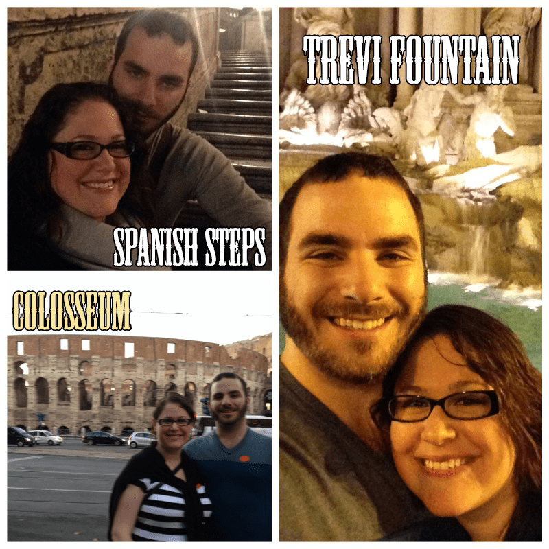

This week seriously flew by! I feel like I got pretty much nothing accomplished, and sadly have to spend the entirety of my Sunday playing catch up. Hopefully your day is more relaxing! If you’re just as busy as I am, at least take a moment to enjoy my Sunday Funday: Issue 8!

## Makes Me Laugh: Snuggly Owl

I know nothing of where this owl came from (yet another random image that Husband sent me) but I just love him! I realllllllly love owls as is, and this one is all fat and snuggled in the tree! So cute!

## What I’m Reading: Gabriella Miller Kids First Research Act

This week, on April 3rd, President Obama signed the

[Gabriella Miller Kids First Research Act](/Gabriella%20Miller%20Kids%20First%20Research%20Act/ "https://www.govtrack.us/congress/bills/113/hr2019")

. It was introduced on May 16, 2013, passed by the House on Dec 11, 2013, passed Senate on Mar 11, 2014 and as of this week, officially enacted. The bill is to “eliminate taxpayer financing of political party conventions and reprogram savings to provide for a 10-year pediatric research initiative through the Common Fund administered by the National Institutes of Health, and for other purposes.”

The bill is named after Gabriella Miller, a 10 year old girl who lost her battle with brain cancer after only 11 months due to an inoperable tumor. Instead of spending the last months of her life in mourning, she spent it as an advocate. She helped raise hundreds of thousands of dollars for Make-A-Wish, launched “Smashing Walnut” to fund pediatric cancer research and was quite the little activist- and such a brave little girl!

Less than six months after she lost her battle, the bill was in the President’s hands. At the signing of this new law, President Obama said,

_“…we needed to make sure that we get more money into research for the National Institutes of Health so that we can know more about brain tumors, how they affect children relative to adults, \[and] what more we can do to make sure that the pain that the Miller family went through is not something that has to be repeated.”_

More research funding for brain tumors? It’s about time!! In an interview for a cancer awareness documentary, Gabriella said,

_“Talk is bull\*\*\*\*. We need action.”_

Indeed!

See how you can help fund brain tumor research and spread awareness today at the

[National Brain Tumor Society!](http://www.braintumor.org/ "NBTS")

The beautiful and brave Gabriella Miller.

## Place I Love: Rome

It’s been five months since the Husband and I honeymooned in Italy, but I’ve been missing it a lot this week! Rome wasn’t the only place we visited while there, but it’s the place I love for this week. I miss everything about it- especially the food. Maybe next week will be a different Italian city!

## Something Delicious: Ben & Jerry’s – That’s My Jam Core

I was mega excited when I heard about the new Ben & Jerry’s Core ice creams earlier this year, but haven’t seen any around yet- not that I was in the ice cream aisle when it was winter out anyway. This week I spotted one! Two, actually. There was the

[Karamel Sutra Core](http://www.benjerry.com/flavors/karamel-sutra-core "Karamel Sutra Core Ben & Jerry's")

(which I almost got!), and the one I inevitably bought,

[That’s My Jam](http://www.benjerry.com/flavors/thats-my-jam-core "That's My Jam Ben & Jerry's")

. It’s half chocolate ice cream, half raspberry ice cream with fudge chips and has a raspberry jam core. Oh. So. Good. It’s no gelato from Rome, but then nothing is. \*sigh\*

_TIP: Ben & Jerry’s Free Cone Day is in two days! Find a_

_[Ben & Jerry’s near you](http://www.benjerry.com/scoop-shops/free-cone-day "Ben & Jerry's Shops")for some free ice cream!_

## Project That Inspires: Wire Wrapped Button Ring

As I practice more and more types of wire wrapping and ring making, I found this really cute button ring tutorial from

[Curry Design Handmade](http://www.currydesignhandmade.com/p/tutorials.html "Curry Design Handmade")

! It seems simple enough (though working with wire is totally trickier than it looks!!!), so I think I’ll go give it a whirl when this post is all done! If it comes out well, I’ll be certain to write about it!

Happy Sunday, everyone!!
