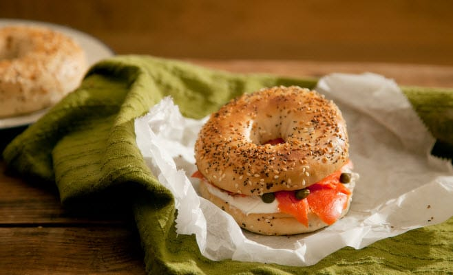
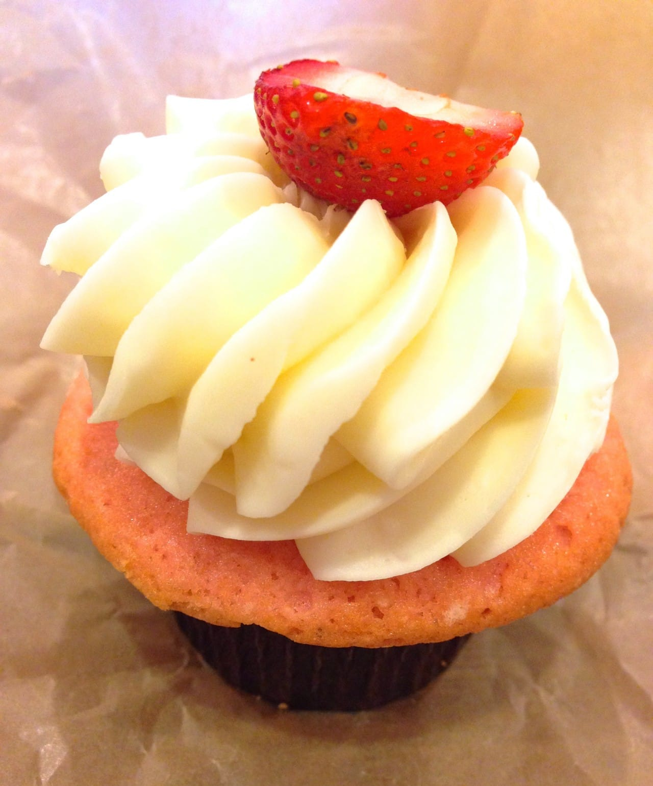

This is our first and last “free weekend” for a long while! Then it’s at LEAST 5 (probably 6, maybe 7) straight weekends in a row of events, plans and a trip thrown in the mix! Don’t get me wrong, I’m super excited for each of these things- but I do so love a free weekend. Enjoy yours too as you read Sunday Funday: Issue 9!

## Makes Me Laugh: Marutaro the Hedgehog

Yet ANOTHER adorable animal photo that Husband is responsible for finding. Marutaro the Hedgehog has his own

[Twitter](https://twitter.com/hedgehogdays "Hedgehogdays on Twitter")

account and about a zillion silly faced photos and more. It’s just the cutest thing ever, so I absolutely had to share! I can’t decide which face I like the best. What do you think?

## What I’m Reading: Bagel Tax

According to

[TurboTax’s “12 Strangest State Tax Laws,”](https://turbotax.intuit.com/tax-tools/tax-tips/General-Tax-Tips/12-Strange-State-Tax-Laws/INF26061.html "TurboTax 12 Strange State Tax Laws")

those delicious NYC bagels cost more sliced than whole! Click the link to read more super weird tax laws!

> “New York prides itself on serving the best bagels in the country … which is a good thing, considering you’re paying a premium to eat them. While an uncut bagel is tax exempt, the state adds an 8-cent tax to any altered bagels. If you ask for it with cream cheese or lox, or even if you just want it sliced for you, that’s considered preparing it for consumption on the premises – which inspires that extra tax.”

## Place I Love: Sweetbox

This could easily double as my “Something Delicious” for the week, but I made it my place I love instead.

[Sweetbox](https://www.facebook.com/Iheartsweetphilly "Sweetbox Cupcakes")

used to just be a food truck in Philly that eventually turned into an additional teeny storefront in the corner nook of an alley that happens to be just three blocks from our apartment. Their cupcakes are the best. This was the Strawberry Margarita one- and omg- it was just as good as it sounds.

## Something Delicious: Pho

I love pho. So much. Sometimes, I long for it. “Hoooooney. I’m craving Pho again,” I’ll say to Husband. “We JUST had it!” is always his response, even if we haven’t had it in a month. I guess he’s not as obsessed as I am. It just makes my insides warm and fuzzy, and soon it will be too hot to eat it! Gotta get those last few bowls of noodle soup in before the summer sun hits us!

## Project That Inspires: DIY Undies

I bought some fold over elastic specifically for this project. I told my buddy that I’m making her a pair too- even if it’s weird. I think they are so cute and hope that they are as easy as they look and hold up well! I’ve found a TON of tutorials and don’t know which I’ll end up liking most for this project, but I’ve included a photo from

[Sew Can Do](http://www.sewcando.com/2011/07/craftshare-make-undies-yourself.html "Sew Can Do - DIY Undies")

, because seriously- how cute are those! I’ll be trying that tutorial first, for sure!

Hope you enjoyed this issue of Sunday Funday! Have a good one!
