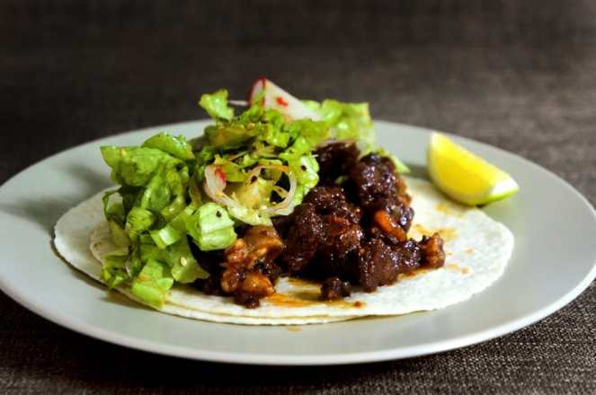
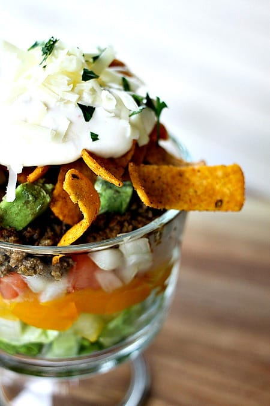
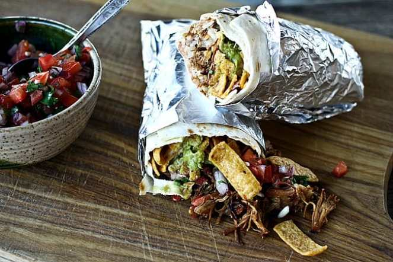

Taco Tuesday: 5 Recipes! (+ Bonus Burrito Recipe!)

It’s Taco Tuesday! To celebrate, I spent many hours slaving away on Pinterest

_(read: 30 minutes enjoying Pinterest)_

to find you 5 taco recipes that make me drool! I also threw in a burrito recipe for Husband, because those are his favorite. I haven’t tried any of these yet, but certainly will once we move in to the new place and unearth our cookware!

## #1. BBQ Tilapia and Sweet Potato Tacos

I’m not usually a fish person, unless it’s a very mild white fish like flounder or tilapia! And having it smothered in BBQ sauce and paired with sweet potatoes certainly helps! This recipe from

[Lemons and Basil](http://lemonsandbasil.com/bbq-tilapia-and-sweet-potato-tacos/ "Lemons and Basil BBQ Tilapia and Sweet Potato Taco Recipe")

is mouth watering. Where we are moving is two and a half blocks from the Italian Market, where I’ll be able to buy fresh produce, meat and fish whenever I please. I will definitely be trying this recipe out as soon as possible!

## #2. Spicy Chicken Tacos With Corn, Feta and Avacado

I’m not really in to Feta cheese too much, so I may sub in something else, but overall this taco sounds pretty awesome! The recipe is from

[Serious Eats](http://www.seriouseats.com/recipes/2014/07/spicy-chicken-tacos-recipe.html "Serious Eats Spicy Chicken Taco")

via Yasmin Fahr and they only take 20 minutes to make! I love spicy chicken and so does Husband, so I have a feeling this will be one we keep going back to.

## #3. Korean BBQ Short Rib Tacos

Mmm. Just thinking about them makes me dizzy. Korean BBQ short rib tacos are one of my favoritest things on the whole entire planet. They are involved, and the ingredients list is far too long for something I will inhale in 45 seconds flat, but for those of you who want the challenge, here is a recipe from

[Lady and Pups](http://www.ladyandpups.com/2012/11/21/chasing-kogi-truck-eng/ "Korean BBQ Tacos on Lady and Pups")

that looks incredible.

## #4. Taco Pizza

If traditional tacos aren’t your thing, or you really want a spin on the old classic, a taco pizza is definitely a fun route to go! I love the recipe from

[Taste of Home](http://www.tasteofhome.com/recipes/taco-pizza "Taste of Home Taco Pizza")

!

## #5. Layered Chopped Taco Salad

[Foodie With Family](http://www.foodiewithfamily.com/2014/07/10/layered-chopped-taco-salad/ "Foodie With Family Layered Chopped Taco Salad")

is responsible for this deconstructed taco recipe, and it looks great! I love the idea of individual little bowls of salad using all taco ingredients. It looks way better than any taco salad I’ve received in a restaurant! Plus there are FRITOS on top! Anyway, salads are healthy… 😉

## 

## BURRITO BONUS: Neato Frito Over-stuffed Burrito

Husband actually found this one all on his own. It also hails from

[Foodie With Family](http://www.foodiewithfamily.com/2014/02/11/neato-frito-overstuffed-burritos/ "Neato Frito Over-stuffed Burrito on Foodie With Family")

(have you checked the site out yet? There are so many good recipes!) and I have to say, it looks disgustingly delicious (and I don’t usually go for burritos!) I mean, pulled pork…cheeses…guac…more Fritos… how can I say no? Just look at it. LOOK!

All of these recipes (at least, the ones in shells) require soft taco shells, but I always opt for hard ones if I can- the crunch is my favorite part of a taco! Now that I’m starving, I’m going to leave you to your taco dreams. Enjoy!

Which of these recipes is your fave?
