Third Day of Christmas: DIY Mini Makeup Bag Tutorial

**\&#xA;**

_♫ On the third day of Christmas, Katie Crafts gave to me- a makeup bag that is so mini! ♫_

On the third day of Christmas, I decided it was time to whip out the sewing machine! This mini makeup bag will fit in any purse and make a great gift for holding your hair accessories, mascara, trinkets and more.

I’m currently using my mini bag to hold my lip gloss, craft scissors, buttons and stuffing as I keep it in my Knitting Class bag! Make it for anyone who needs a little zippered pouch for holding things as a gift alone, or fill it with goodies before wrapping it!

The inside of this bag has a complimentary fabric, but a visible seam. Since it’s the inside of the bag and isn’t seen often, this doesn’t bother me. Still, I wanted to let everyone know, in case you are someone who hates when seams are showing no matter where they are! You’ll see a photo of the inside seam later. For now, here’s what you need to complete the project.

## Materials:

- 7 inch zipper

- two panels each of two different fabrics in complimentary patterns or colors (4 panels total: 2 interior, 2 exterior)\*

- matching thread (I used black so you can see in photos)

- sewing machine

- zipper foot (optional, I didn’t use one here)

- scissors

- pins

\*Each of your four panels should measure 9″ across, so that there is one extra inch of fabric on either side of your zipper. If you are using a 9″ zipper, make sure you have at least 11″ across of fabric. You can make it a 9×9 square, or a smaller rectangle like I did- that part is up to you. As long as one side of the fabric is long enough for the zipper!

## Instructions:

- First, be sure your panels are long enough to fit your zipper, as mentioned above! Note: Your zipper may say “7 inches” but a quick look at it in the store may leave you puzzled since it’s clearly longer than that. The size refers only to the part that will be zipped itself- not to the extra portion on the end. You can see what I mean in the photo above.

Four panels, measured and cut in adorable Christmas fabric!

- Next, you’re going to lay one exterior fabric panel right side UP and place the zipper on top of it facing DOWN so that the edges of the zipper fabric and the edges of the fabric panel meet.

- Lay one interior fabric panel right side DOWN on top, making a neat little zipper sandwich.

- Pin across.

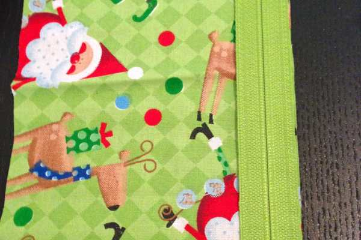

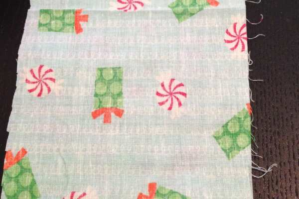

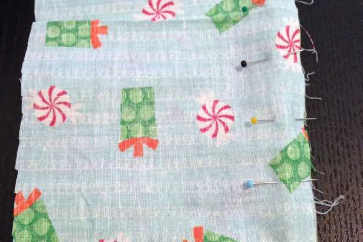

- Sew together along the seam with a straight stitch. Below is what it looks like after it’s stitched and opened!

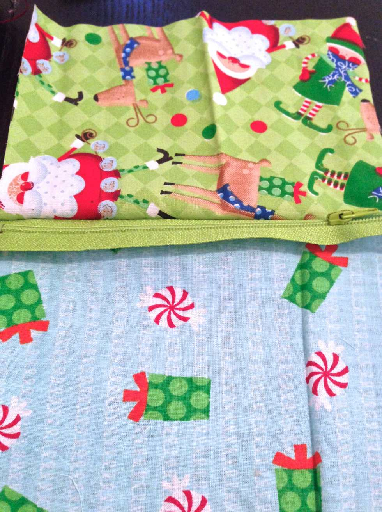

- Time to make another sandwich! Close back up the stitched panel you just made so that the exterior and interior panels are flat and their wrong sides are touching.

- Place an exterior panel right side UP on your table

- Lay the already sewn zippered panel on top as you did before (with the edges of zipper and panel touching)

- Place an interior panel right side DOWN on top, making sure all edges are even. As you can see from the third photo below, I have some major trimming to do, so I took care of that before going on to the next step!

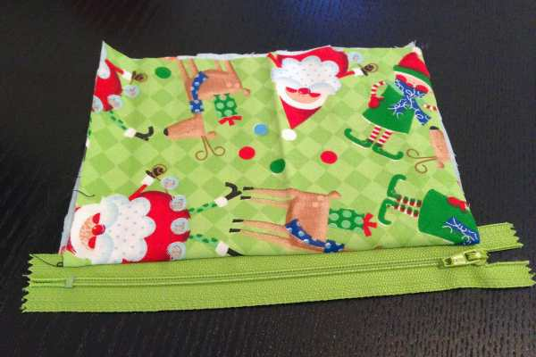

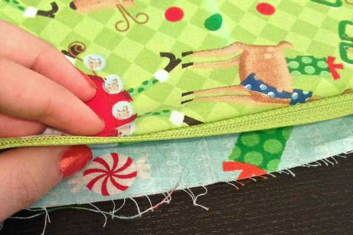

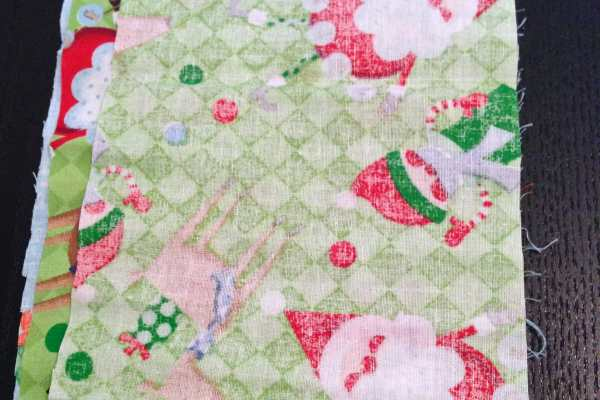

- Pin across.

- Sew together along the seam with a straight stitch. If you are not using a zipper foot, just sew to the end where the zipper is, stop, raise your needle, push zipper past your needle, lower needle and finish sewing as pictured below.

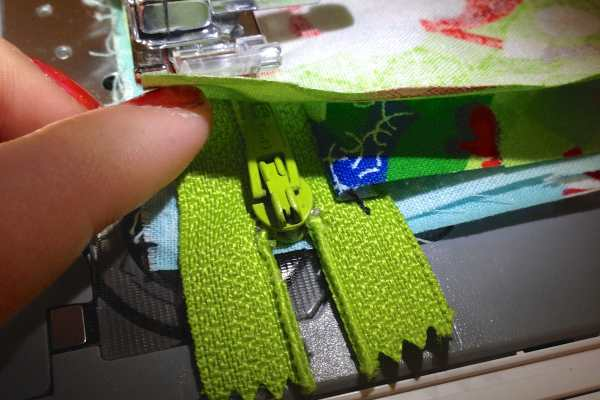

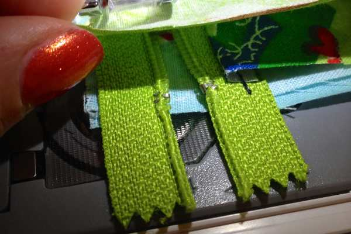

- You should now have all your panels attached to your zipper and it should look like the below photos!

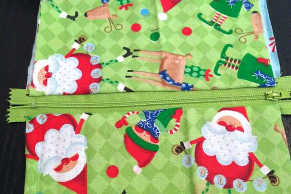

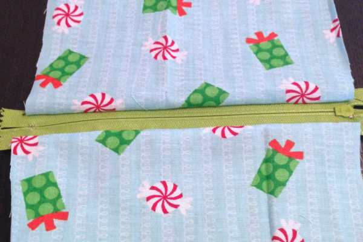

- Fold the panels like a book, with exterior panels showing and interior wedged between, zipper as flat as possible. See below.

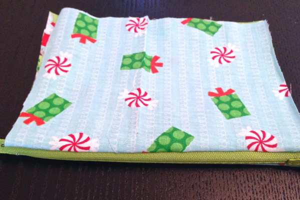

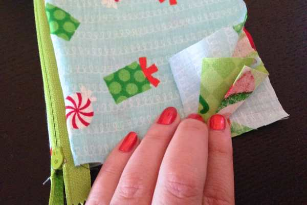

- Stitch closed along seam to create a tube.

- Turn tube so that zipper is on top in the middle, and unzipper from the inside about halfway.\* \*Very Important Step for turning!

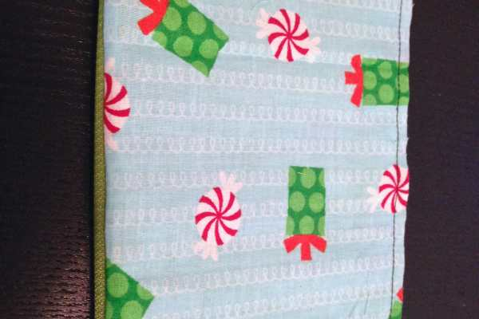

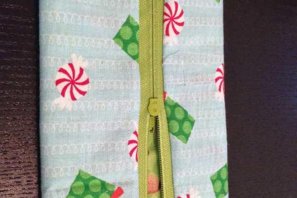

- Sew across the top that is currently zippered. If you have to go across the teeth themselves, that’s fine!

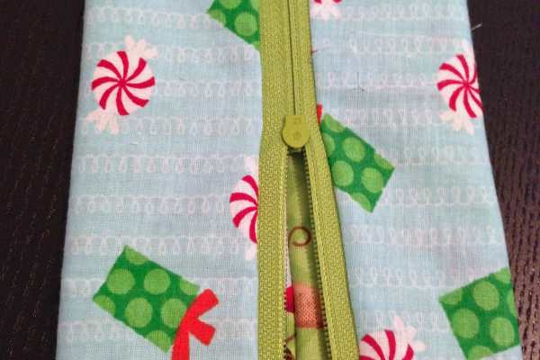

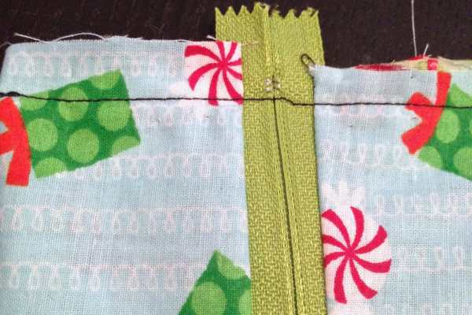

- Pin other side closed (leaving that zipper still open!) and stitch across again.

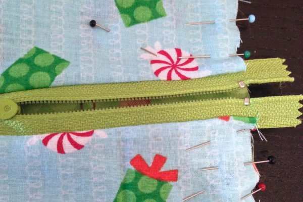

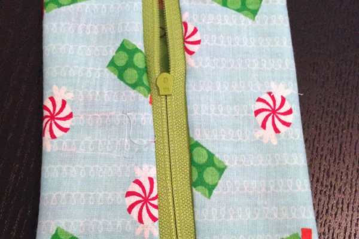

- Your bag will now look like this!

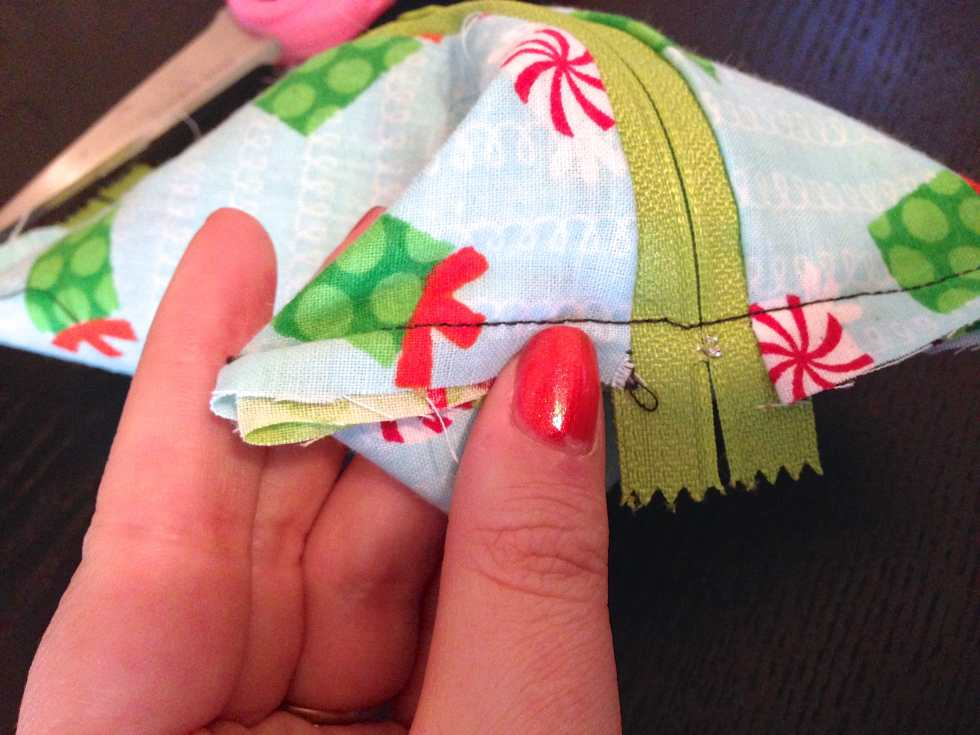

- Make boxed corners by pinching each corner into a triangle and sewing across, as you learned in my

  [Tote Bag Tutorial](/reversible-tote-bag-tutorial/ "Reversible Tote Bag Tutorial")

  .

- Trim excess if desired.

- Flip inside out through the unzipped hole you left.

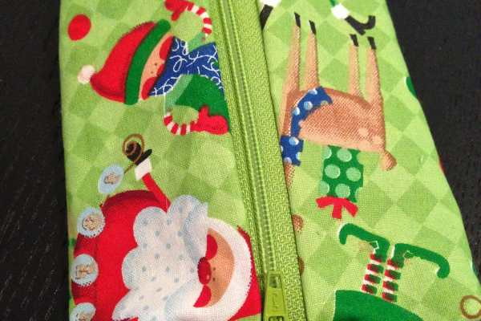

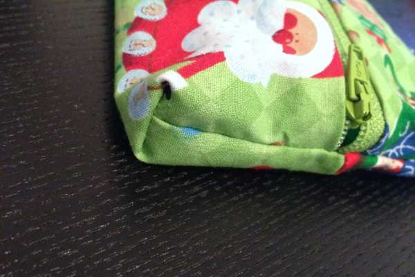

- Enjoy your new little bag! (Note: inside seams visible in below photos)

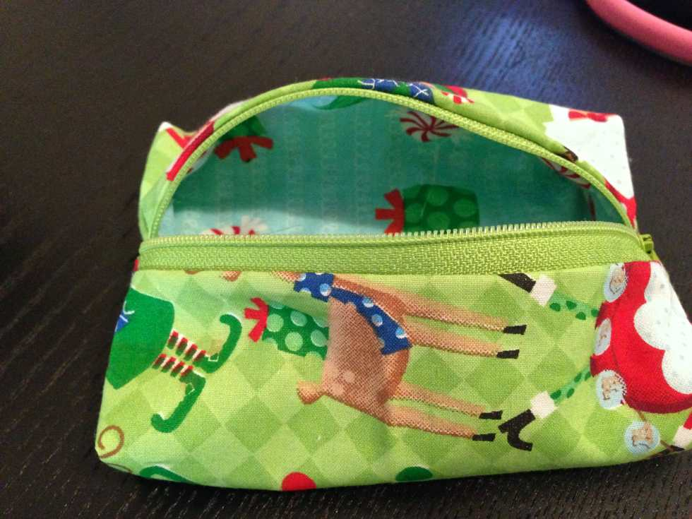

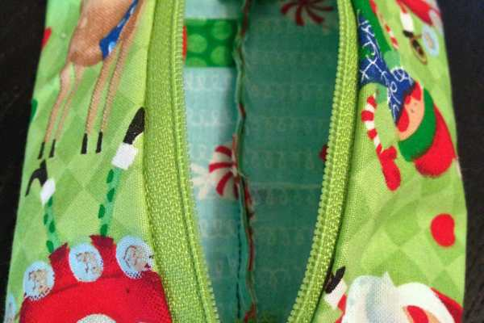

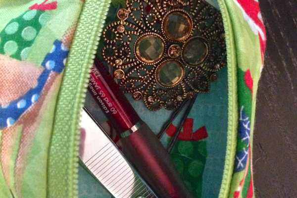

This little bag works up super quickly and is really cute! I’ll be making one for the Husband’s manbag (though I won’t be using Christmas patterned fabric!) so that he can hold the Advil, Chapstick, etc. that I’m always asking him to hold for me. So really, I’m just making the bag for myself. We won’t tell him that part.

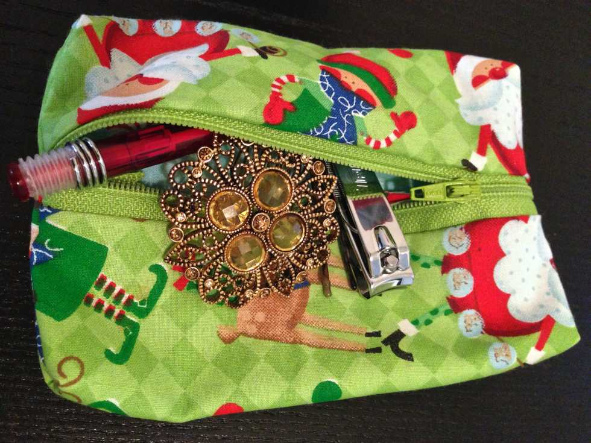

Hope you enjoyed my mini makeup bag tutorial on this third day of Christmas on Katie Crafts! Don’t forget about our first day of Christmas giveaway!

[**_Click here to enter!!_**](/first-day-of-christmas-gift-tag-giveaway/ "First Day of Christmas: Gift Tag Giveaway")
