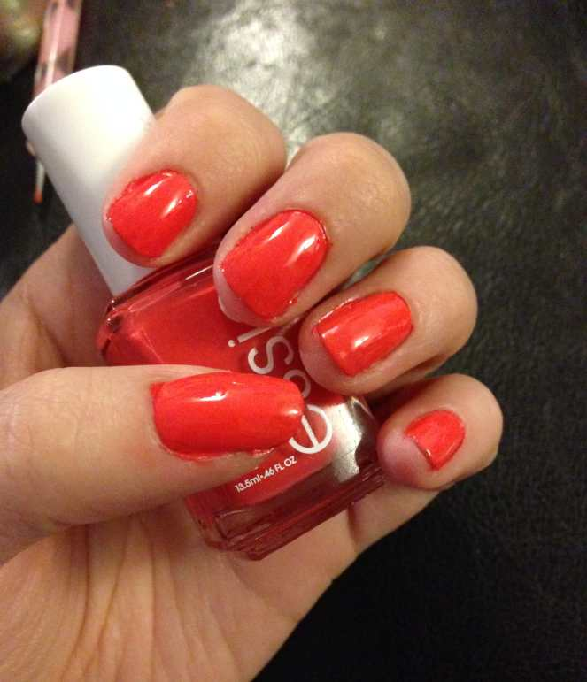
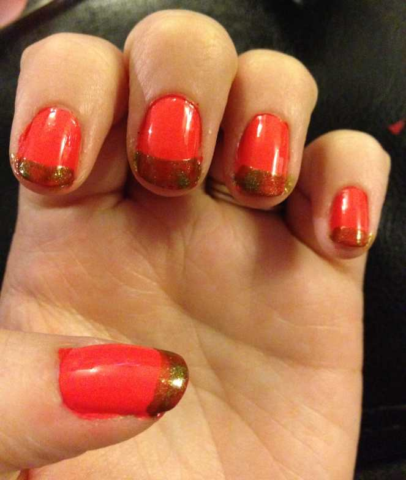
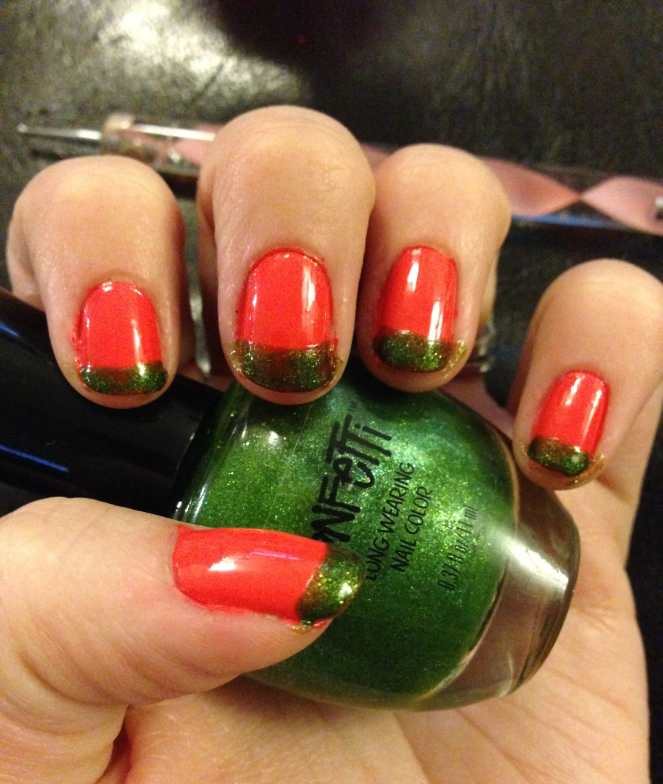
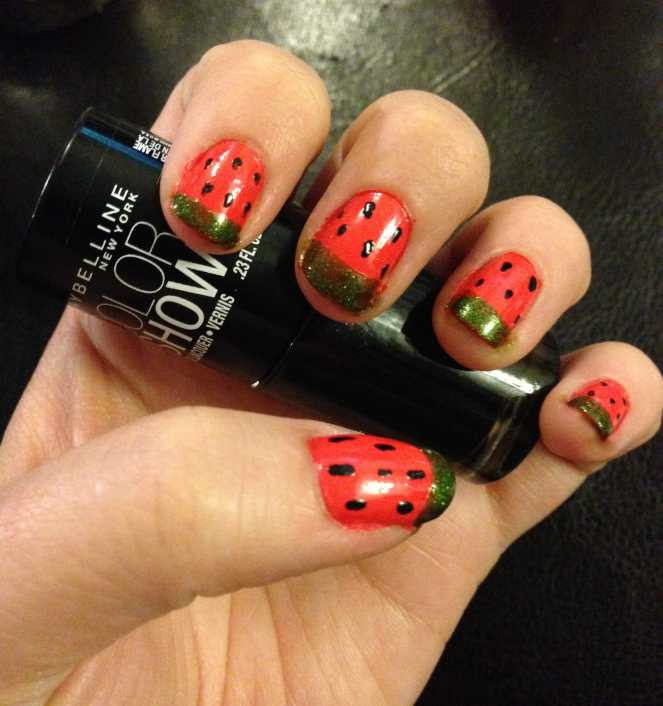
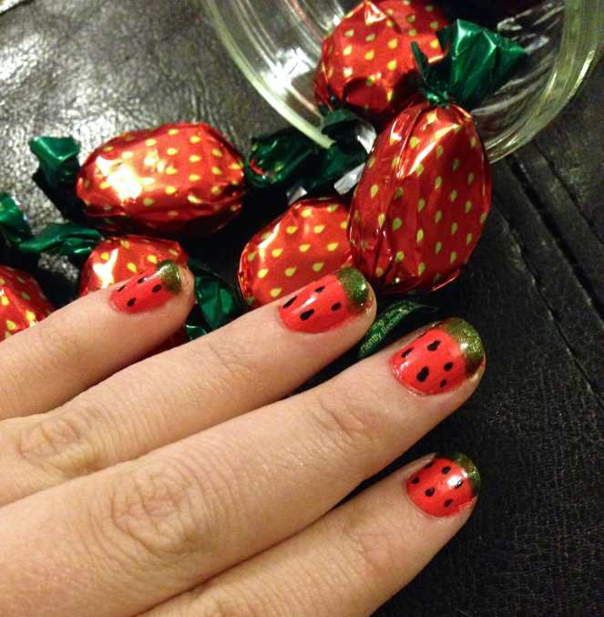
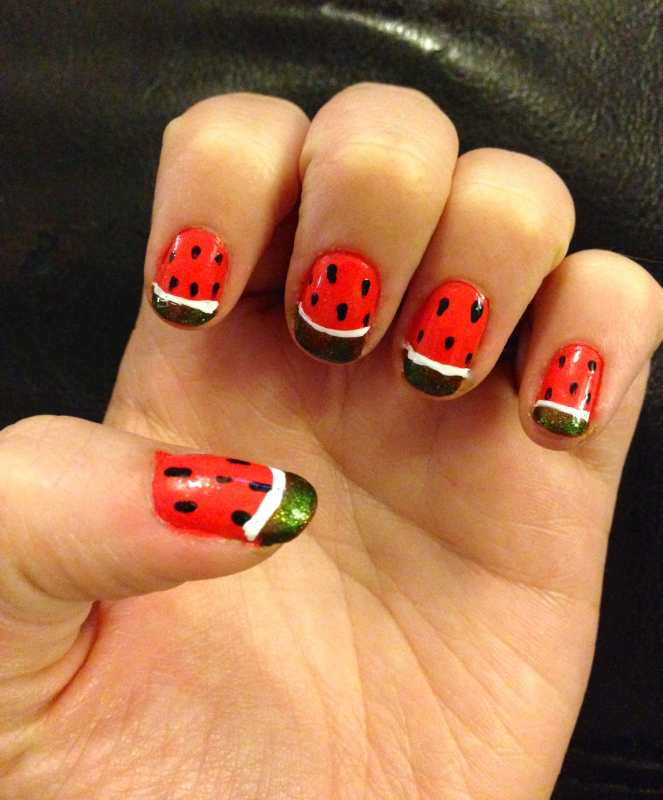
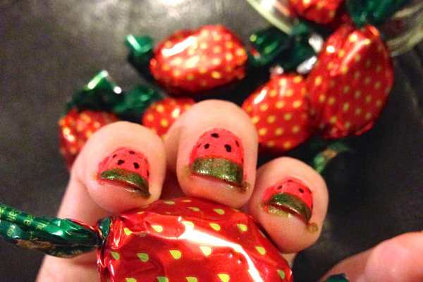

**\&#xA;**

Inspired yesterday by

_[Aquariann](http://blog.aquariann.com/2014/08/french-tip-manicure-watermelon-nail-art.html "The Art and Tree Chatter of Aquariann")‘s_

watermelon nail wrap post, I decided to try my hand at making my own watermelon nail art design! My

_[apple design](/apples-nail-art-design/ "Apples Nail Art Design")_

is still my fave fruit so far, but these are a pretty cute way to end the summer. BONUS: If you skip one step, you end up with

_strawberry nails_

! Which do you like better?

## Materials:

- Pink or red nail polish

- Green nail polish

- Black nail polish

- White striper or white nail polish + nail art brush

- Dotting tool or toothpick

- Clear top coat

## Instructions:

- With clean dry nails, do one coat of your pink or red nail polish and let dry. I used my favorite coral shade (

  [Essie’s “Come Here”](http://amzn.to/1n5xxBU "Essie ")

  ) since soon I will have to retire it for the season! You don’t have to use coral, if you don’t want to, though! You can use red if you are going for a strawberry look, or hot pink for a great watermelon design!

One streaky coat! (Please ignore how horribly cracked and dry my hands look! No matter now much lotion I put on them before I take photos for the blog, they always look like they belong to someone 108 years old.)

- See those streak marks from one coat? Do a second coat and let dry completely.

Two coats- much better!

- With your green polish (I used Confetti’s “My Favorite Martian”), do a somewhat thick french tip on the top quarter to third of your nail. This is the top of your watermelon slice! Let dry.

One coat of green

- If the polish you choose is streaky here too, do a second green tip coat and let dry.

Two coats of green

- Use your dotting tool or toothpick and some black nail polish, and make little seeds throughout the pink/red. Let dry.

Seeds!

- Right now, you can call it a day, do a quick coat of clear polish, and end the design with some strawberry nails if you want!

Don’t worry about nails not being cleaned up- you can do this at the end!

- If you want to continue to have watermelon nails, use your white striper or white nail polish and a nail art brush to make a thin line between where the pink and green meet.

Watermelons!

- Finish with clear top coat. Done!

So which do you like better: straawwwwberries or watermelons?
