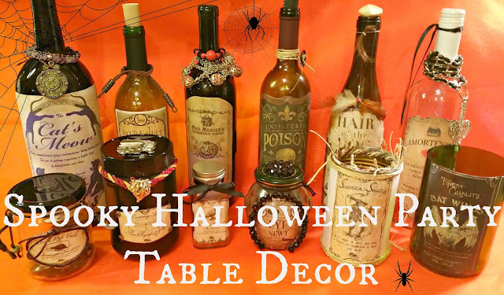

Welcome to week two of the September blog hop! Last week,

[Robin of Redo It Yourself Inspirations](http://redoityourselfinspirations.blogspot.com/2015/08/spooky-halloween-party-table-decor.html)

posted an amazing DIY on refashioning old bottles and jars into spooky apothecary Halloween decor! She even pinned an entire Pinterest board devoted to labels, of which I’ve already scoured and downloaded tons. I’m so glad she’s the featured post for this week! Check out her post and Pinterest board and add your links to the What Are You Doing? Blog Hop at the bottom of the page. Maybe you’ll be next week’s featured post!

### Welcome to this week’s blog hop!

****

**This blog hop runs from Monday 12:00 PM through Friday 11:59 PM EST.**

(I know today is Tuesday, so I extended the blog hop until Saturday!)

### Your hosts:

Sara from

[Content in the Meantime](http://contentemeant.blogspot.com/)

Kassandra from

[Coffee and Their Kisses](http://coffeeandtheirkisses.com/)

### [Meet your co-hosts for the Month of September:](http://coffeeandtheirkisses.com/)

[\
Katie from](http://coffeeandtheirkisses.com/)[Katie Crafts](/)\
[Pinterest](https://www.pinterest.com/imkatiecrafts/)[Twitter](https://twitter.com/imkatiecrafts)[G+](https://plus.google.com/+Katiecrafts215/posts)[Instagram](https://instagram.com/imkatiecrafts/)[Bloglovin](https://www.bloglovin.com/blogs/katie-crafts-crafting-sewing-recipes-more-11771265)[Facebook](https://www.facebook.com/imkatiecrafts)!

Joan from

[Starting Over…Again](http://www.jrrmblog.com/)\
[Pinterest](https://www.pinterest.com/jmerrell81/)[Twitter](https://twitter.com/jrrmblog)[G+](https://plus.google.com/+JoanMerrell/posts)[Instagram](https://instagram.com/jmerrell81)[Bloglovin](https://www.bloglovin.com/blogs/starting-over-again-13770881)[Facebook](https://www.facebook.com/jrrmblog)

### Featured posts of the week:

Posted below is the featured blog post of the week. I love to find unique blogs and post to share about and write little comments on their writings. I try my best to give every blog a chance to be chosen, so make sure to enter your blog every week!

I love all the cool things you can make with recycled items, and

[Robin at Redo It Yourself Inspirations](http://redoityourselfinspirations.blogspot.com/2015/08/spooky-halloween-party-table-decor.html)

has made some great decorations for Halloween! I love the designs of the labels, and she has a Pinterest board with all the linked labels on her blog. Thanks for sharing, Robin! Congratulations to the featured blogs!

<http://contentemeant.blogspot.com/2015/8/what-are-you-doing-blog-hop-113.html”>

Don’t forget to check out the other blogs from last week!

### What have I been doing?

Sara’s Post:

[Content in the Meantime – Lorenzo’s New Home](http://contentemeant.blogspot.com/2015/09/lorenzos-new-home.html)

Joan’s Post:

[Starting Over Again – Paying Cash – How I Saved $200 This Month](http://www.jrrmblog.com/debt-2/paying-cash-how-i-saved-200-this-month/)

Katie’s Post:

[Katie Crafts – Longwood Gardens Photo Recap](/longwood-gardens-photo-recap/)

[a Rafflecopter giveaway](http://www.rafflecopter.com/rafl/display/9948790e10/)

### Now it’s your turn! What have you been doing this week?

- - - **Please post the link to a specific blog entry, not just the blog.**

      I look at every link posted,and I comment in every entry. If you don’t post a specific entry I can’t comment!

* * **Adding your email address will add you to my blog hop email list.**

    I will only send you an email once a week informing you of the blog hop. If you don’t want to be emailed, just

    [let me know](mailto:silverluna316@gmail.com)

    .

- - **If your blog is featured on this blog hop, I will be using the picture you posted on the linky.**

* * **All blog posts will also be pinned on my[What Are You Doing? Pinterest board](http://pinterest.com/saracraft/what-are-you-doing-blog-hop-entries/), so others can see the awesome things you are doing!**

- - **Family friendly posts, please!**

* * **\*NEW\* I also added a LIKE feature to the list, so make sure you check out the other blogs and like your favorite!**

    Help me choose the featured blogs for the week! You only get one choice for a favorite though, but if you have other favorites, let me know in the comments!

[Follow Sara @ Content in the Meantime’s board What Are You Doing? Blog Hop Entries on Pinterest.](http://www.pinterest.com/saracraft/what-are-you-doing-blog-hop-entries/)

**Grab a Button!**

<http://contentemeant.blogspot.com/search/label/WAYD%3F%20Wednesdays”>

<http://2.bp.blogspot.com/-gRssF1YfMEY/UYE9isaUrdI/AAAAAAAAA6A/VdB8zWR6_-o/s320/WAYD.png”/>

**Follow Content in the Meantime for future blog hops!****Follow Coffee and Their Kisses!**

//

**Powered by Linky Tools**

[Click here to enter your link and view this Linky Tools list.](http://www.linkytools.com/wordpress_list.aspx?id=260336\&type=thumbnail)
