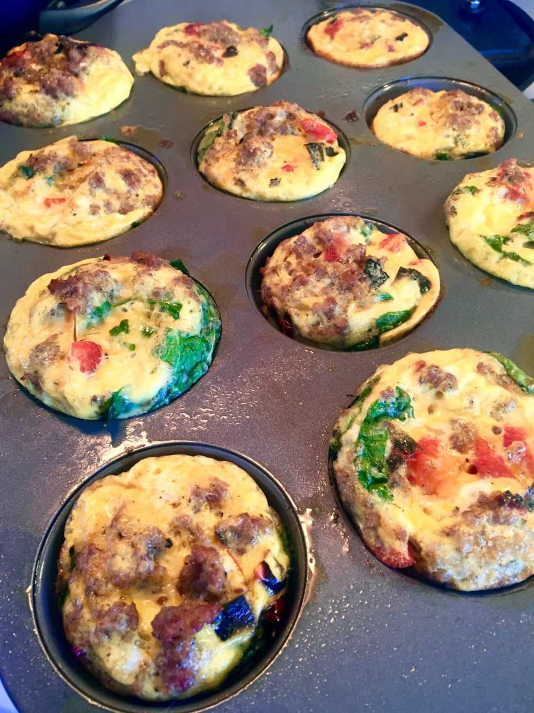

I’ll be the first to tell you, I hate breakfast. I like breakfast foods, but I don’t like eating as soon as I wake up. I’m never hungry in the morning- in fact, I get nauseous if I eat too early. And I never, ever, ever want to wake up and immediately cook. Husband is the opposite, being famished within moments of fluttering his eyes open. That’s why these

[**Whole30**](/blog/whole30-day-1/)**approved Egg Muffins**

are such a lifesaver for both of us!

Part of this whole challenge is resetting my body AND my habits. I need to learn to eat in the morning, even if I’m not hungry, so that I can jumpstart my metabolism. Knowing there is something quick, easy AND delicious waiting for me is a great start.

I wake up later than Husband, so he can heat these handheld frittatas for himself quickly before he leaves for work. There are also endless possibilities with this recipe, so long as you follow your whole30 guidelines! I made a dozen at once, so they’d last throughout the week, but you can make whatever floats your boat. Here is what I put in mine.

## Ingredients:

- Pork sausage (no sugar or soy!)

- Cage-free organic eggs, 12 eggs makes 12 muffins

- Fresh spinach, chopped, 1/2 to 1 cup

- Roasted red pepper, chopped, 1/2 to 1 pepper

- Salt, pepper, onion powder, garlic powder, parsley

- Olive oil cooking spray (no soy or additives!) or brush on some olive oil

## Instructions:

- Preheat your oven to 350 F.

- Spray or brush olive oil on the bottom and sides of each the holes in the muffin tin. You won’t be using cupcake wrappers for these so the eggs will be all up in there. Make sure your muffin tin is clean before you begin!

- In a large bowl, break and scramble all your eggs. Add salt and pepper. Set aside.

- If your sausage is in casings, remove those now. You want your meat in crumbles.

- In a large pan with a little olive oil, fry up your crumbled sausages. Add onion powder, garlic powder, salt, pepper and parsley (and any other compliant spices you like!). Cook until done.

* Remove sausage from pan and set aside.

* While the sausage is cooling, give your spinach and roasted red pepper a rough chop if you haven’t already.

* Equally disperse the spinach and red peppers in each muffin tin hole.

* Use a spoon to do the same with the sausage.

* Lastly, add eggs. I transfer my eggs to a spouted measuring cup for easier pouring!

- Give each cup a little mix and pop these babies in the oven for 25 minutes, or until eggs are fluffy and cooked in the middle.

- Enjoy egg muffins now while warm, OR let cool completely and pop in a freezer bag for your freezer. Reheat wrapped in a few papertowels in the microwave for 1 minute 30 seconds. The egg muffins let off a lot of water (possibly from the fresh spinach, so next time I’m going to try out frozen spinach instead) so those paper towels are important! If you cook them too long, they get a little rubbery. I’ll try to fix that on my next round too.

This weekend we are making another dozen for the upcoming week, but with different flavors: avocado & bacon/prosciutto! I’ll let you know how those turn out. 🙂

Have you made egg muffins in the oven before? What flavors did you use?
