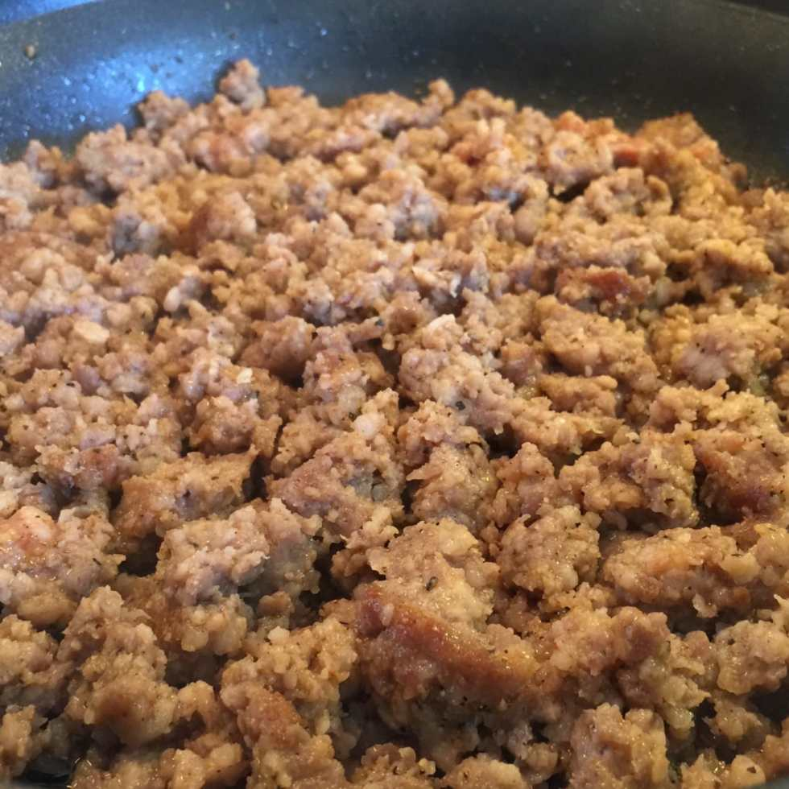

Happy Monday, readers! Today is the day I begin Whole30! I’ve been feeling very sluggish and tired and generally yucky lately, so I was looking for a way to reset my insides and try to figure out what it is causing it. My friends were about to start Whole30 too, so I hopped on the bandwagon with Husband in tow. Here we are: Whole30, Day 1!

Me and the Husband, outside grilling!

It took hours to plan the first two weeks of meals, more hours shopping for all the ingredients for those meals, and 4 hours last night doing prep for the first week. It was all pretty exhausting (even though I adore planning and have had a weekly meal chart on our fridge for months now) but it was worth it when I woke up this morning and didn’t have to think about what to eat- it was already made!

Roasted red peppers to top off salads, make roasted red pepper sauce, and to fill up egg muffins! Grilled chicken for chicken salad and regular salad!

On Whole30, you cannot have sugar/artificial sweeteners, grains, legumes, dairy or alcohol. I LOVE cheese and eat it at least once a day, so that will be a hard one for me. I also live for chocolate, and crave it on the daily- so that will be killer. My biggest weakness is the iced mocha latte at my local coffee shop, combining two things I cannot have into one delicious chilled drink. Still, the urge to know what I may be sensitive to (you slowly reintroduce each category back into your diet after 30 days to see how your body reacts to each) outweighs the need for a mocha. For now. It’s only day 1, after all.

So much crumbled pork sausage!

One of the easiest breakfasts of all time!

Egg Muffins! Want the recipe? I can share it later this week if you do!

Over the next 30 days, you can expect some delicious and healthy recipes added to the blog, along with tips to make things more manageable and things I’ve learned along the way! For now, you can watch us try to make homemade mayo below! 😉

[http://www.katiecrafts.com/wp-content/uploads/2016/04/IMG\_0023.m4v](/wp-content/uploads/2016/04/IMG_0023.m4v)

If you’ve completed the Whole30 before, share your favorite recipes below! I am definitely looking for suggestions!
