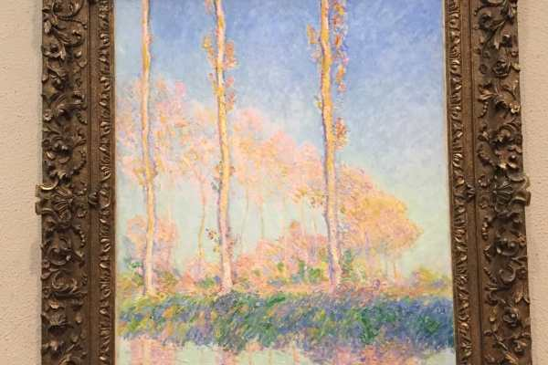
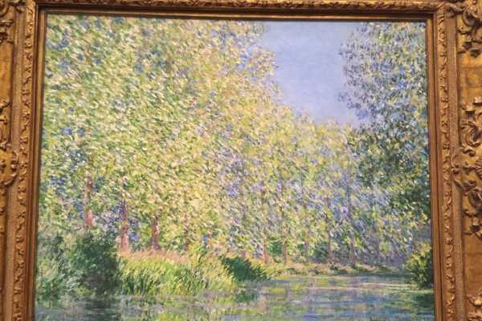
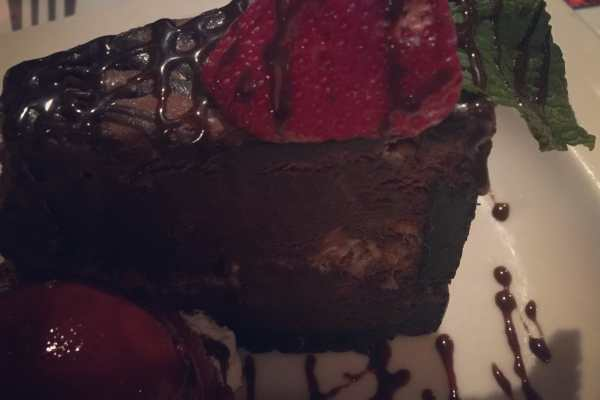
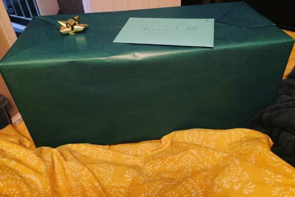
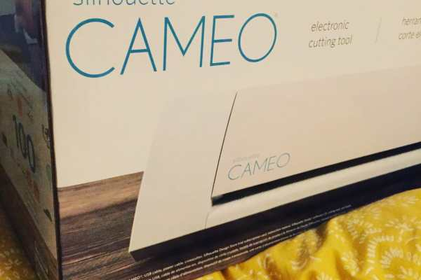

If you follow me on

**[Instagram](https://www.instagram.com/imkatiecrafts/)**

, you know that I spent my 33rd birthday yesterday going to brunch, then the Philadelphia Museum of Art, followed by walking around a rainy city and then dinner. I snapped just a few photos from the day and thought I’d share them with you!

Such a miserable rainy day!! 🙁 At least the city looked pretty cool from the Art Museum steps!

The exhibit we saw was called Audubon to Warhol: The Art of the American Still Life. It featured three decades worth of paintings, ranging from 1700 to 1960. There were 130 oil, watercolor and mixed media paintings included. By the time we left the exhibit, two and a half hours had gone by! We had no idea we’d spent that much time in it, but there certainly was a lot to see! We weren’t allowed to take photos inside the special exhibition, but you can

[check out some of the works included right here](http://www.philamuseum.org/exhibitions/818.html)

.

While at the Art Museum, I just had to peek in on a few of my favorite works! Van Gogh’s Sunflowers (above) and the Monets below have me in awe no matter how many times I see them.

Later in the evening, we headed to one of my favorite restaurants for dinner. I saved room for birthday cake, too! Chocolate toffee mousse something or other with raspberry sorbet. Mmmm!

After we were so stuffed we couldn’t move, we headed home! I was pretty excited to play with the new toy I got from Husband for my birthday: a Silhouette Cameo! I wasn’t expecting it at all so it was a huge surprise!

I was tired after a long day but I

_**had**_

to give my new Cameo a try!! After a few complete fails, I made this Thanksgiving card. I think it’s super cute!

All in all it was a pretty great birthday! Hopefully the week continues! 🙂

Share your Wordless Wednesday links below and I’ll pop in and comment on them! And if you’ve ever used a Silhouette Cameo for a project, tell me about! I’d love to hear your ideas!

> _P.S. Happy Veteran’s Day to all those brave men and women who keep us safe!_
