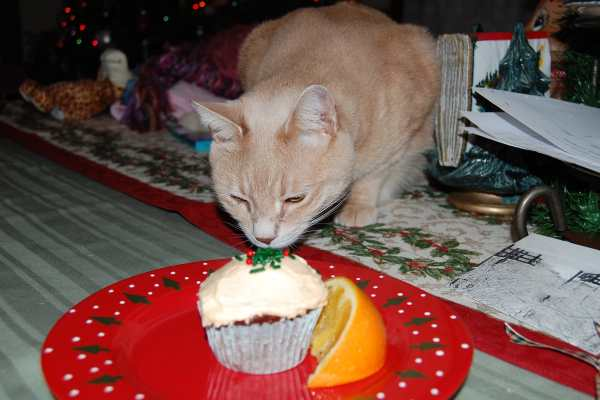
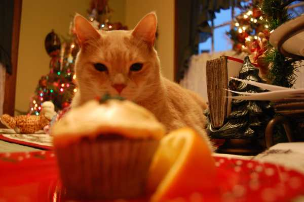
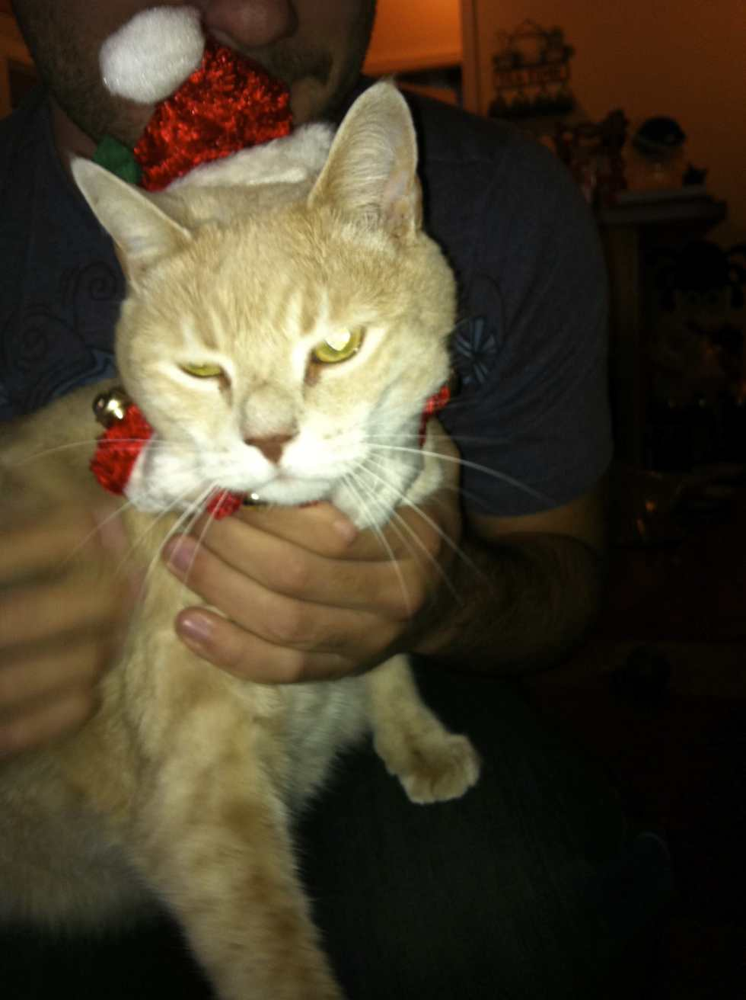
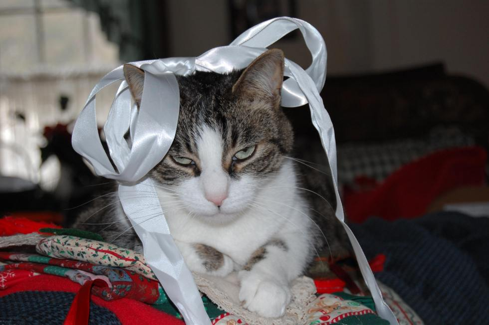
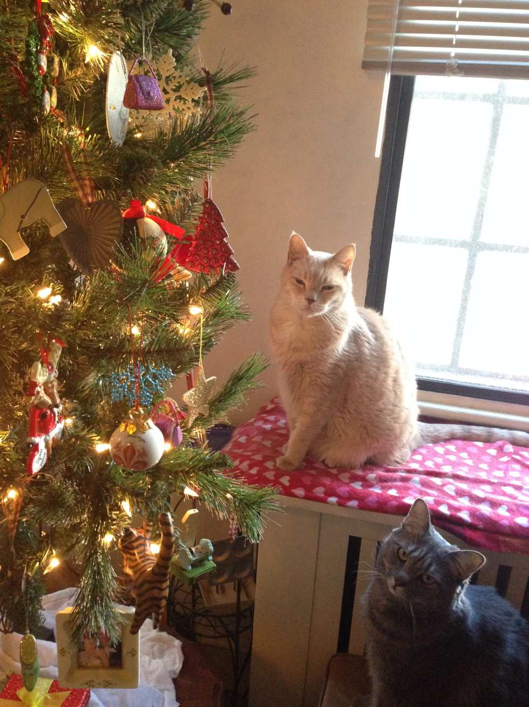
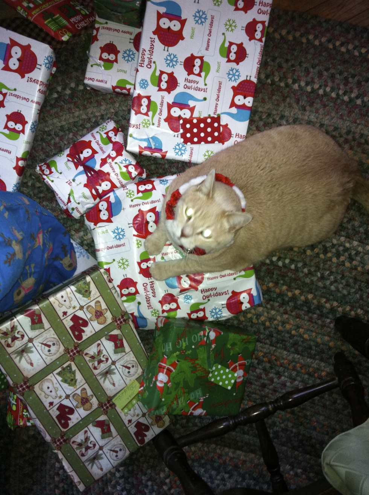
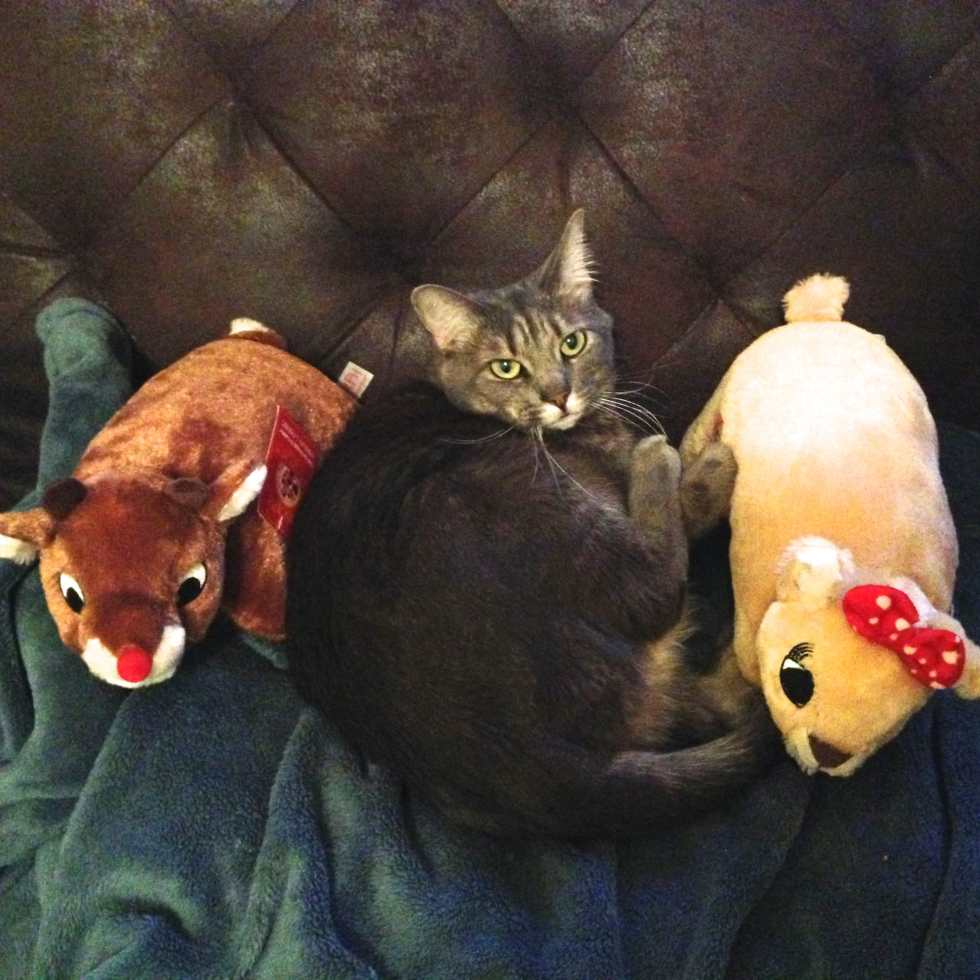
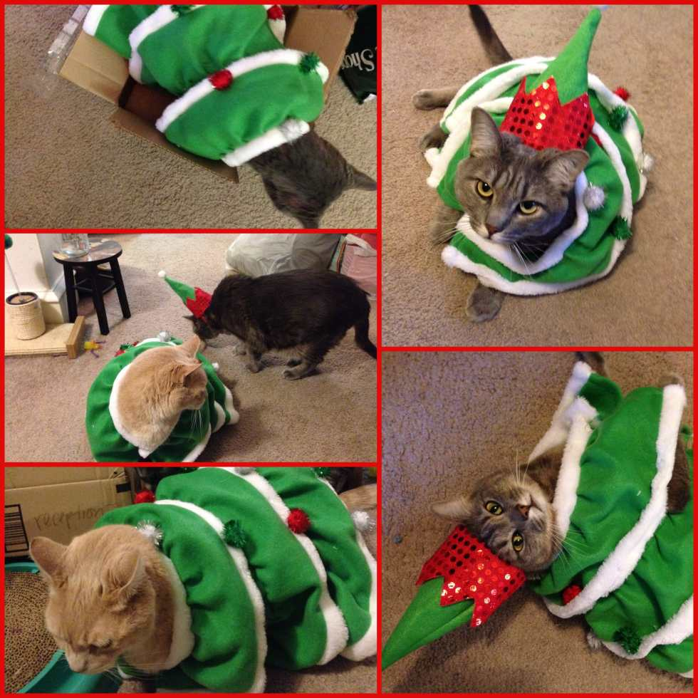

Over the years, I’ve subjected the cats in my life to many a costume or bow, most of the time for adorable photos. Some of those cute pics involve Christmassy outfits, presents or trees. I combed through photos from the last several years and found a handful of my favorites that I thought I would share! Besides, what’s cuter than a Christmas Kitty? Three Christmas kitties, that’s what.

When I first adopted Lucky, he was a big boy! I brought him to my parent’s house for Christmas so he wasn’t left alone in my apartment, and he didn’t know what to make of the Christmas tree. I guess it was the first he’d seen!

Spud, however, was a seasoned veteran. She always loved hiding underneath the branches.

Lucky stalked the cupcake for quite awhile, but never actually tried to eat it. He just liked the scent of oranges.

Mabel likes to help wrap gifts. After I finish one and put it in a pile, she lays on it to make sure the tape holds.

He always pulls the hat off quickly, but he lets us keep the collar-with-bells on for awhile. It’s so cute.

Spud wouldn’t get off the stockings for us to hang them up, so we tied a ribbon around her head for a photo. She wasn’t amused.

“Why did you put all these toys just out of reach?”

As much as Mabel likes helping wrap gifts, Lucky likes helping open gifts. Especially ones that jingle or smell like catnip.

Mabel and her new besties, Rudolph and Clarice.

More photos of Lucky and Mabel dressed as a Christmas tree and elf! We had to rapid fire take these shots because these costumes don’t stay on for more than a minute!

Isn’t he thrilled?

Not a cat, but I thought I’d throw one in of the Husband in a mini Santa hat for good measure. Merry Christmas!
