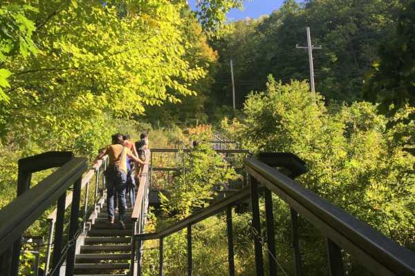
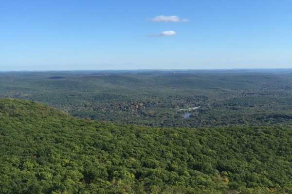

Last week, Husband went on a work retreat to Grape Hollow Farm in Holmes, NY. As I stayed home cleaning the house, he sent me photos of the beautiful views and adventures he was going on to make me jealous. It totally worked.

He went kayaking on a river, hiked a mountain and had lots of bonfires at the giant beautiful farmhouse where they stayed. The photos he sent were so pretty- you can expect to see more for Wordless Wednesday next week! I’m saving my favorite mountain top views for then. 😉

I’m glad he took lots of lovely photos and I’m jealous I didn’t get to see it all in person, but I know my old lady body wouldn’t be able to handle a hike!!

Have you ever climbed a mountain before? Send me your favorite photos from your hike and I’ll include them in my blog next week!
