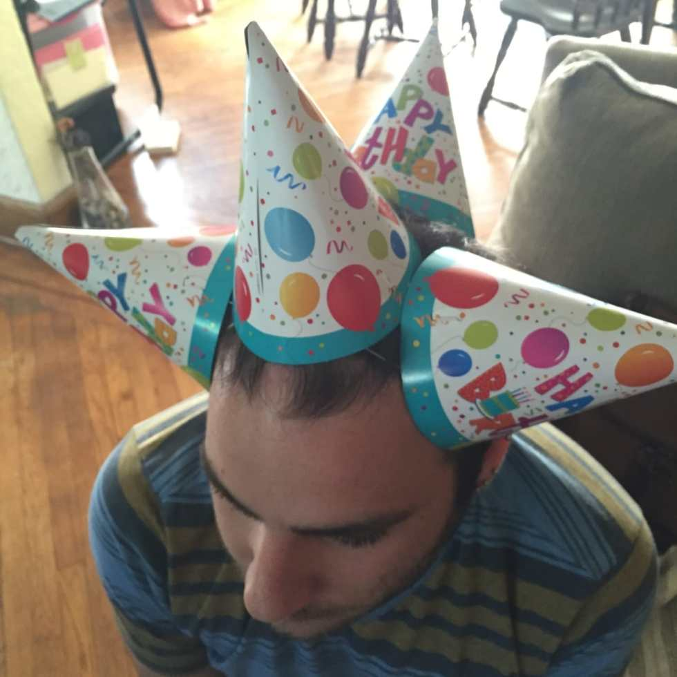

With Dad’s birthday this week, my sister’s last week and my Husband’s this weekend, you can imagine how busy May is. Add in Mother’s Day, Memorial Day, and other random obligations like baby showers and weddings, May is the busiest month for me. That’s why I had to celebrate everyone’s birthdays at once!

I went to Jersey over the weekend and made my family stay in the living room while I quickly ran around the dining room decorating! I had a “Happy Birthday” banner that I put across the windows, “30” hanging streamers for my sis and husband who both turn(ed) 30 this month, and “Happy 4th Birthday” balloons for my dad, because there were no “Happy 64th Birthday” balloons. A Sharpie fixed that for me. 😉

The Kindle sleeve I made my sister, and a little bag to carry it and her wallet & keys in!

I set up hats and presents for each and I got it all done in about 5 minutes. How is still a mystery.

I also made brownies the next day and made everyone put their hats back on so I could take pics of them blowing out their bday candles! Hopefully all their wishes come true. 🙂

How silly is my husband, wearing ALL the hats?

What is your busiest month?
