This past Sunday, November 1st, was the

**[Race for Hope Philadelphia](/join-us-in-the-race-for-hope/)**

! It’s an annual race held by the National Brain Tumor Society which raises awareness and money for research in the fight against brain tumors. This year was their 10th year in Philly!

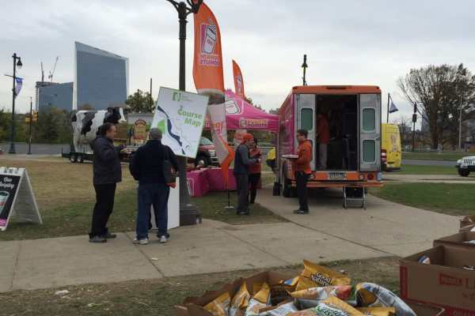

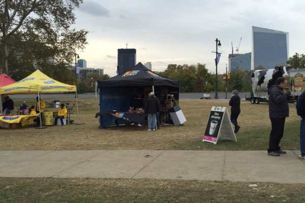

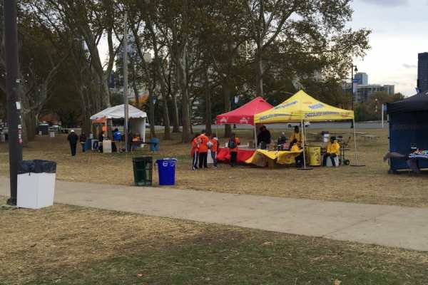

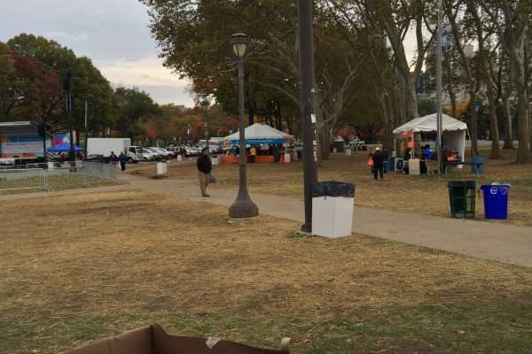

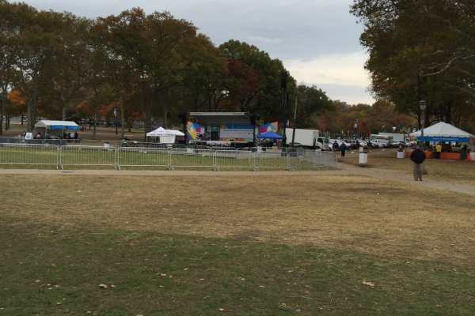

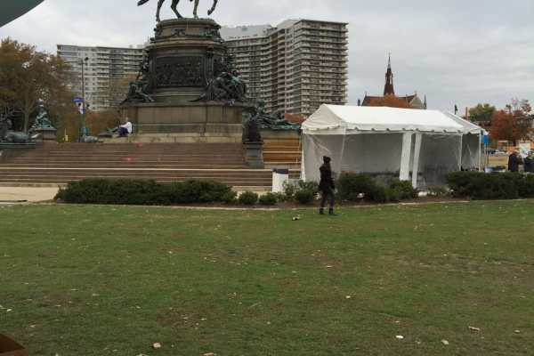

As you know, I lost my Mom to brain cancer 3 years ago, and have been participating in this race for the last 5 years. The first few years we walked it, the year we got married we just went to watch the speeches and cheer people on (we were leaving for our honeymoon a few hours later and I didn’t want to take the chance I’d hurt my ankle or something!), and intended to walk again last year until I badly hurt my knee. It ended up being a FREEZING day anyway, so we just bundled up and watched the speeches and cheered runners and walkers on again. That’s when we decided the next November we’d volunteer instead.

Still so dark out as we set up!

Husband and I woke up at 5am on Sunday (after having had a Halloween party the night before! Ouch!) and got to the Art Museum at 6, just before the sun came up! We were stationed at the refreshments tent, handing out water, bananas, chips, pretzels and cookies to all the walkers, runners, families, friends, survivors and volunteers.

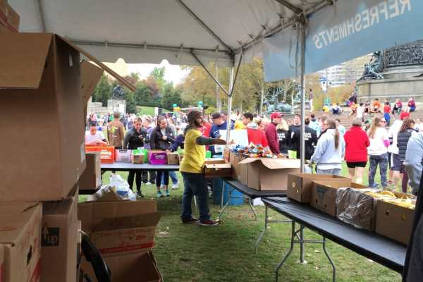

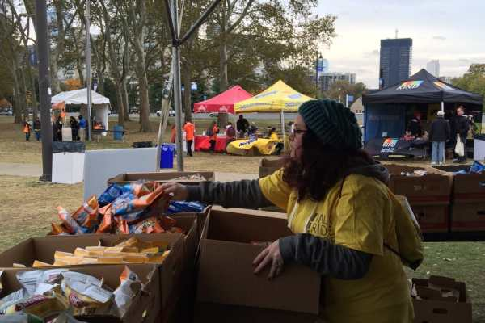

_There’s Husband pushing pretzels while I refill Cheetos!_

We were on our feet for the next 5 hours refilling boxes and greeting everyone, and it was wonderful. So many people would thank us sincerely for volunteering, when we were there for the same reason as they were- to support the important cause that impacted each of us. We will definitely be volunteering in the years to come!

All the team shirts lined up on the fence!

Okay, so this didn’t turn out to be so much as a Wordless Wednesday as it did a Wordy Wednesday, but that’s okay! You got to see pics from the race and I got to share something important to me. 🙂

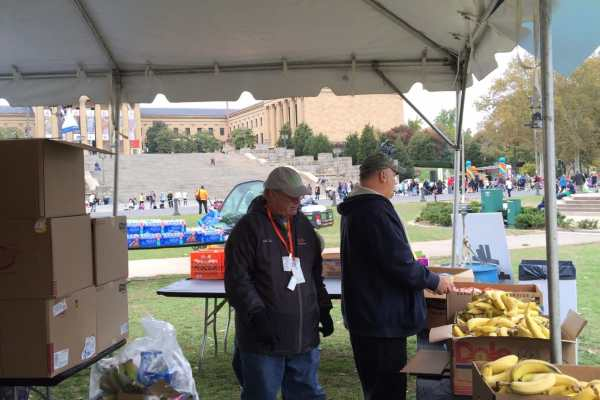

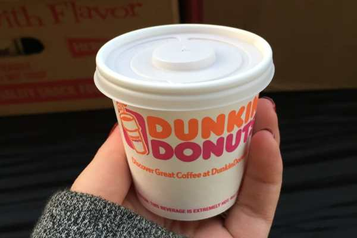

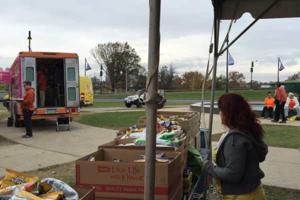

_How cute was my teeny tiny baby sample cup from Dunkin, who provided us with free coffees all day?!_

Have you ever volunteered at a race or walk before? What causes are important to you?
