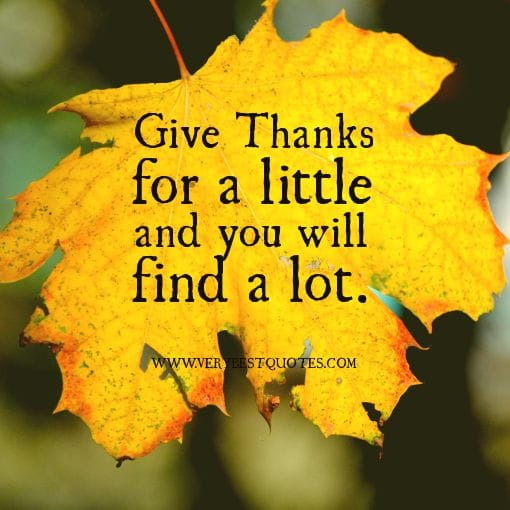

Today’s Words for Wednesday are about tomorrow’s holiday! Here are a few quotes I gathered from

**[Pinterest](https://www.pinterest.com/imkatiecrafts/things-that-inspire/)**

that are about giving thanks. They are both lovely sentiments and really pretty to look at, too! Enjoy these quotes and enjoy your

**[Thanksgiving](/5-last-minute-thanksgiving-side-dish-recipes/)**

!

I guess today is both a “Words for Wednesday” and “Wordless Wednesday” since I am not saying too much myself! That’s just because I love the artwork created for each of these wonderful quotes, so there isn’t much to say. If you do too, be sure to check out the originals by visiting each of their pins.

Which quote reminding you to give thanks did you like best? Pin it on Pinterest!
