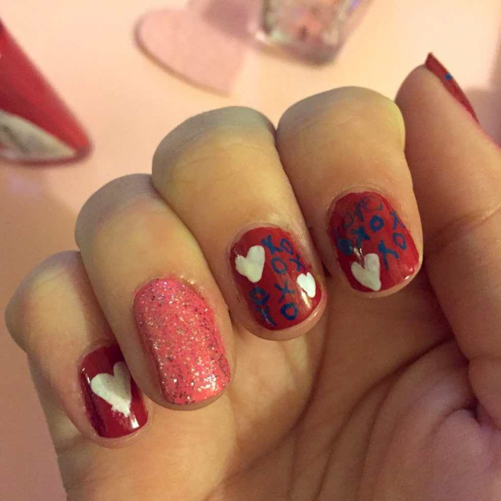
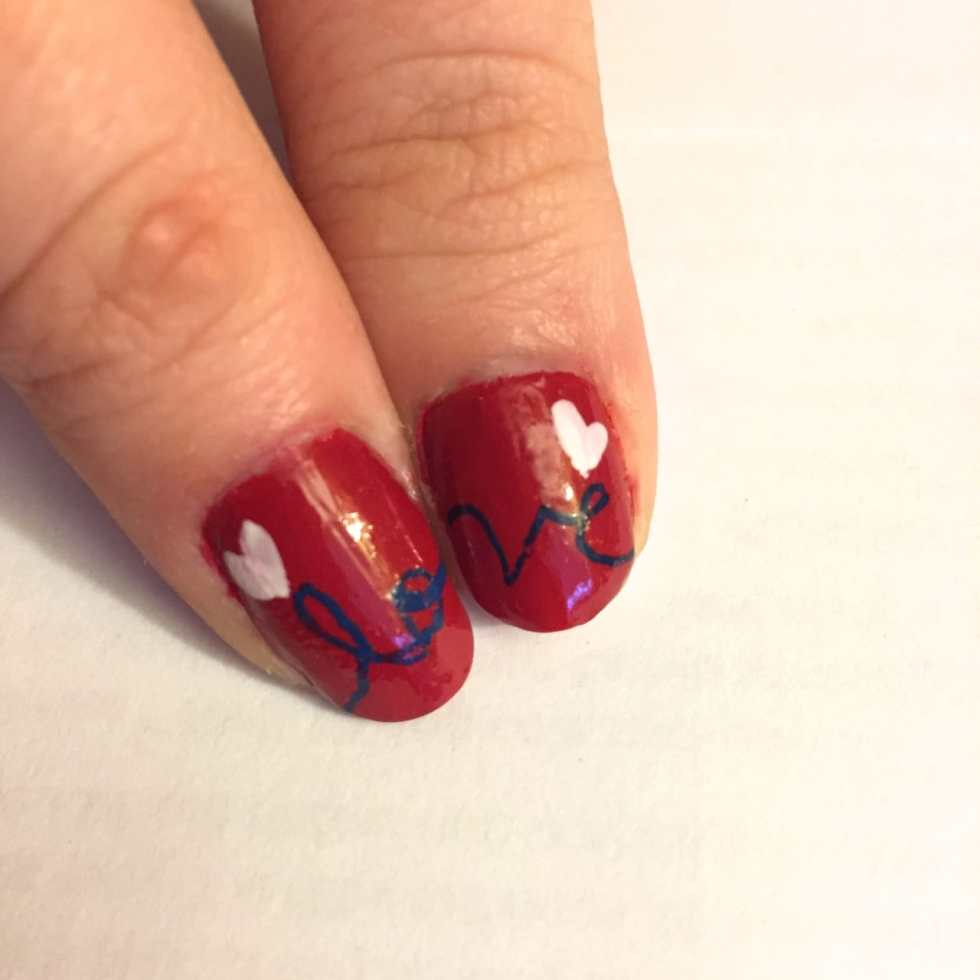
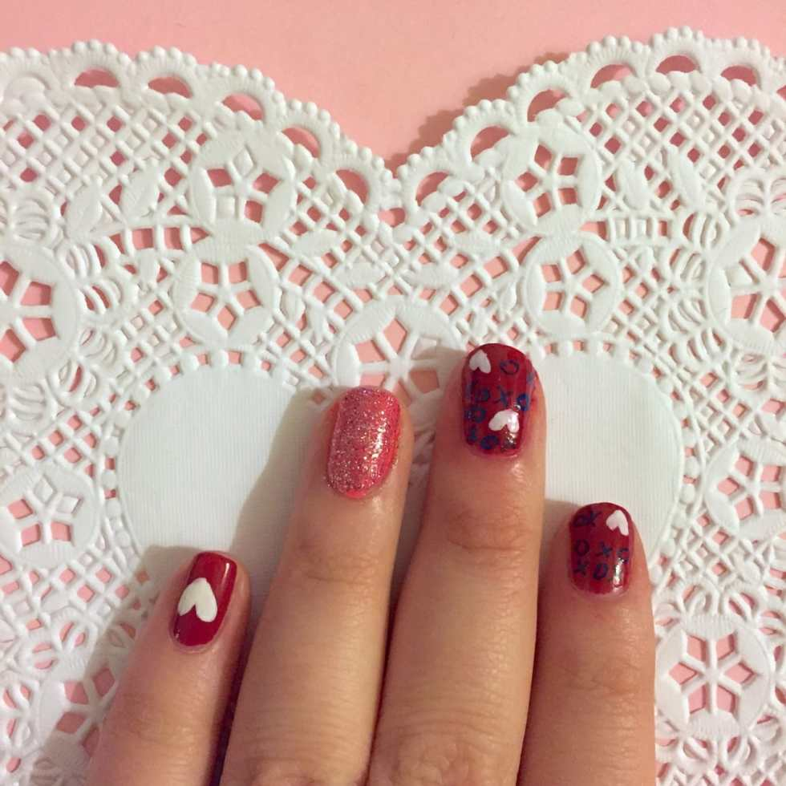

XOXO Valentine’s Nail Art Design

In case you missed it, yesterday I was lucky enough to be a guest blogger over at

[**The Art and Tree Chatter of Aquariann**](http://blog.aquariann.com/2015/02/valentine-manicure-heart-nail-art.html "Valentine Manicure Heart Nail Art on Aquariann")

! It’s Kristin (Miss Aquariann herself)’s birthday week so I was happy to jump in with a Manicure Monday post sharing a cute nail art design I plan on wearing this Valentine’s Day. I will re-post it below now, so you guys can see it too!

## Materials:

- Red nail polish

- Pink nail polish

- Pink glitter polish

- White nail polish

- Clear top coat

- Nail art pen in blue or black (I used one from

  [**Sally Hansen**](http://amzn.to/1Ccftzw "Sally Hansen Nail Art Pen in Black on Amazon")

  )

## Instructions:

- Begin with clean, dry nails.

- First, paint all your nails red, except your ring fingers which you’ll paint pink. Do one or two coats- however many it takes to make them opaque. Let dry.

- Once they are 110% dry, use the white polish to make little hearts on the red nails and let dry.

* Use your nail art pen to draw X’s and O’s on your pointer and middle fingers.

You can tell this my right hand by how terrible the writing is on it!

- Draw “lo” and “ve” in cursive on your thumbs, so that when you put them together they spell “love”!

- On the pink nails, use a generous coat of your pink glitter polish to make your accent nail really pop.

- Seal each nail with a clear top coat and you’re good to go!

I know these won’t last all the way until Saturday, but I’m going to try to extend their life with extra care over the next 6 days! They’re too cute not to wear for V-Day! Be sure to drop by the original post over at

[**Aquariann**](http://blog.aquariann.com/2015/02/valentine-manicure-heart-nail-art.html "Valentine Manicure Heart Nail Art on Aquariann")

and wish her a happy birthday!

How are you doing your nails this Valentine’s?
