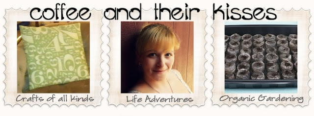
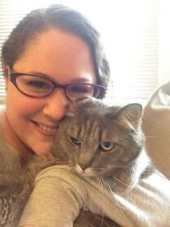
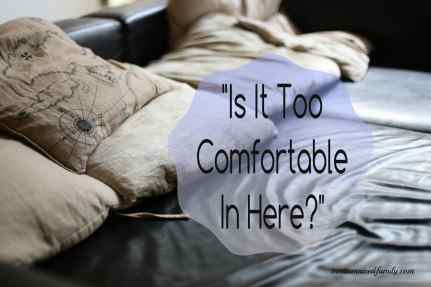

_Yarn Bombing- also known as yarn storming, guerrilla knitting and graffiti knitting: type of street art wherein colorful yarn displays are crocheted or knitted around objects._

There are many trees, signs, poles and more around Philadelphia that have been yarn bombed by others, but I was feeling the tree outside our house was kind of lonely, so I started on my own sweater for him! What do you think of the colors I picked so far? I think the blues and browns will be lovely.

Mabel was helping me choose colors for this project!

I’ll be sure to explain more about yarn bombing as well as post pics of the finished product once it’s sewn on to the tree! I may even make something for the tiny tree at the end of our street too, in case he is also lonely… Have you ever yarn bombed anything before?

In the meantime….

Last month, I shared some posts on a blog hop called “What Are You Doing?” that

[La Vie en May](http://www.lavieenmay.com/)

was participating in- and I won a guest co-hosting spot for the month of September! Yay! For the rest of the month, you’ll get a chance to check out some new great posts and even enter to win a future guest spot just by visiting my blog and posting your own links on this fun hop hosted by Content in the Meantime. Enter by clicking the link at the bottom of the page!

### Welcome to this week’s blog hop!

This blog hop runs from Monday 12:00 PM through Friday 11:59 PM EST.

### Your hosts:

Sara from

[Content in the Meantime](http://contentemeant.blogspot.com/)[Kassandra from](http://contentemeant.blogspot.com/)[Coffee and Their Kisses](http://coffeeandtheirkisses.com/)

[\
\
](http://coffeeandtheirkisses.com/)

### Meet your co-hosts for the Month of September:

Katie from

[Katie Crafts](/)\
[Pinterest](https://www.pinterest.com/imkatiecrafts/)[Twitter](https://twitter.com/imkatiecrafts)[G+](https://plus.google.com/+Katiecrafts215/posts)[Instagram](https://instagram.com/imkatiecrafts/)[Bloglovin](https://www.bloglovin.com/blogs/katie-crafts-crafting-sewing-recipes-more-11771265)[Facebook](https://www.facebook.com/imkatiecrafts)!

Joan from

[Starting Over…Again](http://www.jrrmblog.com/)\
[Pinterest](https://www.pinterest.com/jmerrell81/)[Twitter](https://twitter.com/jrrmblog)[G+](https://plus.google.com/+JoanMerrell/posts)[Instagram](https://instagram.com/jmerrell81)[Bloglovin](https://www.bloglovin.com/blogs/starting-over-again-13770881)[Facebook](https://www.facebook.com/jrrmblog)

### Featured posts of the week:

Posted below is the featured blog post of the week. I love to find unique blogs and post to share about and write little comments on their writings. I try my best to give every blog a chance to be chosen, so make sure to enter your blog every week!

[Jamie from Medium Sized Family](http://www.mediumsizedfamily.com/is-it-too-comfortable-in-here/)

shared a great post on challenging yourself on the changes you make in your life. She made a really good point on justifying a food purchase, and I don’t really want to say anything else on it because I want you to read it yourself! It just really challenged me to change the way I think about restrictions. Thanks for sharing, Jamie! Congratulations to the featured blogs!

<http://contentemeant.blogspot.com/2015/8/what-are-you-doing-blog-hop-113.html”>

Don’t forget to check out the other blogs from last week!

### What have I been doing?

- Sara’s Post:

  [Content in the Meantime – Crochet Style Ideas: Free People](http://contentemeant.blogspot.com/2015/08/crochet-style-ideas-free-people.html)

- Joan’s Post:

  [Starting Over Again – 5 Steps to a Successful Grocery Budget](http://www.jrrmblog.com/debt-2/5-steps-to-a-successful-grocery-budget/)

- Katie’s Post:

  [Katie Crafts – Fashion Inspiration: 3 Labor Day Looks](/fashion-inspiration-3-labor-day-looks/)

[a Rafflecopter giveaway](http://www.rafflecopter.com/rafl/display/9948790e10/)

### Now it’s your turn! What have you been doing this week?

- **Please post the link to a specific blog entry, not just the blog.**

  I look at every link posted,and I comment in every entry. If you don’t post a specific entry I can’t comment!

- **Adding your email address will add you to my blog hop email list.**

  I will only send you an email once a week informing you of the blog hop. If you don’t want to be emailed, just

  [let me know](mailto:silverluna316@gmail.com)

  .

- **If your blog is featured on this blog hop, I will be using the picture you posted on the linky.**

- **All blog posts will also be pinned on my[What Are You Doing? Pinterest board](http://pinterest.com/saracraft/what-are-you-doing-blog-hop-entries/), so others can see the awesome things you are doing!**

- **Family friendly posts, please!**

- **\*NEW\* I also added a LIKE feature to the list, so make sure you check out the other blogs and like your favorite!**

  Help me choose the featured blogs for the week! You only get one choice for a favorite though, but if you have other favorites, let me know in the comments!

[Follow Sara @ Content in the Meantime’s board What Are You Doing? Blog Hop Entries on Pinterest.](http://www.pinterest.com/saracraft/what-are-you-doing-blog-hop-entries/)

Grab a Button!

<http://contentemeant.blogspot.com/search/label/WAYD%3F%20Wednesdays”>

Follow Content in the Meantime for future blog hops!

Follow Coffee and Their Kisses!

\#mc\_embed\_signup{background:#fff; clear:left; font:14px Helvetica,Arial,sans-serif; }

/\* Add your own MailChimp form style overrides in your site stylesheet or in this style block.

We recommend moving this block and the preceding CSS link to the HEAD of your HTML file. \*/

(function($) {window\.fnames = new Array(); window\.ftypes = new Array();fnames\[0]=’EMAIL’;ftypes\[0]=’email’;fnames\[1]=’FNAME’;ftypes\[1]=’text’;fnames\[2]=’LNAME’;ftypes\[2]=’text’;}(jQuery));var $mcj = jQuery.noConflict(true);

**Powered by Linky Tools**

[Click here](http://www.linkytools.com/wordpress_list.aspx?id=260335\&type=thumbnail)

to enter your link and view this Linky Tools list.
