Project: Yo-Yo Flowers

Today’s project is a very versatile one! You can make yo-yo flowers out of

**any**

type of fabric, in

**any**

size, and use them for

**any**

project you can dream up! They are the perfect embellishment and a really great beginner project for a new crafter.

‘Yo-yo flower’

is a funny name, but it makes total sense. After you hand-stitch around the entire circle of fabric, you pull the thread (just as you’d pull a yo-yo’s string) to gather it together into a little round flower (resembling a toy yo-yo.) Easy and cute.

## Materials (For One Flower):

- Two different fabrics, in contrasting colors or different patterns (we’ll refer to these later as Fabric A and B)

- Round templates to cut circles (these can be the bottoms of cups, candles or other round objects you find around your house!)

- Scissors

- Needle & Matching Thread

- Buttons

- Pencil or chalk

## Instructions:

- First, figure out how large you want your largest yo-yo flower. The yo-yo will end up being approximately HALF that size, so be sure to double the size of the circle from the start.

- Use your template, mug or other circular item to trace a circle on the wrong side of Fabric A with your pencil or chalk.

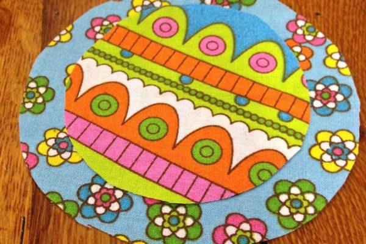

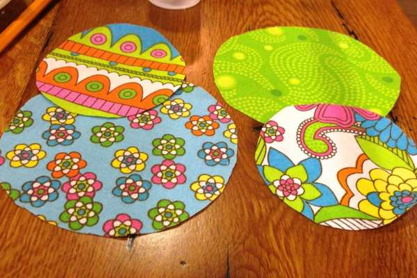

- Cut out the large circle from Fabric A.

- Repeat above steps for Fabric B. Make sure this circle is about a half inch smaller all the way around.

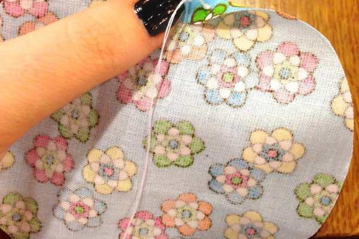

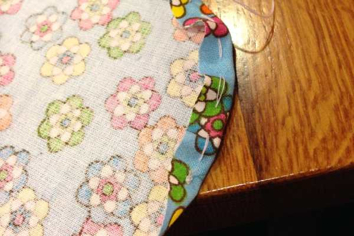

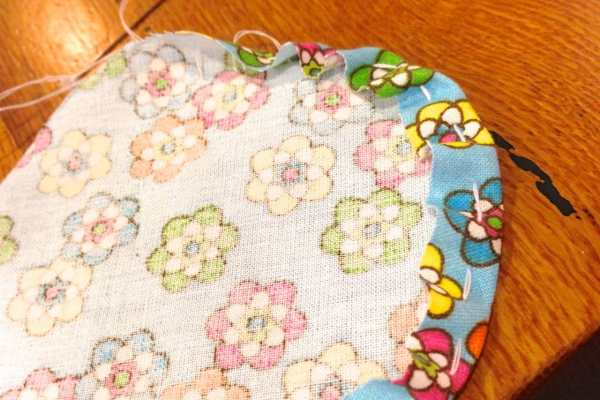

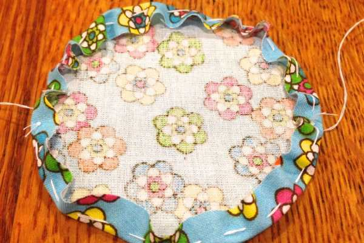

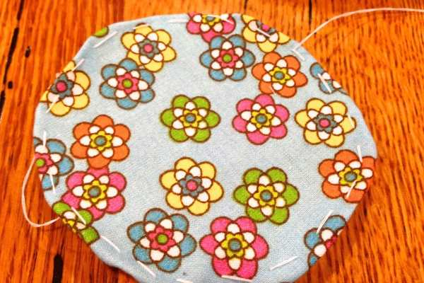

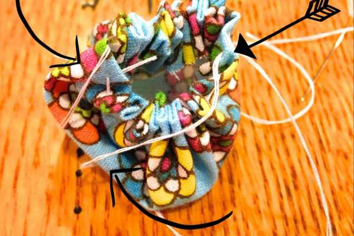

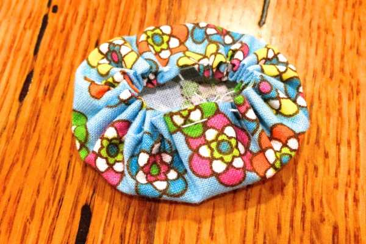

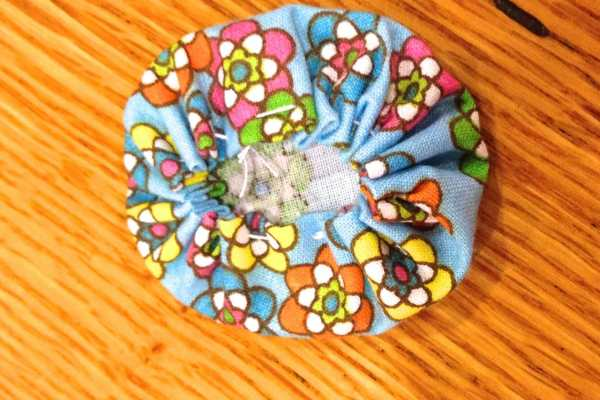

- Take the large Fabric A circle, fold edge back about a 1/4 inch, and continue to do so while you turn and hand-sew a running stitch. Do this all the way around using a matching thread. I used white for this tutorial so you can see it easily!

- When you’ve come back to the point you began at, leave a long tail of thread and snip.

- Gently pull the thread little by little until the yo-yo flower begins to gather and take shape. Don’t worry if it’s looking kind of wonky (photo above with tons of arrows pointing to crazy threads shows that!) Once you’ve finished gathering and flattening it all out, it will be great.

- When the entire flower is gathered with a tiny “donut-hole” at the center, knot the thread and snip off excess. Flatten flower.

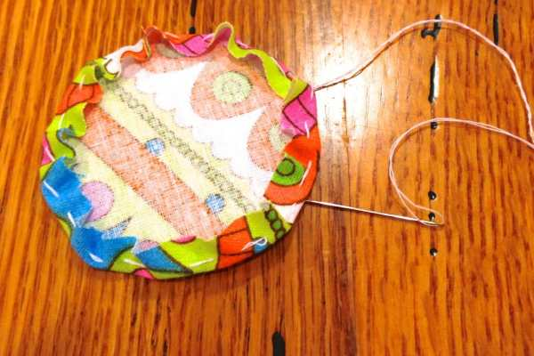

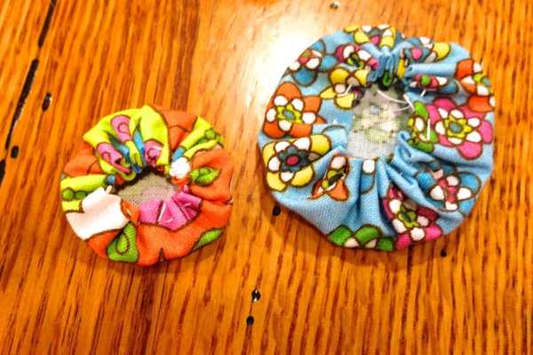

- Repeat for smaller Fabric B circle.

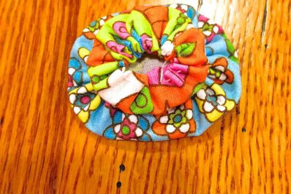

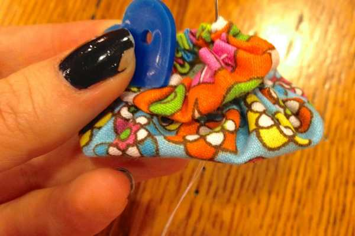

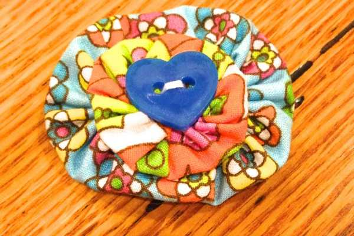

- Flatten out and place the smaller yo-yo on top of the larger one, gathered donut-hole sides facing up.

- Find a button that you love that covers the hole and stitch it securely on, through

  **ALL**

  layers of fabric.

- Voilà! You’ve made a simple and adorable fabric yo-yo! Now you can use these little yo-yo flowers in tons of projects! I’ve used them for a decoration on baby headbands for my niece!

- Repeat all steps for each flower!

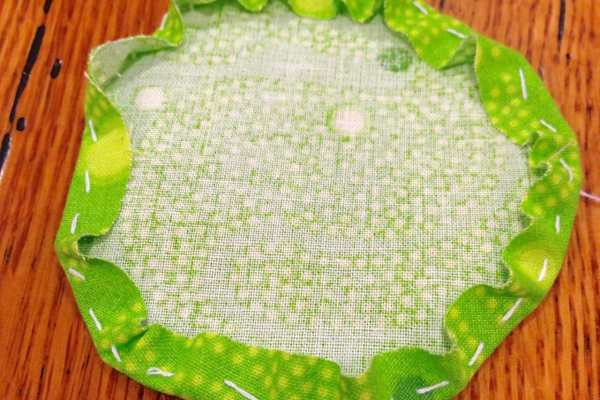

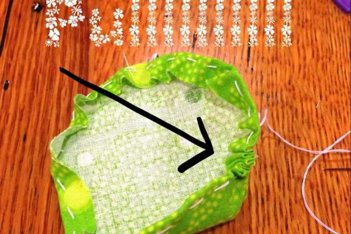

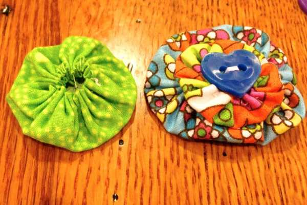

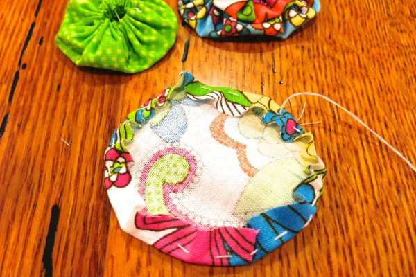

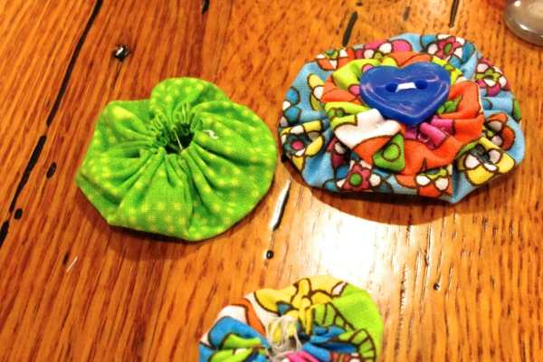

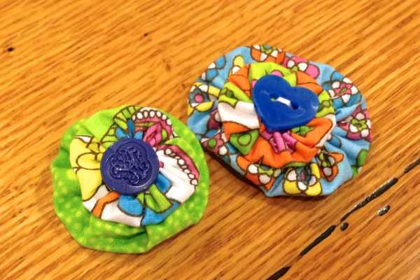

## Tips:

- There are different ways to make these flowers different sizes. As you can see, I started off with two sets of matching sized circles. On one I pulled the thread very tightly at the end of each circle, making the donut-hole middle smaller. On the other, I pulled a little less and left the donut-hole a little larger. This changed the size of each flower. It’s up to you how to do it! If you want your yo-yo flowers to be uniform, just make sure you do the same thing each time!

* Besides flowers for a headband, you can use these yo-yo flowers for many projects! Some examples include: scrapbooking embellishments, brooches/pins/jewelry, decoration for clothing, wedding project enhancements, or stitch them together to make a banner or even a belt!

- These flowers are wonderful for new crafters as well as children! There are

  [plastic needles](http://amzn.to/1htMIY8 "Plastic Needles on Amazon")

  you can buy kids if you are worried about sharp metal needles, but they don’t move easily through all fabrics. Be sure to check that before purchasing!

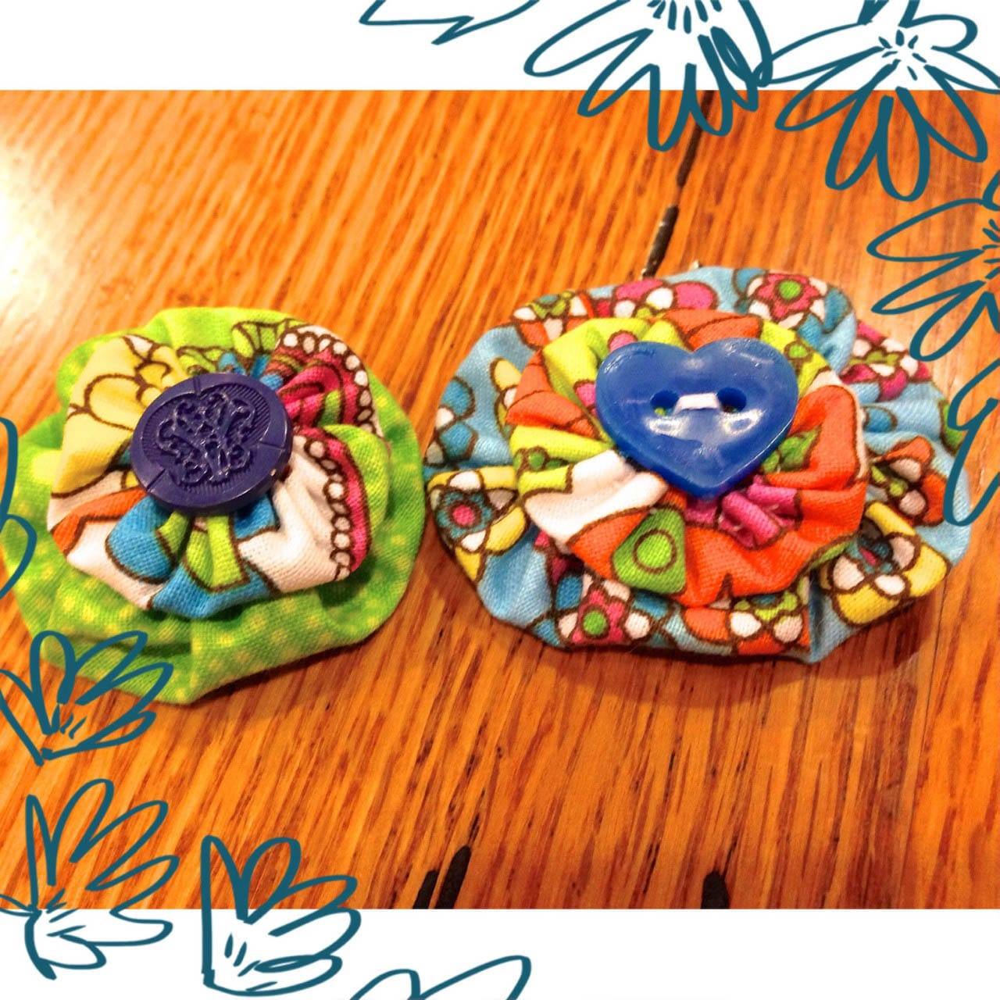

If you’ve tried this project and loved it, tell me in the comments! What other uses do you have for yo-yo fabric flowers?
