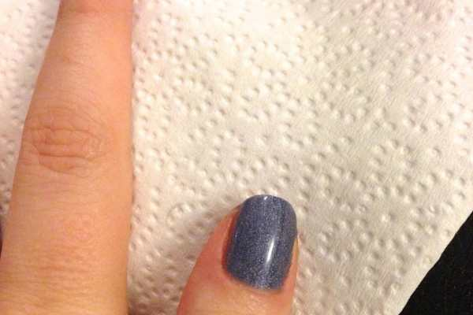
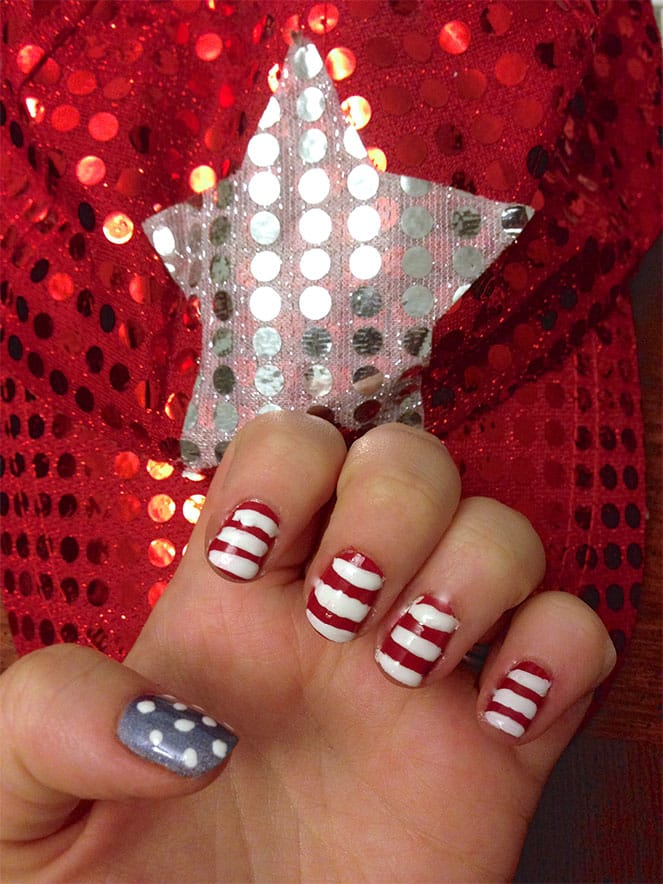

4th of July Nail Art: Two Designs!

Happy Fourth of July! Today we are praying for no rain in the evening hours so we can have our annual picnic on the banks here in Philly as we watch the fireworks! In preparation for this Independence Day, we picked out our red, white and blue outfits and did our nails to match! Okay, so *I* did our nails, while Sister sat huffing and puffing. Either way, we have some really cute patriotic nails for the holiday!

We painted our fingernails and toenails different designs, and included both below so that you can try either or both! If you use quick dry polish, you can totally get your mani-pedi done before it’s time to leave later!
<h2>Materials for Both Looks:</h2><ul><li>
Red nail polish
</li><li>
Blue nail polish
</li><li>
White striper OR white nail polish and nail art brush
</li><li>
Dotting tool
</li><li>
Silver glitter nail polish, transparent or crackle kind
</li><li>
Clear top coat
</li></ul><h2>Instructions for Fingers:</h2><ul><li>
Start with clean, manicured nails.
</li><li>
Paint your thumbs with one coat of blue. Let dry.
</li><li>
Paint the rest of your nails with one coat of red. Let dry.
</li></ul>

          
        

          
        

<ul><li>
When all are dry, do another coat of blue on the thumbs, and a second coat of red on remaining fingers. Let dry completely.
</li><li>
Using your white striper tool, carefully draw lines horizontally across all your red nails. Don’t worry about getting some on your skin- you can clean this off later!
</li></ul>

<ul><li>
While those are drying, take your dotting tool and some of the white polish, and make little dots all over the blue to resemble stars. If you want it to be closer to the American Flag, make many little dots. If you prefer it to be closer to an actual star, put a big dot and carefully drag the tip of the dotting tool up and away from the center of the dot, in 5 directions to create 5 points like on a star! You will be able to fit less stars this way, but they will be super cute. I went with the dots, because it was super late when I did my nails and I was getting too tired to try anything fancy!
</li><li>
When everything is TOTALLY DRY, do any touch ups you need and then do a coat of clear to seal in your look.
</li><li>
Let dry and you are done!
</li></ul><figure id="attachment_3420" aria-describedby="caption-attachment-3420" class="post__figure"><figcaption id="caption-attachment-3420">
The stripes are totally shaky. It’s hard to make a straight line with dripping polish! Still, I think they are pretty darn cute!
</figcaption></figure><h2>Instructions for Toes:</h2><ul><li>
Alternate painting your toenails one coat each of red or blue. Let dry.
</li><li>
Paint a second coat of the same color on each nail. Let dry.
</li></ul>

<ul><li>
Use your silver glitter polish on a few select nails or all your nails- it is up to you!
</li></ul>

<ul><li>
Use a coat of clear polish to seal in your look.
</li><li>
Let dry and you are done!
</li></ul>
If you try out one of these designs, share some photos in the comments! Hope your 4th is fantastic!

