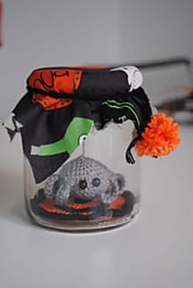

Halloween is coming! Yippee! In anticipation of my favorite day of the year, I’ve started pinning a million Halloween decoration and DIY ideas. I also decided to grab a few Halloween crochet patterns to make before October 31st. Here are five I can’t wait to try- maybe you’ll find one you love too!

All five patterns are available on
<a href="http://www.ravelry.com/" target="_blank" rel="noopener noreferrer">Ravelry</a>
. Some are free, and some are paid- but all are amazing! Whether you are into skull shawls or spiders in jars, I’ve got you covered. Looking for more Halloween crafts that don’t involve yarn and a hook?
<a href="https://www.pinterest.com/imkatiecrafts/future-diy-crafts/" target="_blank" rel="noopener noreferrer">Check out what I’ve been pinning lately!</a>
First up is the one I’m most excited about: the
<a href="http://www.ravelry.com/patterns/library/creepy-skull-triangular-shawl" target="_blank" rel="noopener noreferrer">Creepy Skull Triangular Shawl from Spider Mambo</a>
! I found a skull shawl last year that I fell in love with but the pattern was all in a different language, so I couldn’t figure it out! I am pretty psyched to make this before Halloween, and then continue to wear it all year round. I have a pretty grey yarn that is screaming to be used in this pattern!

These
<a href="http://www.ravelry.com/patterns/library/ghost-coaster" target="_blank" rel="noopener noreferrer">Ghost Coaster by Kara Gunza</a>
are boo-tacular! I will definitely be using this free pattern to whip up some cuties for my upcoming Halloween party!

How cute are these little babies? These
<a href="http://www.ravelry.com/patterns/library/halloween-girls-pdf-amigurumi-crochet-pattern" target="_blank" rel="noopener noreferrer">Amigurumi Halloween Girls by Sayjai Thawornsupacharoen</a>
remind me why I love amigurumi in the first place! They are fun, adorable and perfect for everyone! Which is your favorite?

This
<a href="http://www.ravelry.com/patterns/library/wicked-wizard-witches-hat" target="_blank" rel="noopener noreferrer">Wicked Wizard Witches Hat by Corina Grey</a>
may be meant for a child, but I know I’d definitely find a way to make it adult-sized! Who wouldn’t want to wear this really cute witchy hat!? I’d probably skip the pink and opt for a dark purple. Love it!

No Halloween would be complete without some kind of spider and web! This easy and cute (and free!) pattern will keep your spider right where he should be- in a jar where he can’t escape. I have mason jars and Halloween printed fabric already, so this
<a href="http://www.ravelry.com/patterns/library/spider-in-a-jar-halloween" target="_blank" rel="noopener noreferrer">Spider-in-a-Jar pattern by Renske de Busschere</a>
is a no brainer to try!

If you have a Ravelry account, you can find hundreds of other Halloween crochet (and knit!) patterns that are perfect for the holiday. Be sure to share your favorite below! I’d love to see what Halloween DIY you are working on!

