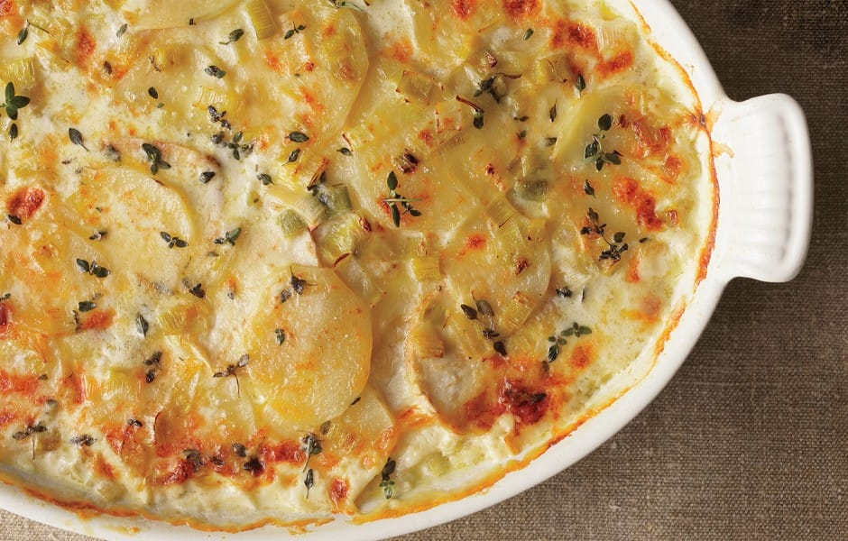
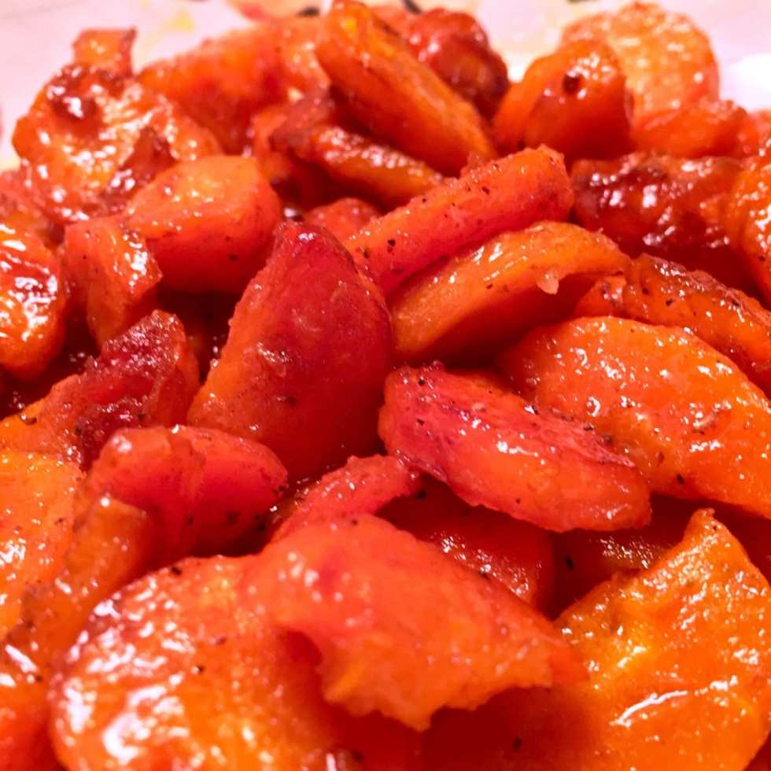

Thanksgiving is two days away! Besides the main event (the turkey!), the side dishes make up the largest portion of the meal and are sometimes even better than the bird itself. Check out these five last minute Thanksgiving side dish recipes I found on Pinterest and make some delicious sides for your feast!
<blockquote>
<em>All mouth watering photos are from each of the websites below!</em>
</blockquote>
The first recipe comes from
<strong><a href="http://juliasalbum.com/" target="_blank" rel="noopener noreferrer">Julia’s Album</a></strong>
. Brussel sprouts get a bad rep, but when they are made well they are wonderful! I love the combination of brussels with cranberries and pecans and cinnamon butternut squash in this recipe- it’s like dinner and dessert in one!
<em><a href="http://juliasalbum.com/2015/10/roasted-brussels-sprouts-cinnamon-butternut-squash-pecans-and-cranberries/" target="_blank" rel="noopener noreferrer">Get the recipe here.</a></em>
Anything that can go in the slow cooker and not require constant attention is a BIG HELP on a busy holiday like Thanksgiving. I cannot WAIT to try this Slow Cooker Creamed Corn recipe from
<strong><a href="http://damndelicious.net/" target="_blank" rel="noopener noreferrer">Damn Delicious</a></strong>
! I kind of want it right now!
<em><a href="http://damndelicious.net/2013/11/24/slow-cooker-creamed-corn/" target="_blank" rel="noopener noreferrer">Get the recipe here.</a></em>
The Homestyle Sausage Stuffing recipe from
<strong><a href="http://www.cinnamonspiceandeverythingnice.com/" target="_blank" rel="noopener noreferrer">Cinnamon-Spice &#x26; Everything Nice</a></strong>
is almost exactly the recipe I’ve had at every Thanksgiving since I was born! My Grams made it the same way with the same ingredients forever. When I took over Thanksgivings ten years ago I changed it a smidge. I omitted the onion and instead added some of the turkey gravy I’d made (which amongst many other things has an onion cooking in it) to the top of the stuffing at the end before fluffing it up. It’s my favorite side and I’m pretty bummed to not have it this year!
<em><a href="http://www.cinnamonspiceandeverythingnice.com/homestyle-sausage-stuffing/" target="_blank" rel="noopener noreferrer">Get the recipe here.</a></em>

Heavy Cream, Garlic &#x26; Gruyère- Oh My!
<strong><a href="http://www.bonappetit.com/" target="_blank" rel="noopener noreferrer">Bon Appétit</a></strong>
has a wonderful take on a normal side that makes you want to dig in! I will definitely be trying this Potatoes and Celery Root Gratin with Leeks recipe out soon.
<em><a href="http://www.bonappetit.com/recipe/potato-and-celery-root-gratin-with-leeks" target="_blank" rel="noopener noreferrer">Get the recipe here.</a></em>

Last but not least, don’t forget the carrots! My Dad’s recipe for honey glazed carrots is still my favorite, so I just had to include it for your dining pleasure! They’d be the perfect side dish to bring to whatever meal you’re attending.
<em><a href="/dads-honey-glazed-carrots/">Get the recipe here.</a></em>
For more deliciously easy recipe ideas, follow my
<strong><a href="https://www.pinterest.com/imkatiecrafts/things-to-eat/" target="_blank" rel="noopener noreferrer">Things To Eat Pinterest board</a></strong>
!

Hope you enjoyed these wonderful side dish recipes for Thanksgiving! No matter what you choose to make this holiday, have a wonderful day with your family!

