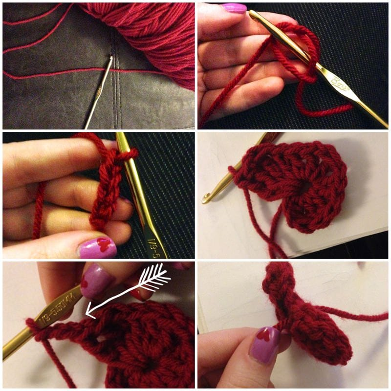
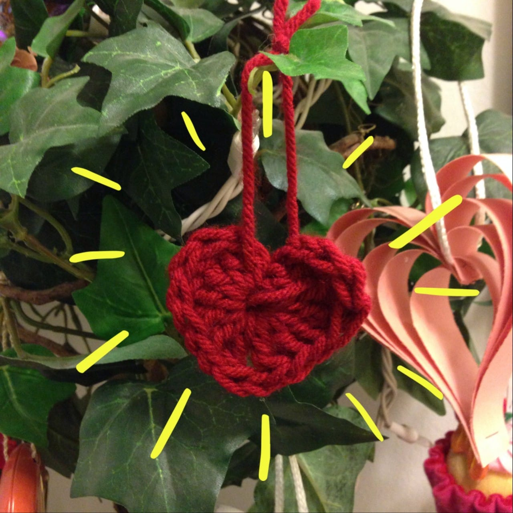

Project: 5 Minute Crocheted Hearts
<strong> </strong>
Continuing Valentine’s themes this week, here is a super simple crochet pattern for mini crocheted hearts! Each one takes only
<strong>
FIVE
</strong>
minutes to make. Make as many as you like in all different colors! Turn them in to ornaments, string them together to make door banners, use them as decoration on your homemade
<a title="Valentine’s Cards" href="/valentines-cards/"><strong>
Valentine’s cards
</strong></a>
– so many options!

Materials:
<ul><li>
Worsted Weight Yarn
</li><li>
Crochet Hook 5.5mm (I-9 US)
</li><li>
Scissors
</li></ul>

Pattern:

Key: ch = chain; dc = double crochet; tr = triple crochet; sl st = slip stitch
<ul><li>
ch 4, making sure to leave a tail of yarn about 3 inches long
</li></ul><ul><li>
work 3 tr in to first ch (continue working ALL stitches in to first ch/center of circle)
</li></ul><ul><li>
3 dc, ch 1, 1 tr, ch 1, 3 dc, 3 tr
</li></ul><ul><li>
ch 3, sl st into center and fasten off, leaving another 3″ tail
</li></ul><ul><li>
Tie tails together to hang, or weave in ends and snip to use as flat heart.
</li></ul>
That’s it! A mere 5 minutes later and you have a cute little heart! Go make a million and let me know in the comments how you used them in your projects!

