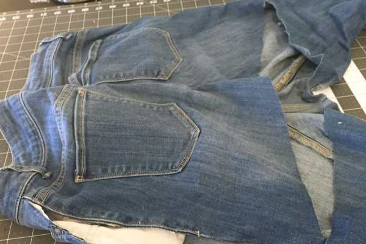
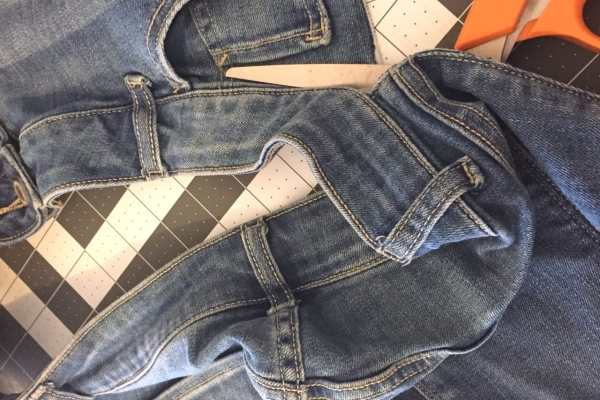
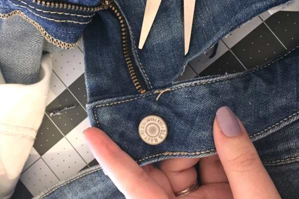
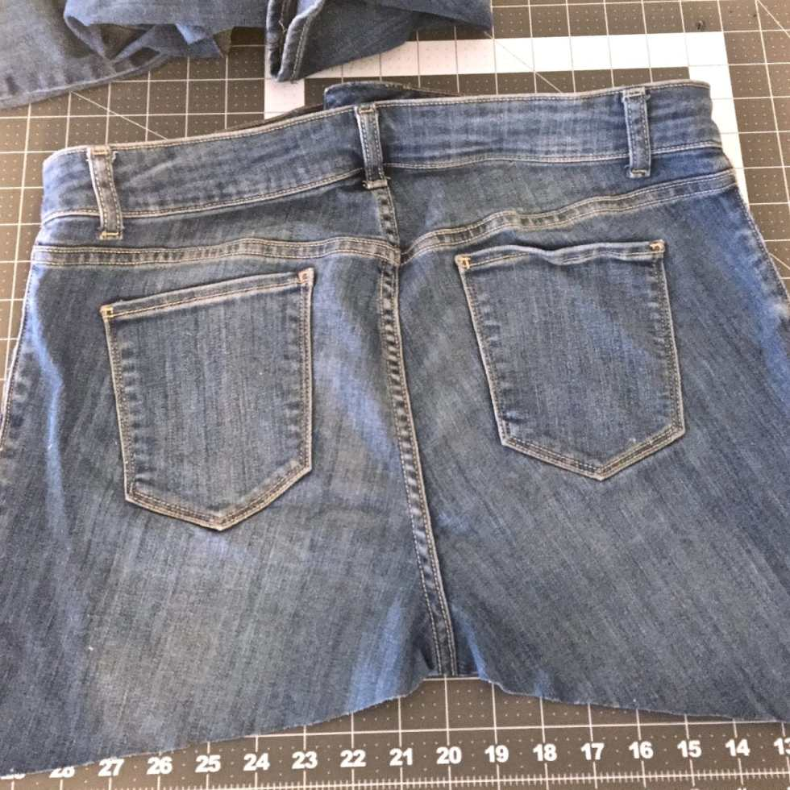
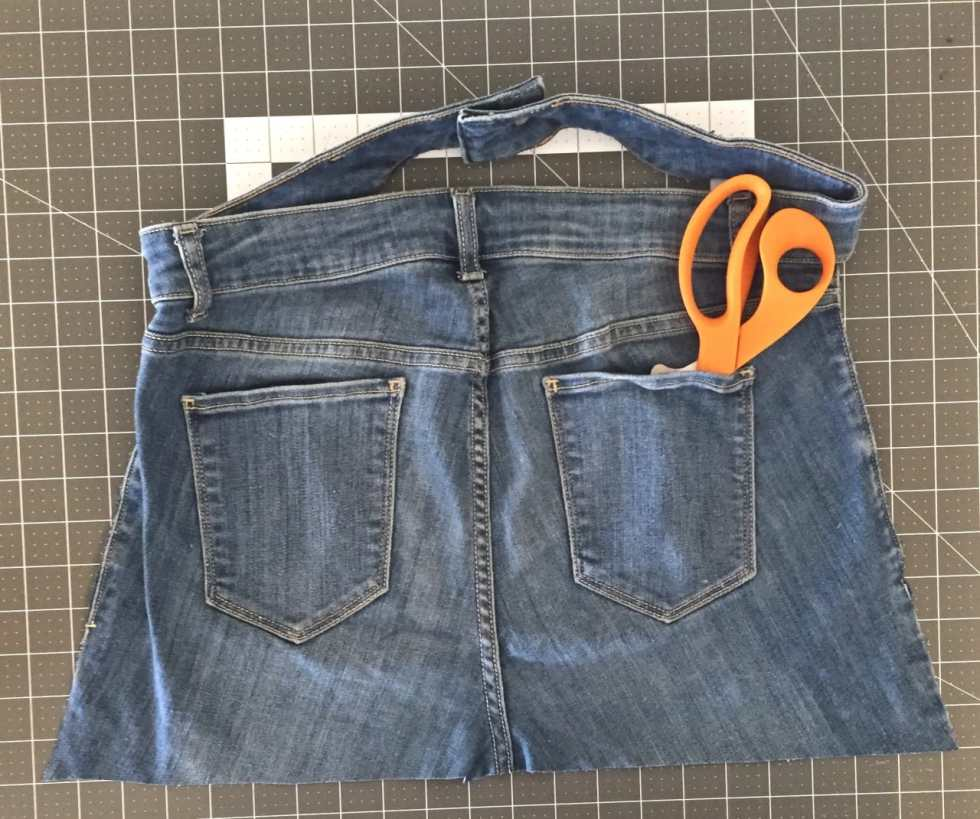
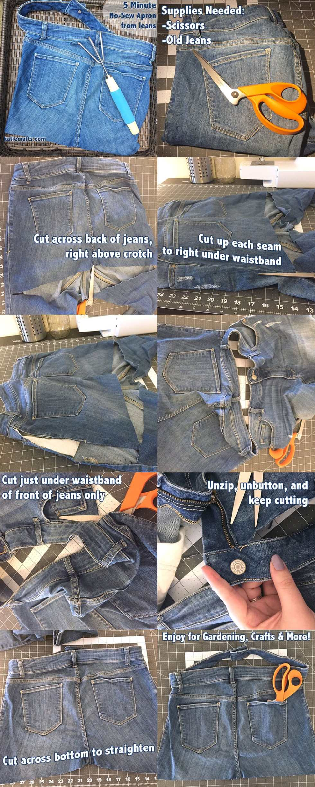

Project: 5 Minute No Sew Apron From Jeans!!
<strong> </strong>
I have been waiting to try this project out for quite some time now! I knew as soon as the nice weather came around that I would want to pot plants on our front and back patios, and I thought a cute gardening apron would make a great Spring post. I have also found myself using it indoors while I’m crafting, so you have lots of uses for this genius upcycled item! If you have five minutes and a pair of old jeans that you were just about to get rid of, try this out- you have nothing to lose!

The best part about this apron, aside from it being so easy that you’ll be mad you didn’t think of it earlier, is that it already fits you, so no measuring required! The button that you used to use in the front of your jeans will now be what closes your apron in the back, and your former back pockets will serve as front pockets for whatever tools you are using as you garden or craft. Also, any project that upcycles or recycles something is a good one to try!
<h2>Materials:</h2><ul><li>
Old pair of jeans
</li><li>
Scissors
</li></ul><h2>Instructions:</h2><ul><li>
Lay your jeans out flat in front of you, with the back pockets facing up.
</li><li>
Make a cut right across the seat, just above the crotch.
</li></ul>

          
        

          
        

<ul><li>
When you get to either side seam, cut straight up until you get to the waistband.
</li></ul><ul><li>
Open the jeans up like in the above photo.
</li></ul>

          
        

          
        

<ul><li>
Cut just under the waistband all the way around the
<strong>
“front”
</strong>
of the jeans
<strong>
only
</strong>
.
</li><li>
When you get to the zipper and button, unzip and unbutton and continue to cut.
</li></ul>

<ul><li>
Lay apron with pockets facing you again, and cut once more across the bottom to even it out and make it neater.
</li><li>
Done!!
</li></ul>

Pin the full tutorial image below so you can see at a glance exactly what to do! You will definitely want to share this project!

If you make your own apron, share a pic in the comments!

