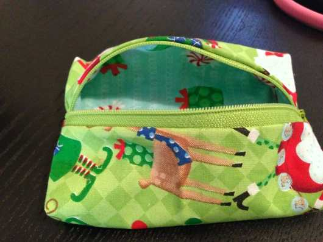
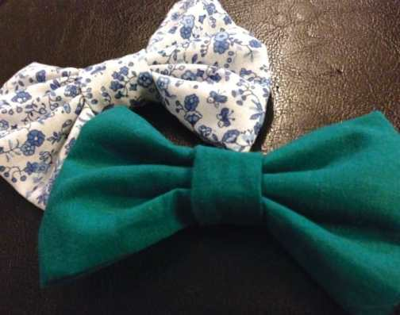
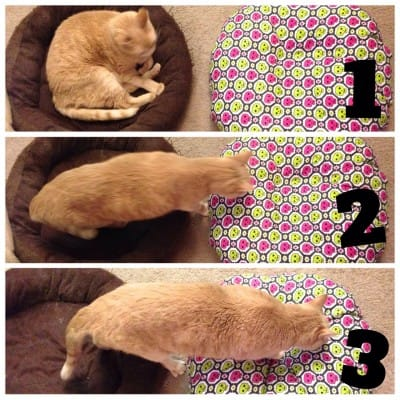
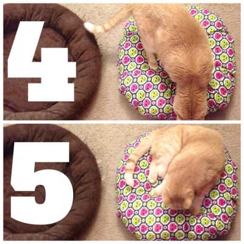
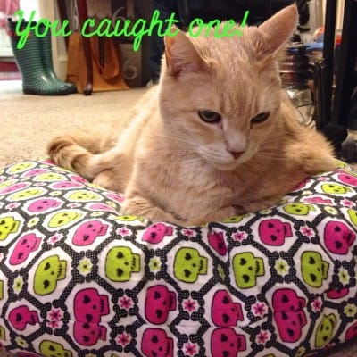

Happy (Throwback) Thursday! Today I’m sharing
<strong><em>
5 Quick Sewing Projects
</em></strong>
from the past year. They are great for people just starting out, for someone who wants to complete a weekend project early enough that they still have their weekend ahead of them, or just anyone who can’t handle time consuming projects!

It just sew happens (see what I did there?) that a few of these are hair accessories! I guess you know what one of my favorite things to make is!
<blockquote>
Note: Some of my projects require only a teeny bit of sewing (like the
<a title="How to Make a No Sew Baby Tutu" href="/how-to-make-a-no-sew-baby-tutu/">tutu</a>
), making them almost no-sew. These are not those projects. You can expect at least 5 minutes of sewing with these. 🙂
</blockquote><h2>Yo-Yo Flowers</h2>
First up, we have these adorable
<a title="Yo-Yo Flowers" href="/yo-yo-flowers/"><strong>
Yo-Yo Flowers
</strong></a>
! I recently made a dozen of these to decorate a banner for my friend’s baby shower. When the shower was over, I collected them back and will be turning them in to little baby hair clips. That is exactly what is so great about these things. They have a trillion uses!
<h2>DIY Turban Headband</h2>
Next up is one I need to make more of, now that my hair is longer! These
<a title="DIY Turban Headband Tutorial" href="/diy-turban-headband-tutorial/"><strong>
DIY Turban Headbands
</strong></a>
are really cute and can be made with just about any material. Since I got some new fabric for Christmas, I should definitely sew up a few more for the upcoming Spring months!

<h2>DIY Mini Makeup Bag</h2>

I was just part of the redditgifts exchanges again (I can’t get enough!) and the girl I had mentioned liking lipstick and nail polish, etc. I made her some earrings, bought her some Burt’s Bees and Revlon, and made her a
<a title="Third Day of Christmas: DIY Mini Makeup Bag" href="/third-day-of-christmas-diy-mini-makeup-bag/"><strong>
Mini Makeup Bag
</strong></a>
to put all the things in (which I embroidered with her name… obviously). This project works up so quickly, you’ll wonder why you haven’t made a dozen of them for different purses/back packs/etc. already! Don’t let the word “Makeup” fool you. I use one to hold scissors and needles for my Knitting Class bag. You can use it for whatever your little heart desires.

<h2>Hair Bow</h2>

These
<a title="How To Sew A Hair Bow" href="/how-to-sew-a-hair-bow/"><strong>
DIY Hair Bows
</strong></a>
have become one of my staple accessories. I have them in many colors and patterns- pretty much something to match each of my outfits. I also have a few in my
<a title="Katie Crafts on Etsy" href="https://www.etsy.com/shop/katiecrafts" target="_blank" rel="noopener noreferrer"><strong>
Etsy shop
</strong></a>
(more coming soon!), should you want to buy one instead of making it!

<h2>Cozy Catnip Kitty Pillow</h2>

This was one of my favorites to make! This
<a title="Cozy Catnip Kitty Pillow!" href="/cozy-catnip-kitty-pillow/"><strong>
Cozy Catnip Kitty Pillow
</strong></a>
was mega simple and my cat, Lucky, loved it instantly. We just recently had to throw it away since it got too dirty to wash, so I’ll be making another one soon! I used soft flannel to make it cozier and he was obsessed. I think we have a cat bed on every floor of our house. Don’t forget to learn
<em>
how to catch a kitty
</em>
below!

          
        

          
        

          
        

What other quick sewing projects do you like to do?

