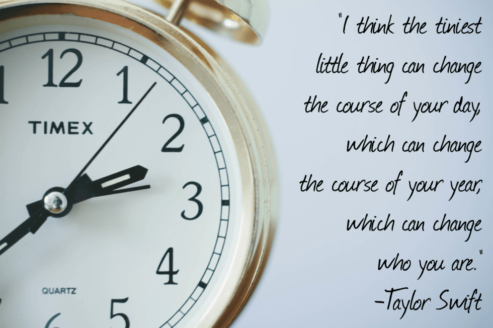

In just the course of the last three weeks, I’ve had one friend move away, one give birth to a beautiful baby girl, and another celebrate her bridal shower. Talk about big changes! I’m happy for all three of them, but at the same time it makes me feel kind of stuck. It happens sometimes to all of us, right? In case you’re in the same boat, here are five quotes pertaining to change that perhaps you will find uplifting!

Whether you’re the President of the United States, or a pop singer, everyone has an opinion on change. The above and below quotes are my favorite on the topic!

Share your favorite quote about change below!

