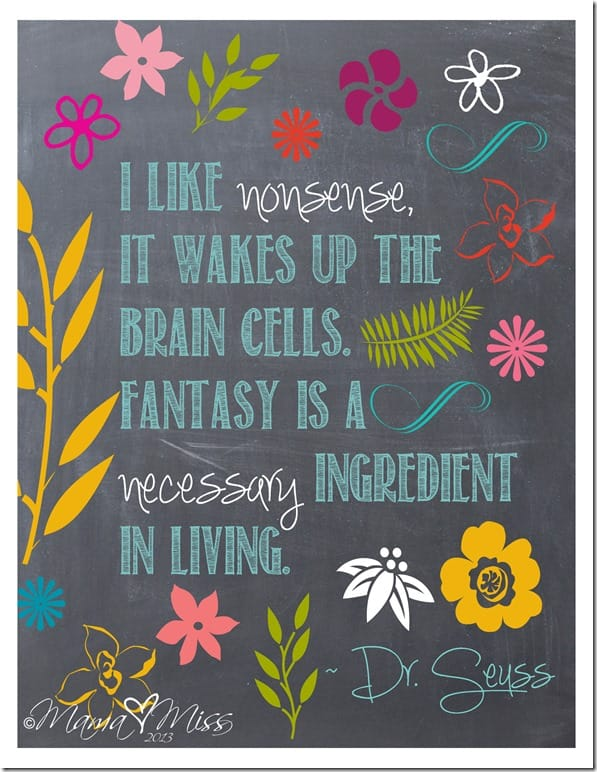
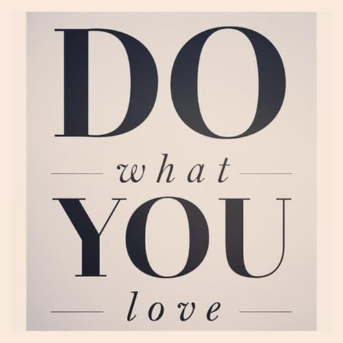

My favorite time to scroll through the boards of
<a title="Katie Crafts on Pinterest" href="http://www.pinterest.com/imkatiecrafts/" target="_blank" rel="noopener noreferrer"><strong>
Pinterest
</strong></a>
is late at night, in my jammies, when I can be totally lazy. On the boards, I’m constantly finding inspiring quotes about art, life, being creative and following your dreams. The one above by Albert Einstein is my favorite. While I could easily share with you a million different quotes, these are the 5 quotes about creativity that really stuck with me. Hope you like them too!

I just love these quotes! I’ll keep an eye out for even more great sayings and share them with you when I can. In the meantime, what quotes inspire you to create and dream? Share them with me on
<a title="Katie Crafts on Pinterest - Things That Inspire Board" href="http://www.pinterest.com/imkatiecrafts/things-that-inspire/" target="_blank" rel="noopener noreferrer"><strong>
Pinterest
</strong></a>
and I’ll re-pin them to the
<strong>
Katie Crafts
</strong>
inspiration board! Hope you’re inspired today!

