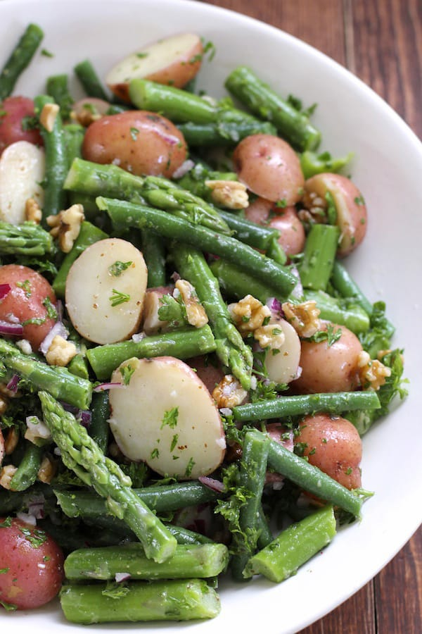
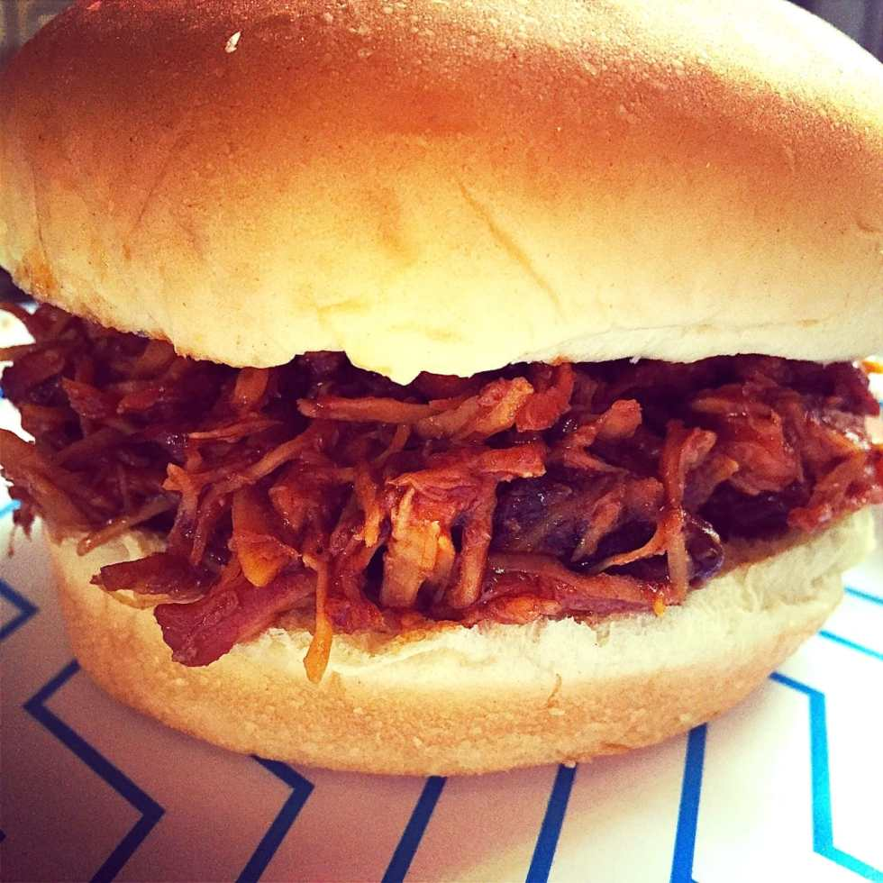

Memorial Day weekend is already here! Is it just me, or is this year basically flying by? I’ll be spending Saturday and Sunday in Jersey with family eating lots of delicious things- and Dad already promised to make us some steak on the grill! Then it’s back here on Monday to spend Memorial Day in Philly. When we get home after a long weekend, we’ll want to make something easy for the holiday. I found 5 recipes for Memorial Day that are simple and delicious that you will want to try!

photo from marthastewart.com
<h2><strong>
EJ’s Simple Ribs!
</strong></h2>
These ribs from Martha Stewart (which are making my mouth water, by the way) are baked for an hour and then grilled for a few minutes on each side. Easy peasy!
<em><a href="http://www.marthastewart.com/350115/ejs-simple-ribs?czone=food%252Fbest-grilling-recipes%252Fgrilling-recipes&#x26;center=0&#x26;gallery=275631&#x26;slide=350115&#x26;crlt.pid=camp.Kt9LNTnyWDd2" target="_blank" rel="noopener noreferrer">Get the recipe right here!</a></em>
photo from marthastewart.com
<h2><strong>
Red, White and Blue Trifle!
</strong></h2>
Yet another recipe from Martha Stewart! Let’s be honest, we probably could have found all five recipes there, right?! This one is both patriotic AND easy! We love that it’s on the lighter side- no heavy or decadent chocolate, just simple berries, lady fingers and mascarpone cream. It’s also no-bake! Score!
<em><a href="http://www.marthastewart.com/852382/red-white-and-blue-berry-trifle" target="_blank" rel="noopener noreferrer">Get the recipe right here!</a></em>
photo from freutcake.com
<h2><strong>
“Drunk In Love” Watermelon Margaritas!
</strong></h2>
OMG! I absolutely HAVE to try these perfect-for-Summer frozen cocktails from Freutcake! Her photos are absolutely fantastic which makes them even more enticing. A recipe makes one full pitcher, but I may have to make two! I don’t think I’ll want to share the first one. 😉
<em><a href="http://www.freutcake.com/in-the-kitchen/drinks-anyone/drunk-love-watermelon-margaritas/" target="_blank" rel="noopener noreferrer">Get the recipe right here!</a></em><figure id="attachment_5889" aria-describedby="caption-attachment-5889" class="post__figure"><figcaption id="caption-attachment-5889">
photo from greenvalleykitchen.com
</figcaption></figure><h2><strong>
Potato Salad with Green Beans and Asparagus!
</strong></h2>
This potato salad from Green Valley Kitchen looks delicious! I love the green veggies incorporated in it, since potato salad is usually heavy and quite unhealthy. Maybe I’ll feel like I’m not being as indulgent when I eat it. I can’t wait to give it a try!
<em><a href="http://greenvalleykitchen.com/potato-salad-green-beans-asparagus/" target="_blank" rel="noopener noreferrer">Get the recipe right here!</a></em><figure id="attachment_5888" aria-describedby="caption-attachment-5888" class="post__figure"><figcaption id="caption-attachment-5888">
photo from katiecrafts.com
</figcaption></figure><h2><strong>
Slow Cooker BBQ Pulled Chicken!
</strong></h2>
I know I’ve shared this recipe before, but it’s just SO DAMN GOOD, I had to share it again! Especially with picnic season beginning. It’s good hot, it’s good cold, it’s good all the time. And it is the absolute perfect (and EASY!) thing to make in the morning, walk away from, and then pack up and bring to a party later on. Try it- you will not be disappointed!
<em><a href="/slow-cooker-bbq-pulled-chicken/">Get the recipe right here!</a></em>
If you try any of these recipes, tell me what you thought in the comments! If you have another recipe I should try out this weekend, let me know! Have a happy and safe Memorial Day!

