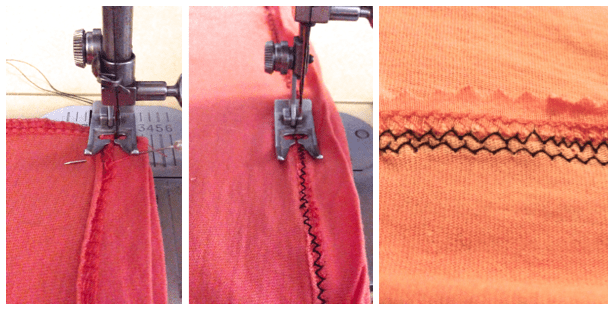
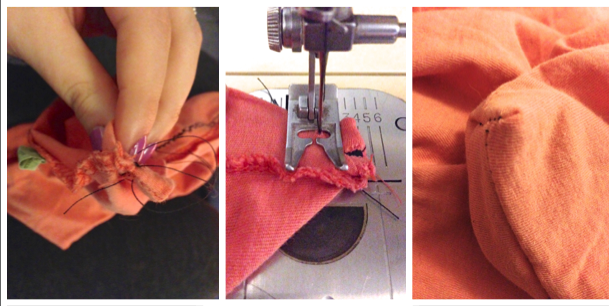
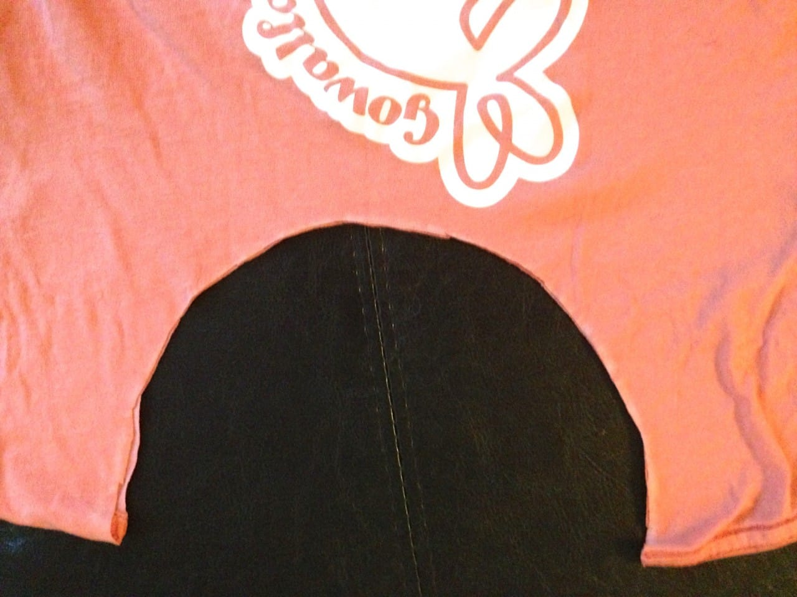

I spy with my little eye… one kitty who wants that yarn!

Project: 5 Step T-Shirt Tote
<strong> </strong>
I love working with found materials just as much as I love buying them. I may get an overwhelming rush when I walk in to
<a title="Hobby Lobby" href="http://www.hobbylobby.com/home.cfm" target="_blank" rel="noopener noreferrer"><strong>
Hobby Lobby
</strong></a>
(honestly, who of us doesn’t?), but when I find something that costs nothing or next to nothing that I can re-purpose in a project I’m just as thrilled. This project is the latter, using one upcycled t-shirt and very little time!
 
Let me preface this DIY by saying the Husband is not a fan. Granted, not everyone will like every project- but he really doesn’t like this one. He says it “still looks too much like a t-shirt.” Well, that IS the point: to rescue a t-shirt you love but can no longer wear and turn it into a bag for groceries, craft supplies, etc. while retaining it’s original design. Perhaps you’re on his side and prefer to keep your tees strictly for clothing use, and that’s fine! For those of you who get excited at the thought of saving a fave t-shirt from certain garbage bin doom, this post is for you!

It’s so easy it basically makes itself, plus it’s washing-machine friendly! I’ve decided to make this tote mega deep, to fit a whole lot of skeins of yarn, so I didn’t cut off the bottom of the t-shirt. You can shorten it to whatever length/depth you choose, though! If you chop off the bottom, this is now a 6-step tote. Not too shabby.

Materials:
<ul><li>
T-shirt
</li><li>
Scissors
</li><li>
Plate
</li><li>
Pins
</li><li>
Sewing machine
</li><li>
Chalk or marking pencil
</li></ul>
Instructions:

Step 1: Cut.

Cut your sleeves off the shirt and throw the remains in your
<strong>
scrap basket.*
</strong>
Congrats! You now have a sleeveless shirt! Wear it one more time for old time’s sake if you like.

*Once a month, I’ll feature a project made by using scraps of fabric I salvaged from past projects. They come in handy, so don’t throw them away!

Step 2: Pin.

Turn your t-shirt inside out. Make sure it’s nice and flat and the seams match up. Pin the bottom where you’ll be sewing it shut.

Step 3: Sew.

Using the zig-zag stitch on your sewing machine, stitch, back stitch a few times, and continue forward across the whole length ending in a few more back stitches. I used the existing hem as my guideline. Repeat again, for double the durability. I used black thread so you could see the photos, but always use matching when you can! Feel free to snip off excess fabric with your scissors or some pinking shears if you like.

‘Why the zig-zag stitch’ you ask? It’s much more forgiving on stretchier materials, and most tees have a bit of stretch to them!

You may consider this next bit another step, but I don’t, since it’s done quickly, requires no pinning, and is done on the sewing machine I’m already sitting in front of.

To make corners, pinch each bottom corner together and stitch across it about 1 1/2 inches from the end. Do this for each corner.

Step 4: Trace.

Turn shirt so the logo is facing you again. Lay out nice and flat on your surface. Place the plate over the neck of the shirt, as wide as you want your bag opening. Using your chalk, trace the plate.

Step 5: Cut again.

Make sure your seams are matched up and everything is laying nice and flat, as you’ll now follow your chalk line and cut through BOTH layers of the fabric. Dust off the chalk bits that are left. That’s it! You’re all done!

Such a quick bag to make! Going to try another one out with one of my husband’s old graphic tees, but make it a big shorter this time. Apologies for the terrible photos- orange is a horrible color to try to photo in different lights! If you make a t-shirt tote of your own, or have another great project that you can make using a tee, tell me in the comments!

