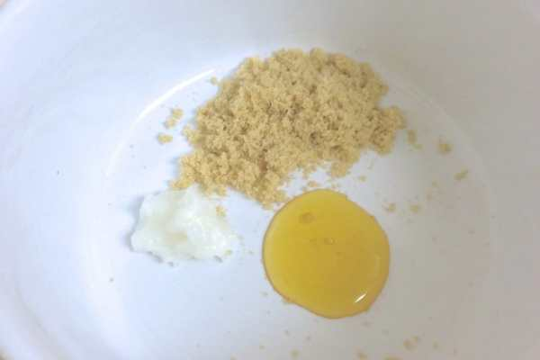
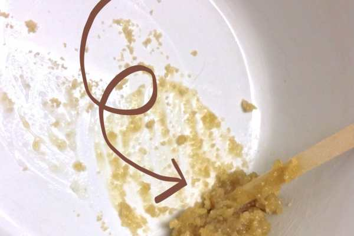

Project: All Natural Lip Scrub Recipe
<strong> </strong>
During the winter, my lips (along with just about every other inch of me) are dry and sad. I searched for a long while for an all natural scrub for my lips to rid them of dry skin, but was turning up empty handed. Everything was either filled with unnecessary ingredients or was waaaay too expensive. So, I decided to make my own!

You only need three ingredients for this lip scrub, and it’s totally natural AND edible (and yummy!) The below ingredients will make a small amount of lip scrub, but you only use a smidgen at a time, so it will still last a while. You can certainly double or triple the recipe though. Store it in your fridge for up to
<strong>
three months!
</strong><h2><strong>
Ingredients:
</strong></h2><ul><li>
1 tsp packed Brown Sugar
</li><li>
1/2 tsp Honey
</li><li>
1/2 tsp Coconut Oil
</li></ul>
First, let me tell you about the ingredients. The
<a title="Domino Light Brown Sugar" href="http://amzn.to/1bVvvil" target="_blank" rel="noopener noreferrer">brown sugar</a>
I used was light brown because that’s what I had on hand. You can use dark brown if that’s what you have on hand. Either one is fine, as both do the same job: exfoliate dry dead skin!

The second ingredient is honey. I use local honey from
<a title="Tassot Apiaries, Inc." href="http://www.tassotapiaries.com/" target="_blank" rel="noopener noreferrer"><strong>
Tassot Apiaries, Inc.
</strong></a>
that I buy from a vendor in
<strong>
Rittenhouse
</strong>
on Saturdays. It is raw honey made from local wildflowers and tastes pretty amazing! I love using local whenever I can. I’ve also made this scrub using
<a title="Clover Honey" href="http://amzn.to/1gPZPhB" target="_blank" rel="noopener noreferrer">Clover Honey</a>
that you can buy at your supermarket. No matter which honey you use, since honey is a natural preservative, your scrub will last you quite a while.

Lastly, you need coconut oil. I found it cheaper to buy a larger bottle of it rather than the smaller, since I knew I’d be trying it out for several projects and recipes (you can cook with it, too!) I looked up lots of reviews before buying, and found
<a title="Parachute 100% Pure Coconut Oil" href="http://amzn.to/1gQ0pf6" target="_blank" rel="noopener noreferrer"><strong>
Parachute 100% Pure Coconut Oil
</strong></a>
to be a good pick.
<h2>Instructions:</h2>

          
        

          
        

          
        

Measure out all the ingredients and put them in a bowl. Mix them together really well, making sure to squish out any last chunks of coconut oil or brown sugar clumps.

          
        

          
        

That’s all you need to do to make your very own all natural lip scrub! Store it in a little container in a cool place. Here is how to use it once you’ve made it:

Using your finger, rub small amount of scrub in circular motion on your lips for 30-60 seconds. Rinse off with warm water or damp towel. Try not to lick it all off (though you can if you really want!) Use your favorite lip balm after to seal in moisture.

If you don’t want to spring for all the expensive ingredients without trying it out first, you can buy the scrub from my
<a title="Katie Crafts - All Natural Lip Scrub" href="https://www.etsy.com/listing/125747203/all-natural-lip-scrub-brown-sugar-and?" target="_blank" rel="noopener noreferrer"><strong>
Etsy shop!
</strong></a><h2>Tips:</h2><ul><li>
Coconut oil is a solid unless it hits 75 degrees or warmer. You want to keep it a solid during your mixing process, as well as when using it. If you aren’t sure if your home will be cool enough for it, just store it in the fridge. When ready to use again, take out of refrigerator, place on counter to warm up for a bit, and then re-mix.
</li><li>
This also makes a really great exfoliating natural face mask!
</li><li>
Honey, along with being a natural preservative, attracts, retains and absorbs moisture into the skin. That’s why finishing the scrub with your favorite lip balm is a great way to lock in moisture!
</li></ul>
If you try out this recipe for all natural lip scrub, let me know how you like it! If you have another recipe you think I should try out, please share!

