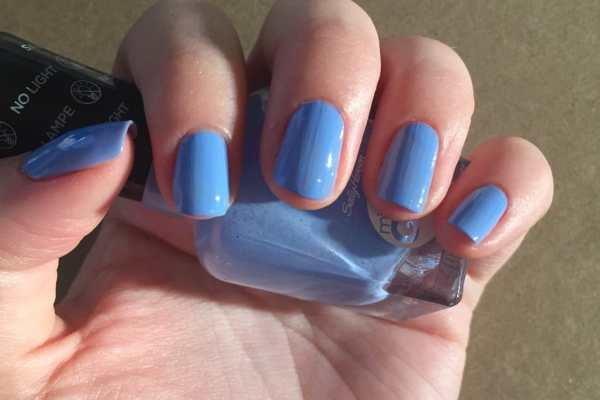
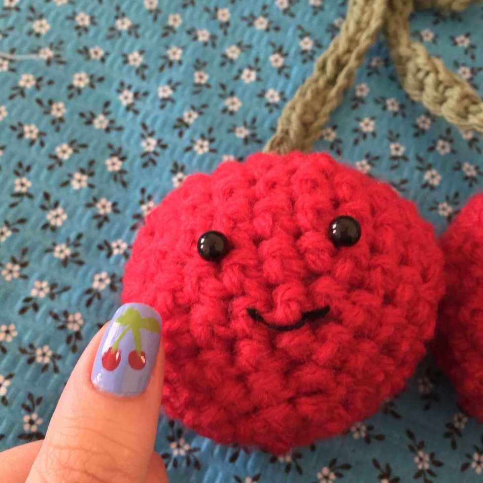

<a href="/cherry-pie-filling/">Cherry pie filling</a>

,
<a href="/5-minute-cherry-tarts/">cherry tarts</a>
, an
<a href="/amigurumi-cherries-pattern/">amigurumi cherry pattern</a>
– it’s time for one last cherry post! I used my Sally Hansen Miracle Gel (no UV light needed!) and made a cute look perfect for the Summer.

I loooove the Miracle Gel polishes! They still chip like regular polish, but they last a little longer and they make my nails feel much stronger. I just really love the feel of them. I’m waiting for a good coupon or sale to grab a few more colors! You don’t have to use the gels to get this cherry nail art look, however. You can use a regular light blue polish and clear top coat if that’s what you have on hand!
<h2>Materials:</h2><ul><li><a href="http://amzn.to/1TOdwSk" target="_blank" rel="noopener noreferrer">Sally Hansen Miracle Gel in Sugar Fix</a></li><li><a href="http://amzn.to/1MixcLN" target="_blank" rel="noopener noreferrer">Sally Hansen Miracle Gel Top Coat</a></li><li>
Red nail polish
</li><li>
Green nail polish
</li><li>
White nail polish
</li><li>
Nail art brush
</li><li>
Dotting tool
</li></ul><h2>Instructions:</h2>

          
        

          
        

<ul><li>
No need to do a base coat with the Sally Hansen Miracle Gels. Do one coat of the pretty periwinkle Sugar Fix, let dry, and do a second coat. Let that dry too!
</li></ul><ul><li>
Use the large end of the dotting tool to make two cherries on whichever accent nails you intend to decorate. Let dry.
</li></ul><ul><li>
Use the nail art brush and green polish to draw little connected stems and some leaves. Let dry.
</li></ul><ul><li>
Use a white striper or white nail polish and nail art brush to create small a small dot or line to create a little “shiny glare spot.” Let dry.
</li></ul>

<ul><li>
When your nails are totally dry, give them each a quick coat of the Miracle Gel Top Coat. Let dry and enjoy your nails!
</li></ul><figure id="attachment_6185" aria-describedby="caption-attachment-6185" class="post__figure"><figcaption id="caption-attachment-6185">
Happy Cherry gives this design a thumbs up!
</figcaption></figure>
Cherries not your thing? Don’t forget about my
<a href="/apples-nail-art-design/">apple nail art design</a>
and
<a href="/watermelon-nail-art-design/">watermelon nail art design</a>
! Any would be cute for a Summery look!

What other fruits should I paint on my nails?

