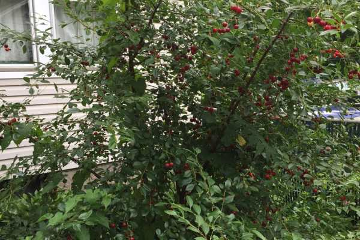
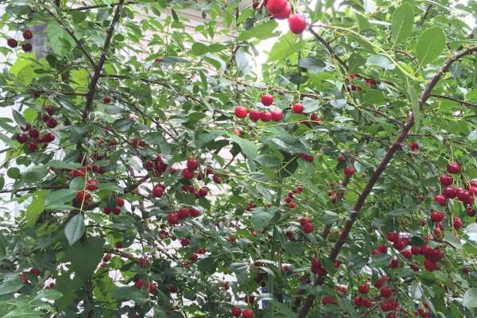
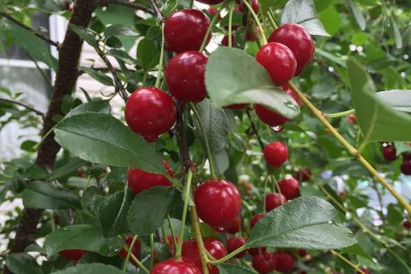
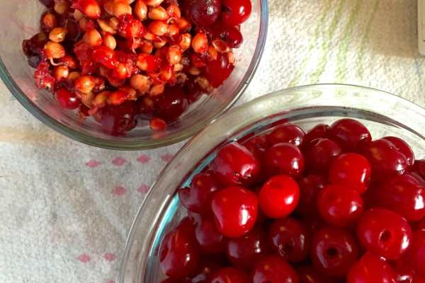
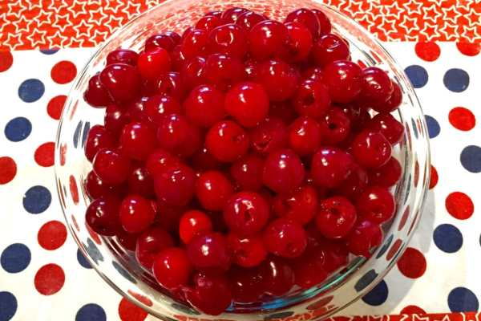

Recipe: Cherry Pie Filling

A few weeks ago, I stole a good amount of sour cherries from my Dad’s cherry tree. I put them to great use last weekend when I made homemade cherry pie filling for some cherry tarts! Next week, I will share the very easy no-bake recipe for those, but today it’s all about the filling!

          
        

          
        

Fact: I don’t like cherries. I never order cherry pie or cherry flavored things, but I wanted to make a red, white and blue dessert for 4th of July and I really wanted to use Dad’s fresh cherries to do it. When I tried the filling, I just about died. It’s so delicious! Turns out I
<em>
do
</em>
like cherries, but only if they are fresh! I hope you’ll love this recipe too!

          
        

          
        

<h2>Ingredients:</h2><ul><li>
6 cups of pitted tart cherries
</li><li>
2/3 cup water
</li><li>
2 Tablespoons fresh lemon juice
</li><li>
1/4 teaspoon vanilla extract
</li><li>
4 Tablespoons cornstarch
</li><li>
2/3 cup granulated white sugar
</li></ul><h2>Instructions:</h2>

          
        

          
        

          
        

Before you begin, pit your cherries! This part was time consuming, extremely messy (we’re talking cherry juice flying every which way!- wear gloves!!), but pretty easy to do. You just push a disposable straw through the top of the cherry and pop the pit out of the bottom. Easy peasy.
<ul><li>
Add ALL of your ingredients to a large pot on medium heat. Stir together.
</li></ul>
It looks so gross in the beginning!
<ul><li>
Bring to boil. Reduce heat and let simmer for 10 minutes until thickened. STIR CONSTANTLY, making sure it doesn’t burn on the bottom of the pan.
</li></ul>
Ahh, turning into a nice syrupy mix now!
<ul><li>
Remove from heat and let cool to room temperature.
</li><li>
Enjoy the most wonderful cherry pie filling you’ve ever had!
</li></ul>

<h2>Tips:</h2><ul><li>
Refrigerating the filling will turn it into a gelatinous jelly mass, which is totally fine but looks gross. Simply reheat in a pan over medium heat until the filling is back to a syrupy consistency. Then bring it back to room temp before using.
</li><li>
There is cornstarch in this recipe, so it cannot be frozen.
</li></ul>
What is your favorite cherry recipe?

