
Project: Cozy Catnip Kitty Pillow
<strong> </strong>
My cats, Lucky &#x26; Mabel, have a few select places they like to sleep: on top of the hamper, on top the chest, on top of clean laundry I just laid out, on top of any project I’m currently working on/my laptop, and in their little kitty bed. It’s a couple years old now and pretty much beat up and hideous. I decided it was time for a new one, one that was pretty to look at and laced with catnip to make them happy!

I wanted to choose a fabric that was super soft on their little kitty paws, so I went with a fun flannel design. The little skulls with hearts in their eyes are also super adorable so I won’t mind looking at it all day on the floor in front of me.

Besides, the old bed was pretty ugly. In fact, we usually have a blanket covering it entirely because it’s not very attractive. Upon lifting the blanket we found many crumbs. And yes, that is indeed a Starbucks coffee cup stopper thingamabob. Mabel loves to play with them, so we get her a new one every time we go. She probably has a dozen hidden around the apartment.

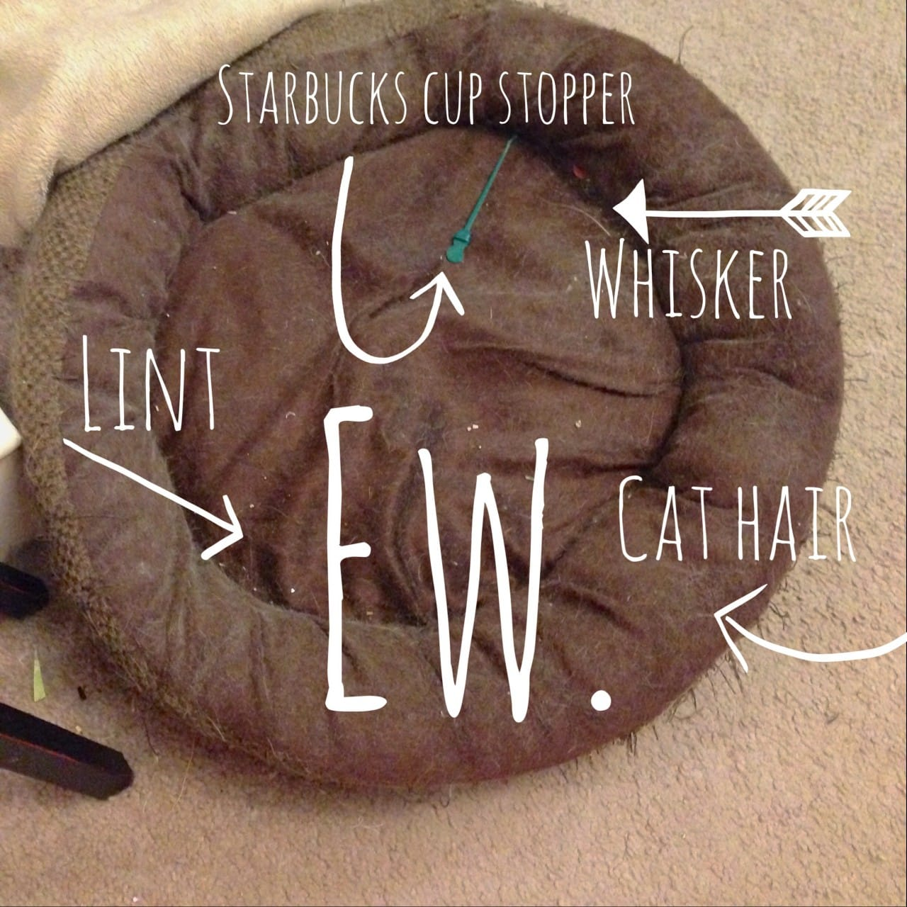

This whole project took me about
<strong>
30 minutes
</strong>
to complete, and that includes two breaks for feeding the cats some of the catnip and then picking up the container of catnip after they knocked it over.
<h2>Materials:</h2><ul><li>
One yard of fabric – you may not use all of it, but better to have it this large in case you do decide to go bigger.
</li><li>
Large circular object to trace on to fabric
</li><li>
Pencil or chalk
</li><li>
Scissors
</li><li>
Sewing machine, matching thread, and needle for hand stitching
</li><li>
Fiberfill
</li><li>
Dried catnip
</li><li>
Pinking Shears (optional)
</li><li>
One, two, or more kitties who will like this bed.*
</li></ul>
*Alternatively, you can leave out the catnip entirely and make this bed for your little pup!
<h2>Instructions:</h2>
First, make sure your fabric is large enough to accommodate two large circles. Lay it out on a fat surface.

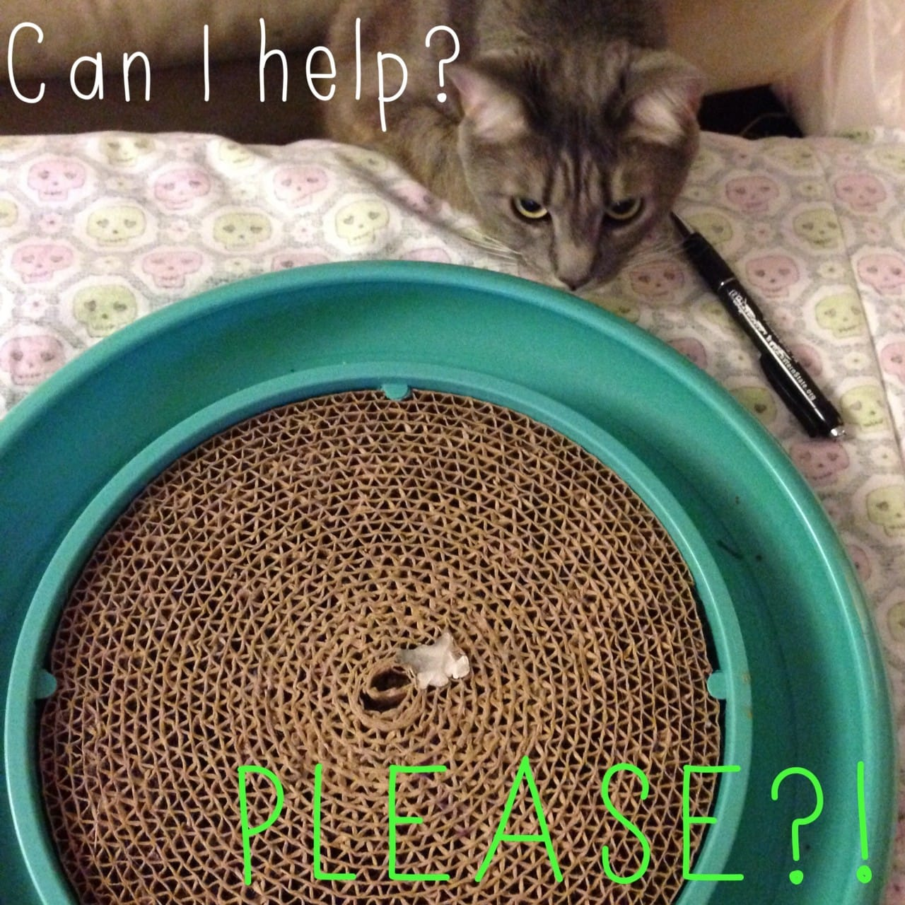

Next, trace your circle on the wrong side (the back, or non-patterned side) of your fabric with your pencil or chalk. I used Mabel’s round toy as my guide and sketched around it about three inches larger all the way around. Fight the urge to let the cat help, no matter how much she begs.

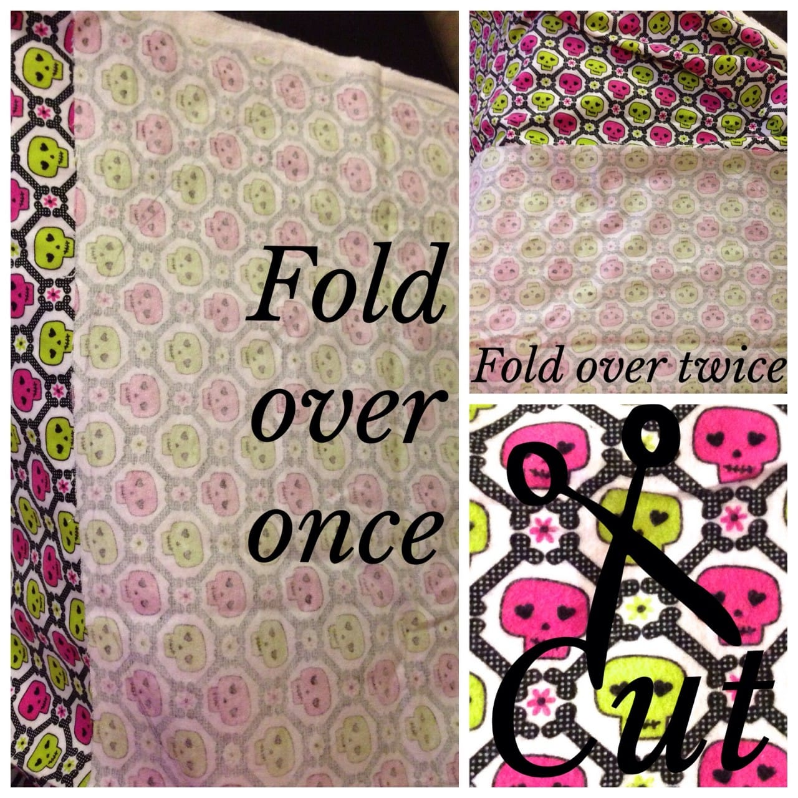

After you’ve traced it all the way around, you’ll fold the fabric in half so you have the drawn circle facing you in it’s entirety and a second layer of fabric behind it large enough to make the second circle. Then fold those layers in half across the middle of the circle so you end up with four layers and a half circle facing you. Just like you’d do with a sheet of paper that you wanted to make two matching circles out of. Cut along the mark and you’ll end up with two matching circles!

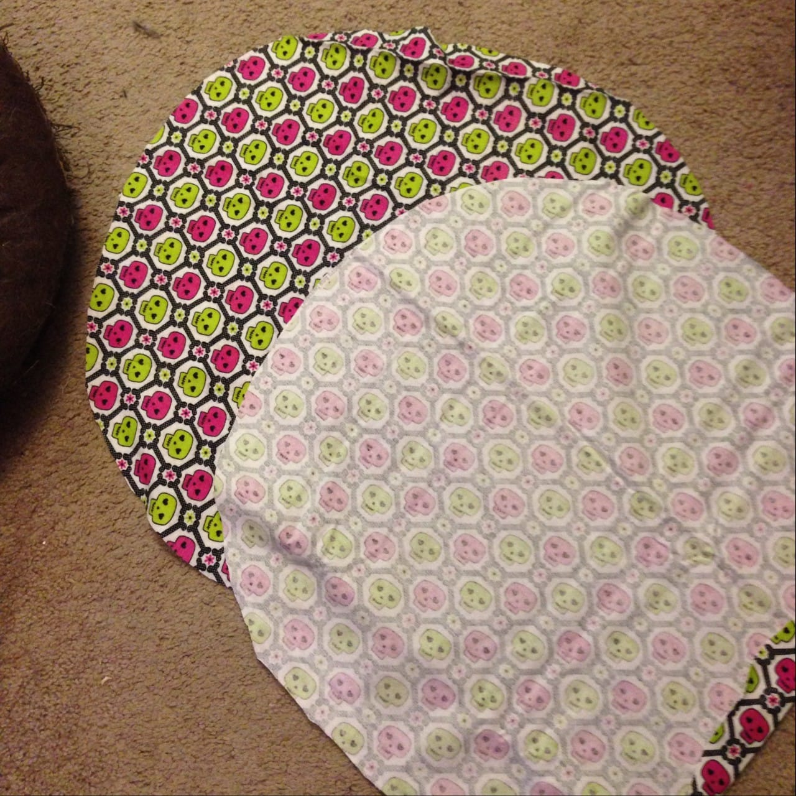

With right sides facing together, pin all the way around, leaving a gap of about 6 or so inches open. You’ll use this to turn the project inside out later and fill it.

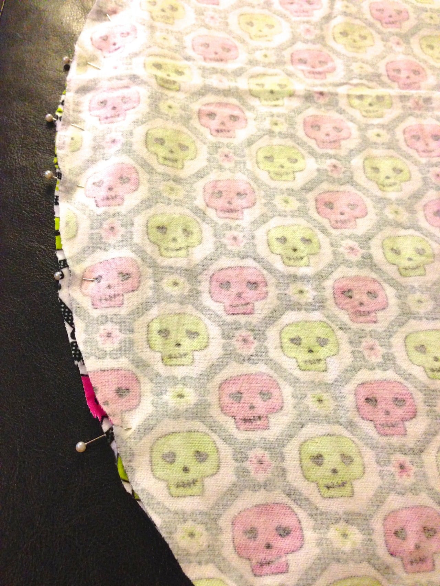

Head over to your sewing machine and run small straight stitches all the way around, minus the unpinned 6″ section. I kept about a centimeter from the edge at all times to make sure it’s a pretty round circle, but it doesn’t need to be perfect. I also used darker thread to show up in the photos but you should use matching thread when possible.

          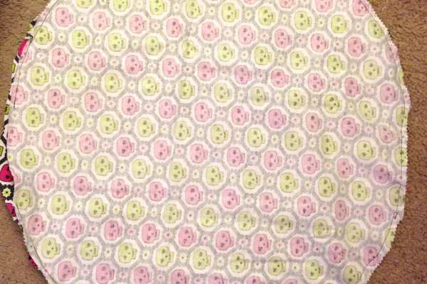
        

          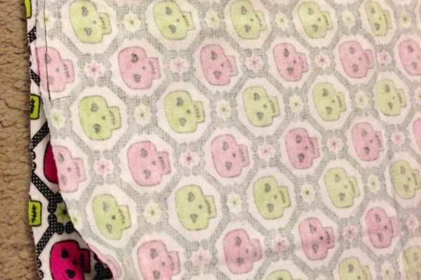
        

When you’re done with your machine, snip off excess fabric with pinking shears or by making little cuts in the fabric around the circle. This will help it to turn in the next step.

Gently turn the project inside out through the opening so the patterned side is facing you once again.

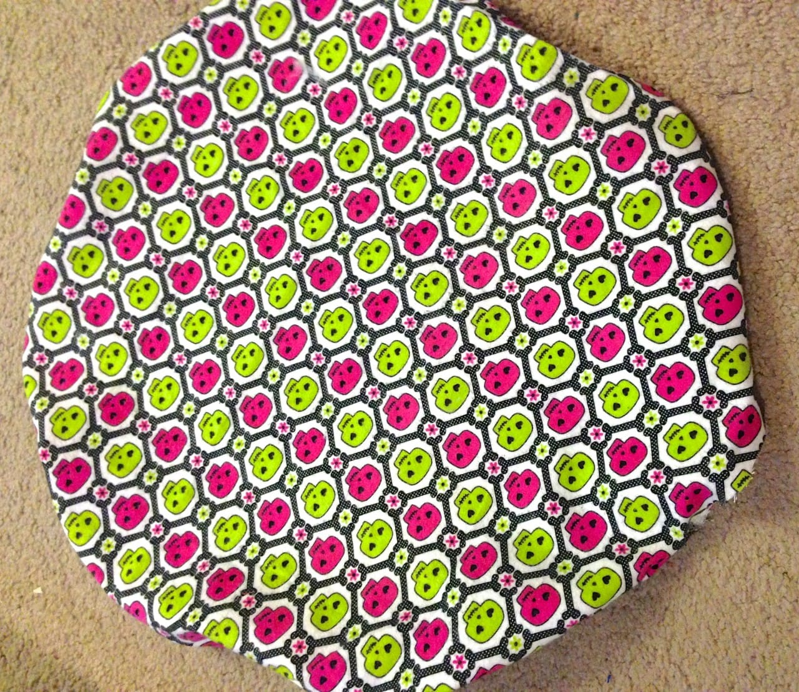

Now it’s time to stuff that pillow up! Fill about halfway with
<a title="Morning Glory Fiberfill on Amazon" href="http://amzn.to/1fzvyTl" target="_blank" rel="noopener noreferrer">fiberfill</a>
, then get out your catnip. Take a break to give some to your kitties who will pester you until you do so, then go back to the project.

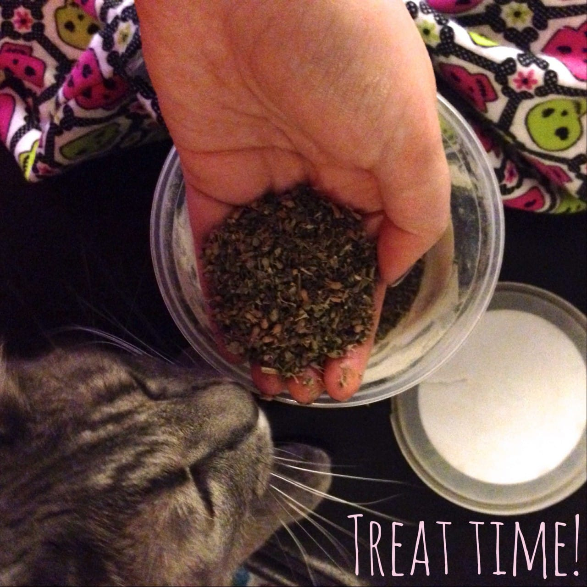

I used probably three small handfuls total of
<a title="Dried Natural Catnip" href="http://amzn.to/1moM3pr" target="_blank" rel="noopener noreferrer">catnip</a>
in this project, but I have a LOT of it so it wasn’t being too wasteful. Also my cats go CRAZY for it so I wanted to make sure it was throughout the filling. I made sure to sprinkle it and mush it all throughout the stuffing. Then I stuffed it the remainder of the way, and added another sprinkle.
<figure id="attachment_595" aria-describedby="caption-attachment-595" class="post__figure">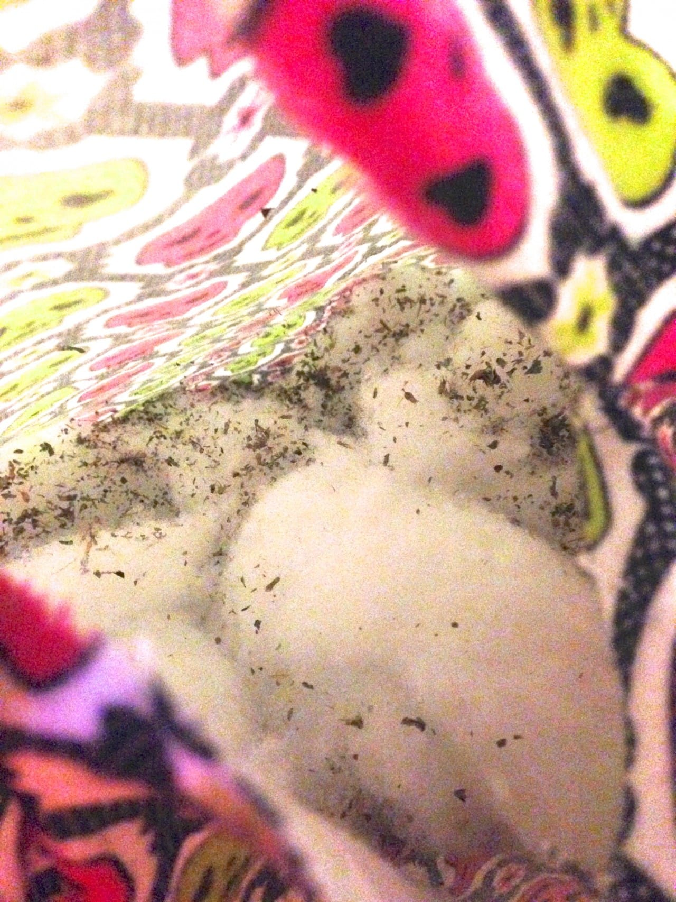<figcaption id="caption-attachment-595">
Yeah, there’s a lot in there.
</figcaption></figure>
As for how much
<a title="Morning Glory Fiberfill on Amazon" href="http://amzn.to/1fzvyTl" target="_blank" rel="noopener noreferrer">fiberfill</a>
you use for the whole project, that’s up to you. I used probably about a pound of it, maybe a little more. If you want it extra fluffy or tall, use more. If you want it smaller or thinner use less. You’ll know as you start stuffing it how much to use.

          
        

          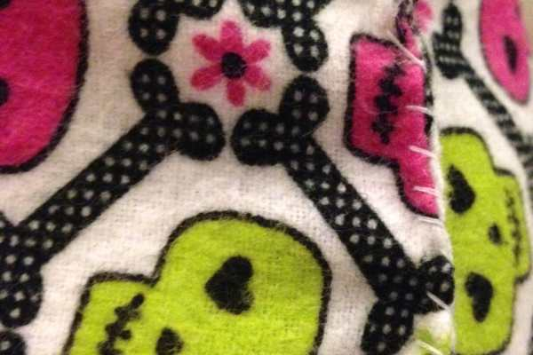
        

Once the stuffing is in, it’s time to pin and stitch up the pet pillow and call it a day. You can absolutely use a blind stitch for this, but since I STILL can’t quite get the hang of them, I didn’t want to risk it not being secure and the cats opening the bed up. They wouldn’t have any qualms about eating catnip laced stuffing and I don’t see that going very well.

Now you just have the set the trap and wait for the kitties to notice. In my experience, it takes about thirty seconds.
<h2>How to Catch a Kitty:</h2>

          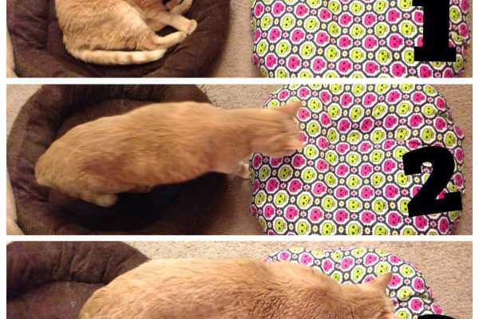
        

          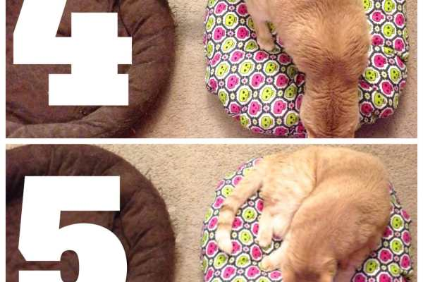
        

          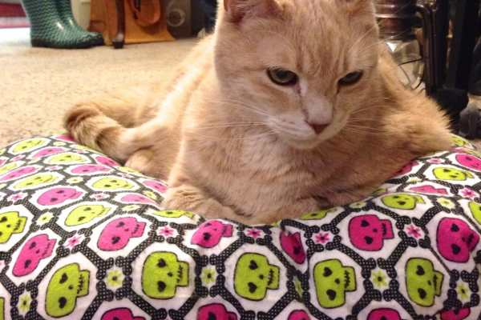
        

That’s it! I hope your cat (or dog!) enjoys his or her new pet pillow! If you try out this quickie project, let me know how it turns out below.

