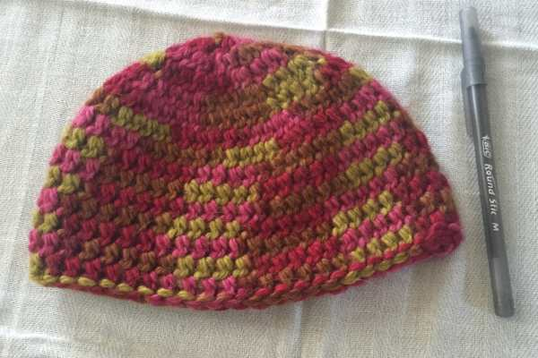

<em>?On the third day of Christmas, Katie Crafts gave to me…?</em>

A sweet little handmade hat for your baby! I crocheted this little guy using baby alpaca yarn so it is sure to keep your little one’s head super cozy! Want to win it for your baby girl? Enter the crocheted baby hat giveaway below!

I love the combo of pinks and green and brown in this hat. It’s different than the typical pastels you’ll see on most newborn accessories and clothes. It’s really cute! I used
<a href="http://www.cascadeyarns.com/" target="_blank" rel="noopener noreferrer">Cascade Yarns</a>
Baby Alpaca Chunky Paints 100% baby alpaca hand-painted yarn, in case you wanted to snag a skein for yourself.

This hat was made following a newborn hat pattern, but because it’s chunky it ended up larger. Still, it’s a tiny hat meant for a tiny head, so if you have a baby on the way, know someone who is due soon or just had a little one, this is a perfect gift for you! Here are a couple of photos of the hat next to a regular ballpoint pen for sizing purposes.

          
        

          
        

Enter the giveaway below and score your favorite little girl a soft hat for this Winter!

Raffle open to US residents only. Must be 18 or older to enter. No bots or fake accounts. All entries are verified. Please read Rafflecopter terms and conditions.

Giveaway ends at 11:59 PM ET on 12/12/15! Don’t forget to check out the
<a href="/elf-haul-giveaway/">e.l.f. haul giveaway</a>
and
<a href="/pearl-earrings-giveaway-with-natalia-khon/">pearl earrings giveaway</a>
also going on, and come back tomorrow for
<em>
another giveaway!
</em>
<a id="rcwidget_0txgq2wi" class="rcptr" href="http://www.rafflecopter.com/rafl/display/64ecfabc30/" rel="nofollow noopener noreferrer" target="_blank">a Rafflecopter giveaway</a>

