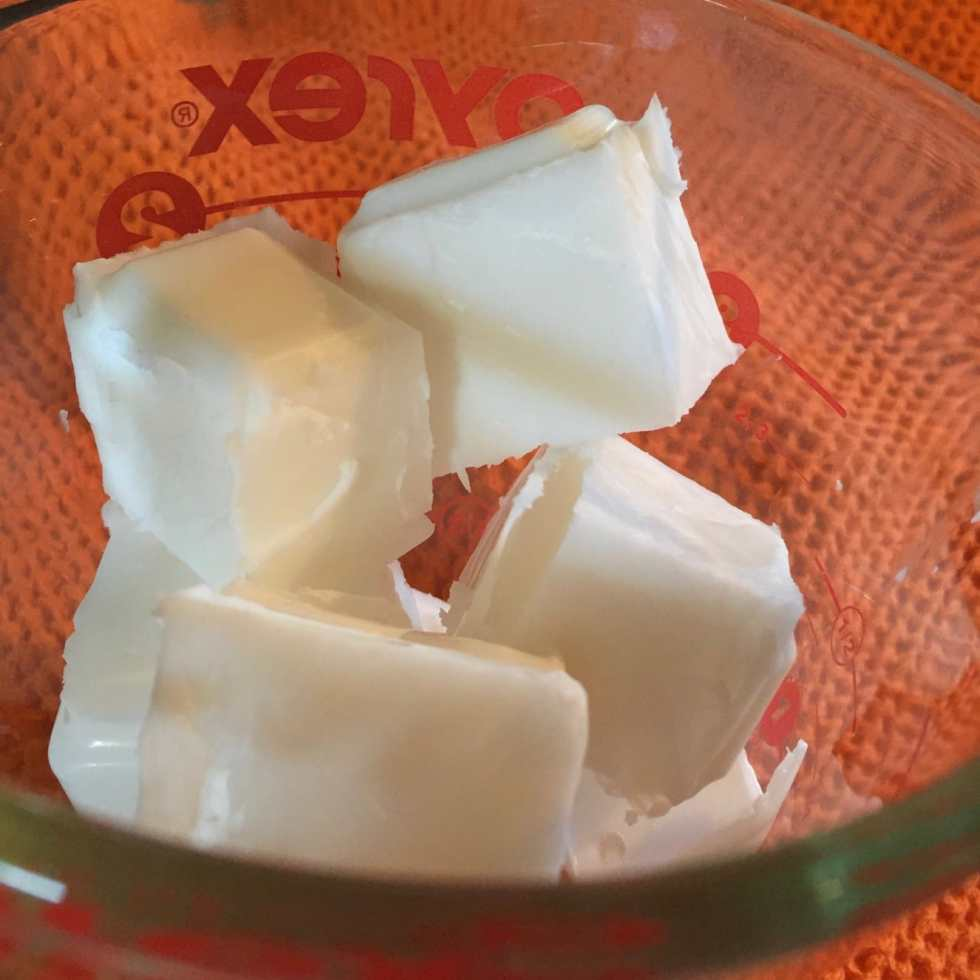
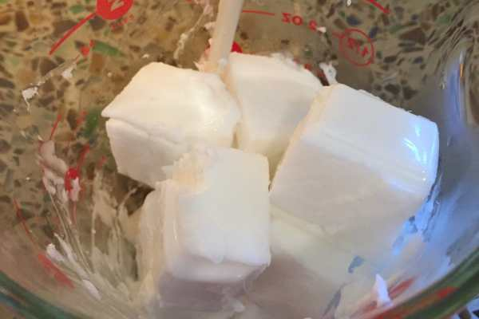
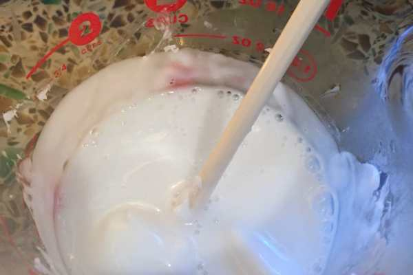
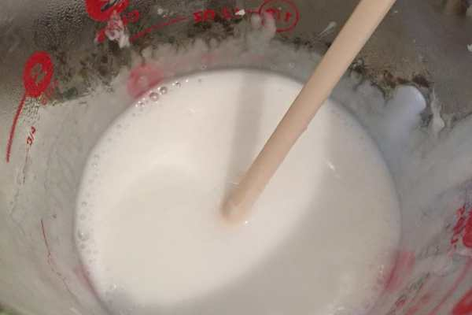
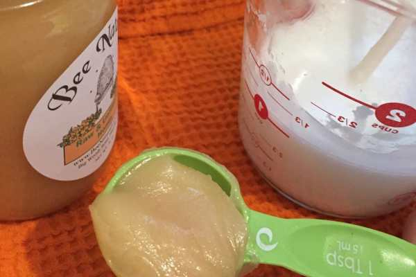
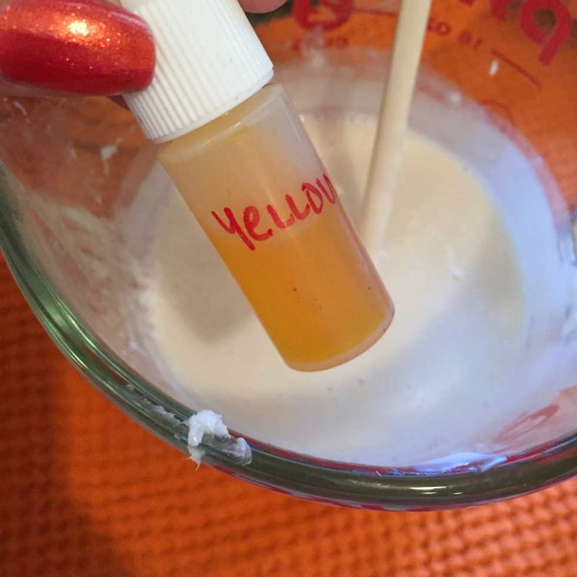
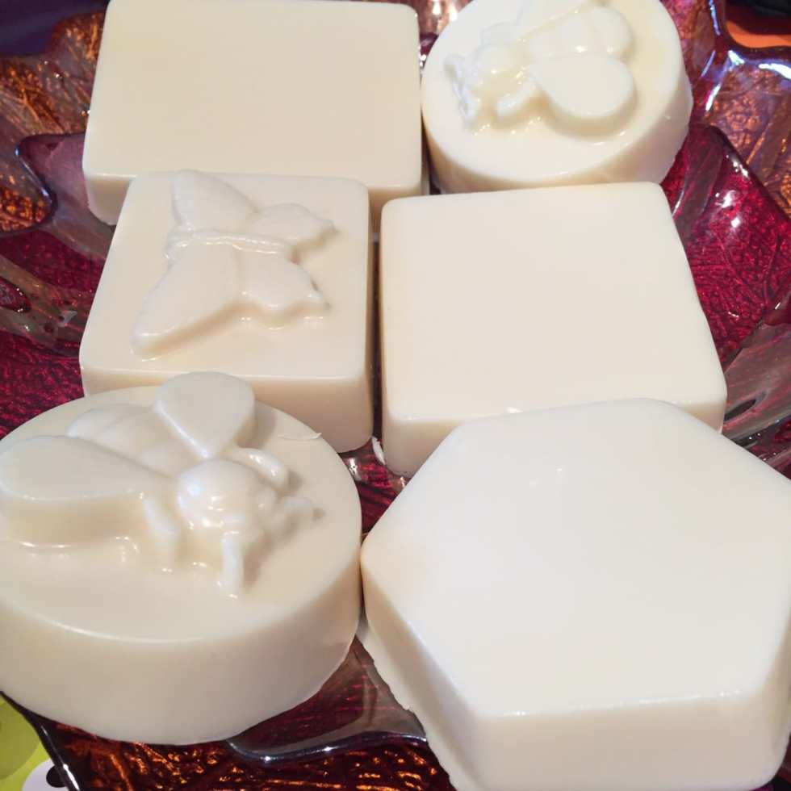
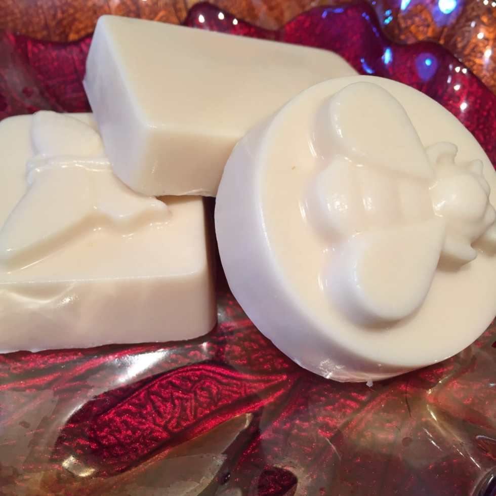

<em>?On the eighth day of Christmas, Katie Crafts gave to me…?</em>

A fantastic handmade gift idea for the holiday season! This DIY 2 ingredient Milk &#x26; Honey Soap tutorial is so easy you’ll be whipping up homemade soaps for everyone in your family this holiday season! But don’t forget to keep some for yourself!
<h2>Ingredients:</h2><ul><li><a href="http://www.amazon.com/gp/product/B002PNV3DI/ref=as_li_qf_sp_asin_il_tl?ie=UTF8&#x26;camp=1789&#x26;creative=9325&#x26;creativeASIN=B002PNV3DI&#x26;linkCode=as2&#x26;tag=katicraf-20&#x26;linkId=GTBQJH3LKT3EAN76" target="_blank" rel="noopener noreferrer">Goat’s Milk Soap</a></li><li>
Raw Unfiltered Honey
</li><li>
Yellow Dye (optional)
</li></ul><h2>Instructions:</h2><ul><li>
Cut 1/4 (which is about a half pound) of the Goat’s Milk Soap into cubes with a knife. It’s soft so it will cut pretty easily. This will yield three large bars of soap!
</li></ul><ul><li>
Use a metal spatula or something similar to help you left the cubes out of the packaging and put them into the glass measuring cup. I accomplished this with a pie server!
</li></ul>

<ul><li>
Microwave for 30 seconds. Stir.
</li></ul>

          
        

          
        

<ul><li>
Repeat the microwave-30-seconds-&#x26;-stir step until everything is melted and liquid. This usually is about 3 to 4 intervals.
</li></ul>

          
        

          
        

<ul><li>
While it’s still hot, add 2 Tablespoons of Raw Unfiltered Honey to the soap. Stir until completely mixed.
</li></ul>

<ul><li>
I also stir in three drops of yellow coloring to make it a little more “honey” like in color, but this is completely optional.
</li></ul>

<ul><li>
Pour into soap molds and let set in freezer for an hour.
</li><li>
Remove molds from freezer, turn over and gently pop out the soap bars. If they are still frozen to the molds, use your hand to warm them up for a minute and try again. They should come out fairly easily.
</li></ul>

<ul><li>
That’s it! Enjoy your milk and honey soap!
</li></ul>

What do you think of my super easy DIY soap recipe? If you decide to use it for a quick holiday gift idea, share a pic in the comments!

