
Project: DIY Back of Chair Cushion

One of the things I needed when I got my new work/crafting desk was a tall stool. I got one with a back, as my back is always hurting and I knew I’d need some support. While the chair itself is okay, it’s not all that comfortable, and my back was sad after the first day. I could look online for little lumbar pillows small enough to fit/attach to this stool, or make my own quickie cushion. To my sewing machine, I went!

My cold, lonely chair was very happy to be getting a new pillow. Because I was impatient and didn’t want to wait til I had perhaps better suited materials, I used what I had on hand. A pretty fabric and an elastic headband.

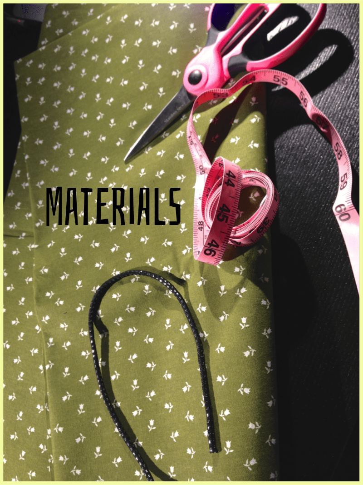
<h2>Materials:</h2><ul><li>
Fabric, enough to fit your chair
</li><li>
Elastic, about the width of your chair
</li><li>
Scissors
</li><li>
Polyfill
</li><li>
Measuring tape
</li><li>
Sewing machine, thread, pins, pencil/chalk
</li></ul>
Your materials will of course vary depending on how large of a cushion you are making. For my needs, clipping an elastic headband to make one long piece, and one yard of fabric was all I needed for this project!
<h2>Instructions:</h2>
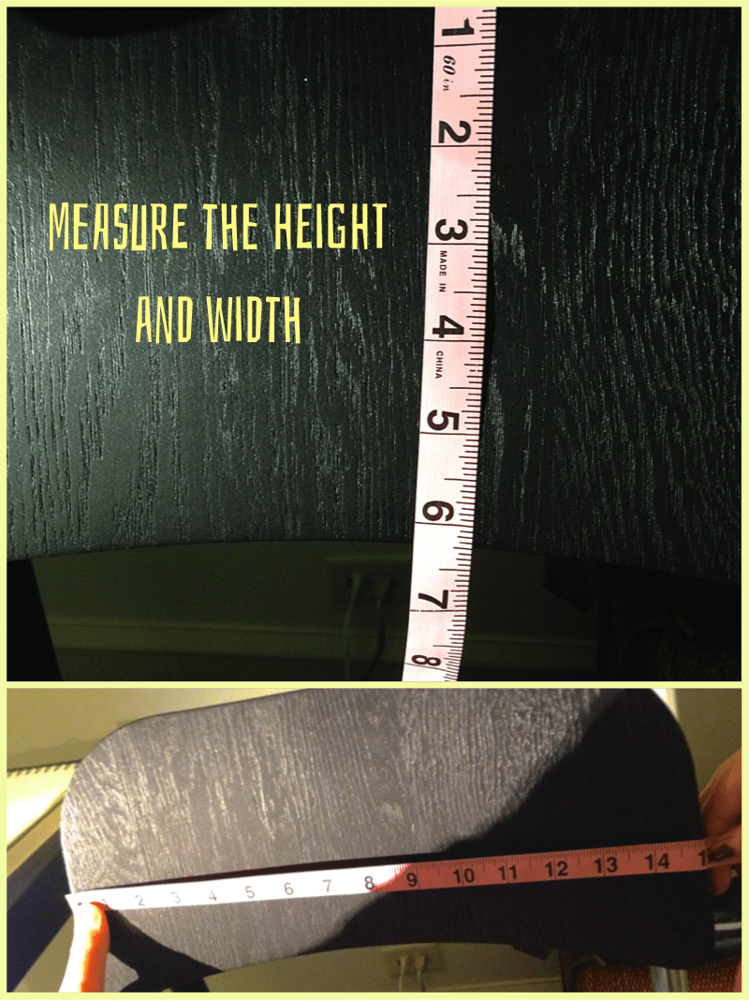
<ul><li>
First up, measure the back of your chair! I wanted my pillow to be slightly smaller than the actual chair back so that it wasn’t too huge, and so that I could move it around to sit in whatever spot on my back hurts that day. To achieve this, I measured my fabric the exact height and width, knowing that once sewn and stuffed it would end up smaller. My chair was 15 inches wide and 6 inches high, so that’s what I cut.
</li><li>
Measure, mark and cut your fabric accordingly.
</li></ul>
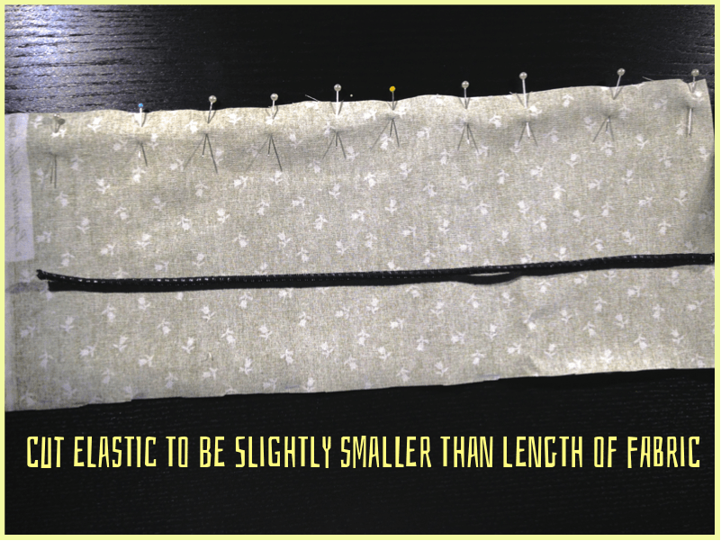
<ul><li>
Make sure your elastic is a bit smaller than the length of your fabric. This is to ensure it’s actually pulling the cushion taut on your chair. Too much elastic and the pillow will just fall right off!
</li><li>
Place elastic
<strong>
inside
</strong>
(between patterned sides of fabric) with a little bit sticking out. Pin that down.
</li></ul><figure id="attachment_1025" aria-describedby="caption-attachment-1025" class="post__figure">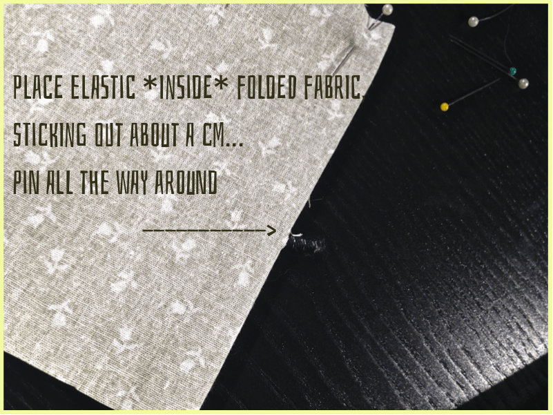<figcaption id="caption-attachment-1025">
Sorry for dark photos! I promise there is a centimeter of elastic sticking out!
</figcaption></figure><ul><li>
Pin all the way around (minus the gap for turning and stuffing). When you reach the elastic on the other side, reach in and pull it through so that a little bit is sticking out again, and pin that. This will pucker your project, but that’s fine.
</li></ul>
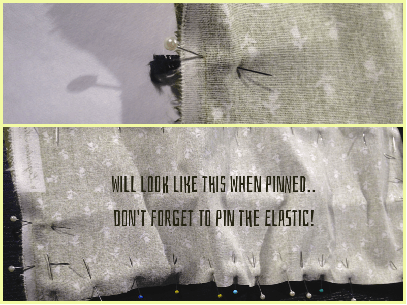
<ul><li>
Now it’s time to sew! Use a straight stitch on your sewing machine to go all the way around the project, less the gap. It will be a little tricky, since it’s not a flat project. Just go slowly and guide the fabric as you go. Don’t forget the back-stitches!
</li></ul>
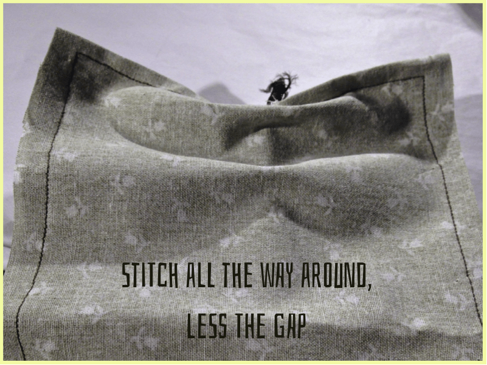

Be sure to go over where the elastic is several times to secure it!

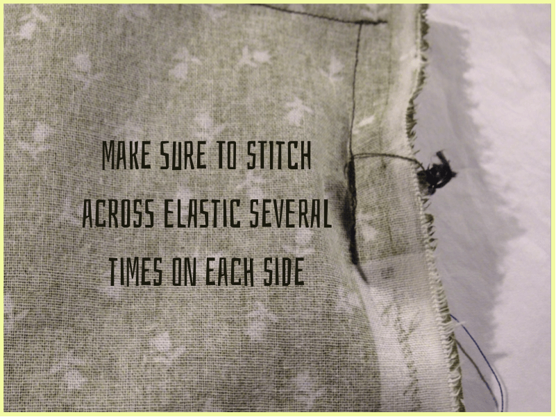
<ul><li>
Snip off excess fabric if necessary.
</li></ul>
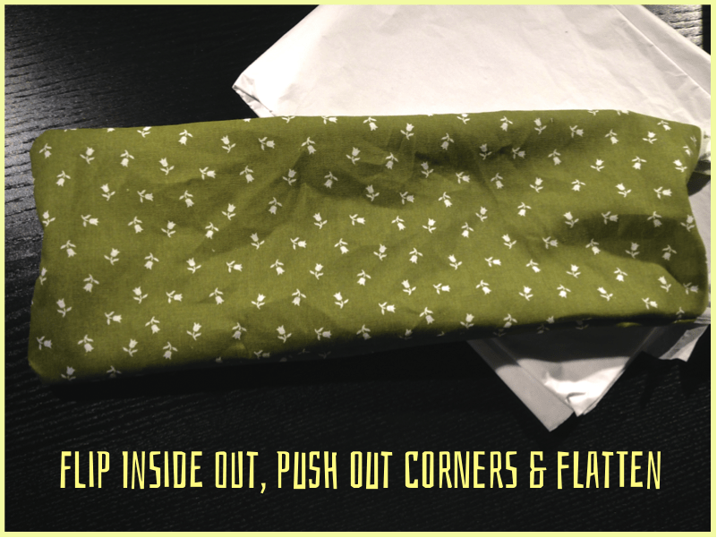
<ul><li>
Gently turn your project inside out through the gap.
</li><li>
Push out the corners (use end of pencil if you can’t get your fingers in there!)
</li><li>
Flatten or steam/iron if you want to get rid of wrinkles.
</li></ul>
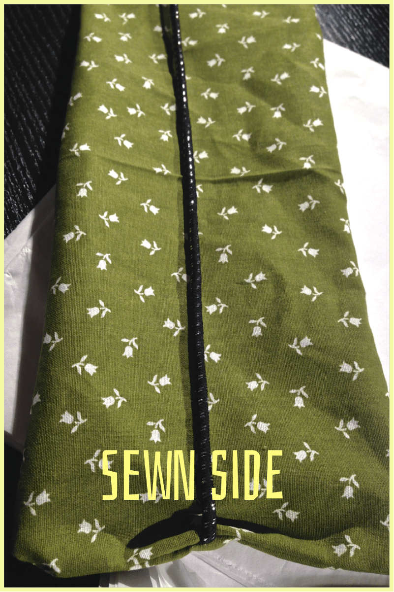

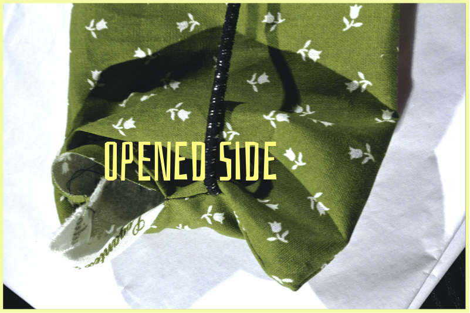
<ul><li>
Time for the stuffing! Use your poly or
<a title="Morning Glory Fiberfill on Amazon" href="http://amzn.to/1fljkkc" target="_blank" rel="noopener noreferrer">fiberfill</a>
to gently stuff your cushion as much as you like.
</li></ul>
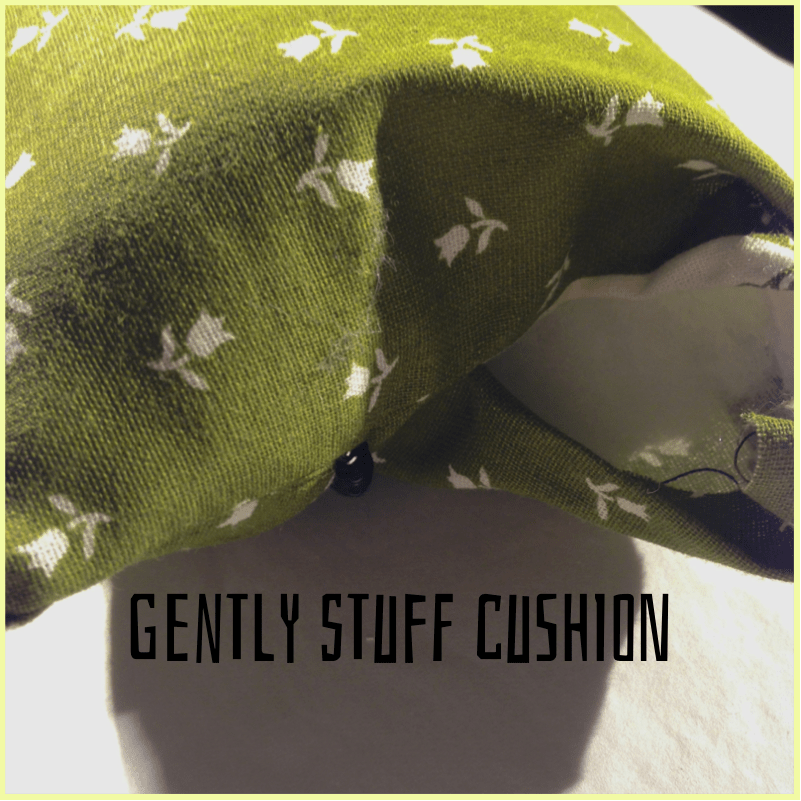
<ul><li>
When you’re satisfied with the amount of stuffing and the firmness of your cushion, pin closed.
</li></ul>
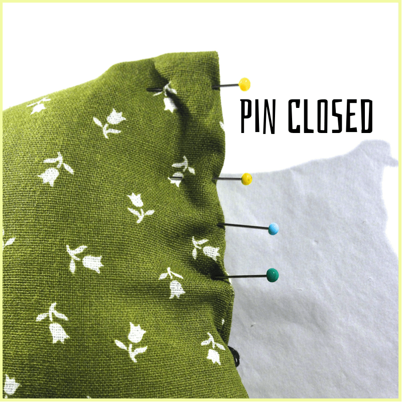
<ul><li>
Stitch the opening closed, using a zig-zag stitch and matching thread! (unlike me, who was too lazy to change it out)
</li></ul><figure id="attachment_1016" aria-describedby="caption-attachment-1016" class="post__figure">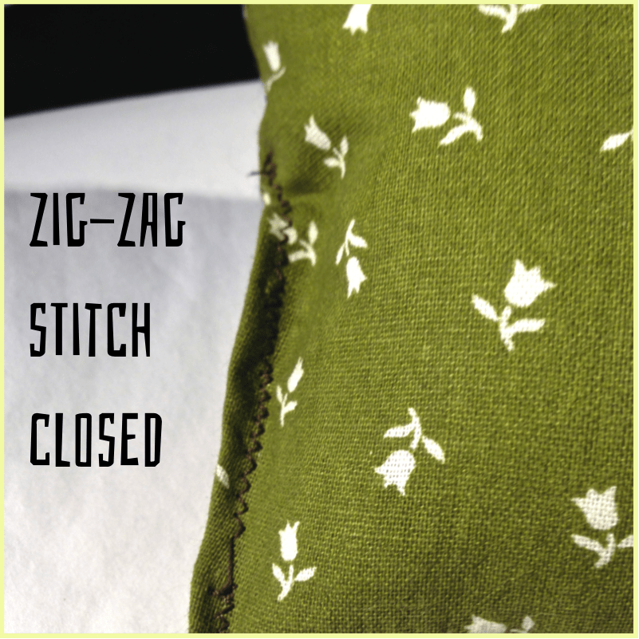<figcaption id="caption-attachment-1016">
Ignore that one wonky spot- I don’t know why it skipped like that!
</figcaption></figure>
Finished! Enjoy lumbar support with your new back cushion! Now I just have to make a matching one for the seat…

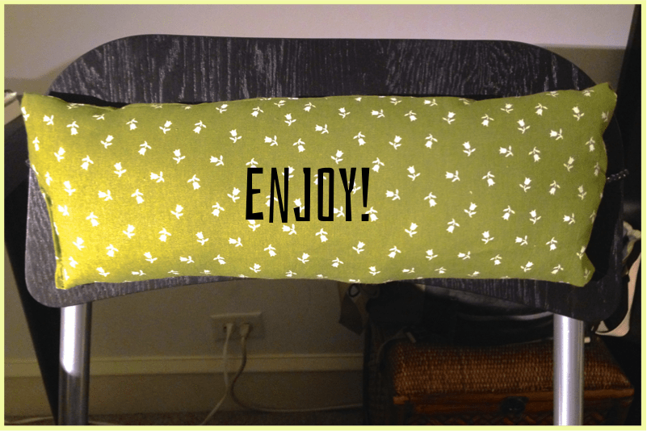
<h2>Tips:</h2><ul><li>
If you don’t have an elastic headband to chop up, or would rather not use elastic at all, use ribbon or fabric to make ties instead. Just sew one end of each tie to the ends inside the fabric rather than the elastic. When you turn the project inside out, the ties hang free for you to tie around your chair.
</li><li>
Because of it’s small size and elastic back, the cushion can be moved anywhere on the back of the chair that is comfortable for you. It also means it can be attacked by small cats and pulled down. You’ve been warned.
</li></ul>
