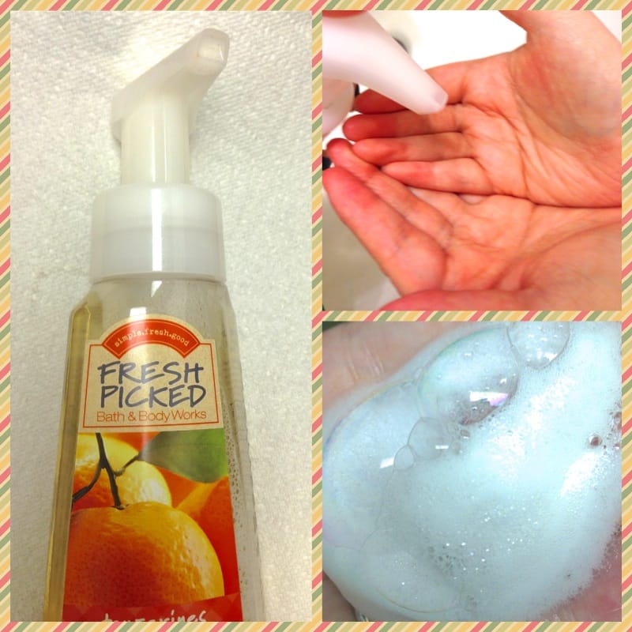

Project: DIY Foaming Soap Refill
<strong> </strong>
A few weeks ago, I told you about a project I wanted to try that was all about making your very own
<a title="Sunday Funday: Issue 4" href="/sunday-funday-issue-4/">foaming hand soap</a>
. Well, I finally got around to trying it out, and it really was crazy simple! I’ll be doing this from now on!

Foaming hand soap is my favorite! I just love the bubbles. I was excited when I first learned that I could make my own, but skeptical that it just wouldn’t be the same. I’m glad I finally tried it, since it’s very much the same, and easy, and cheaper, and I can make it at home. All things I love!
<h2>Materials:</h2><ul><li>
Empty foaming soap bottle
</li><li>
Your favorite body wash
</li></ul><h2>Instructions:</h2><ul><li>
Wash out your foaming soap bottle thoroughly! The one I had was a previous home to a tangerine scented soap. I didn’t have any body wash in that scent on hand, so I washed it extra well so there were no traces of tangerine left!
</li><li>
Next, fill your bottle up with your favorite body wash about an
<strong>
INCH
</strong>
from the bottom.
</li><li>
Using
<strong>
hot
</strong>
(not boiling, but very hot!) water,
<strong>
slowly
</strong>
fill your bottle almost all the way. Leave about an inch on top empty.
</li></ul>

<ul><li>
Carefully stir as much as you can of the soap/water combo. When it doesn’t look like you can stir any more, close it up tightly and
<strong>
GENTLY
</strong>
turn the bottle from one side to the other. The soap will begin to mix nicely with the water.
<strong>
DO NOT SHAKE!
</strong></li><li>
Give it a few pumps and it’s ready to use! That’s it!
</li></ul>

I’ll probably decorate the outside of the bottle with a paper sleeve or something, so that people who go to use it aren’t duped in to thinking there is tangerine soap inside! How would you decorate it?

