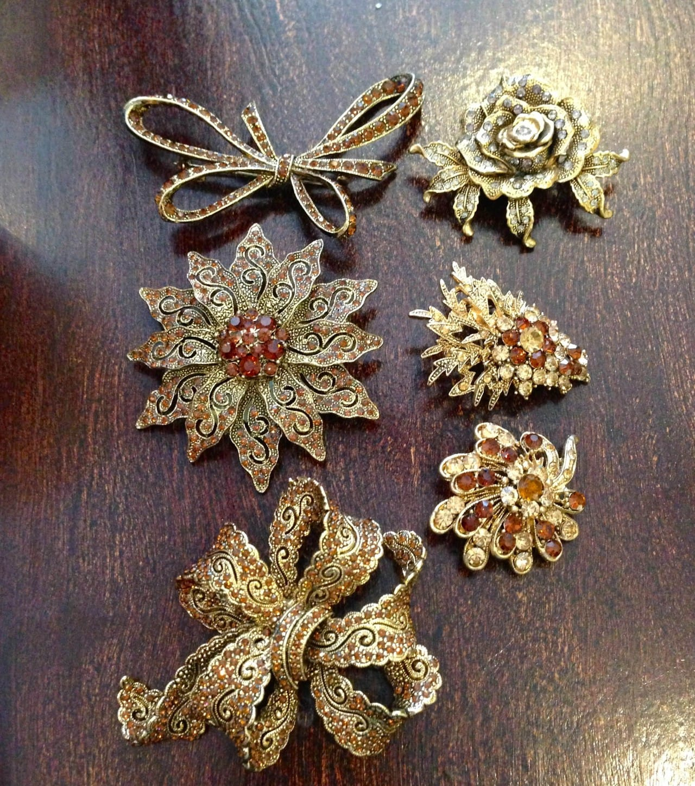

Project: DIY Hair Combs From Brooches

When I got engaged, I immediately began thinking of all the things I could DIY for the wedding. I thought about all the money we could save if I made it all myself- decorations, invitations, and even all the gifts. Oh the gifts. The many, many gifts. I of COURSE didn’t think about the stress it would cause me trying to get it all done! Ah well, c’est la vie. While hunting for brooches for my bridesmaids (to turn in to hair combs) that somewhat matched the theme was a sometimes-grueling-3-month-long task, the actual making them part was very easy! I just love how they turned out!

I really did search for three months (ALL of last Spring!) til I found enough brooches for all the bridesmaids and family members who were part of the wedding. I went into MANY a thrift shop and scavenged through MANY a flea market. Some of the brooches were priced so amazingly, others made me cringe. Still, to be able to find 15 different brooches from different places that matched each other was totally worth it.

I spent hours trying to find hair combs that were both wire (many are plastic) and gold (many are silver). I thought there was some kind of trick to getting the brooch to securely stay on the comb and looked up as many tutorials as I could find- except I could never find any that used the type of hair combs I had.

Finally, I gave up and decided to just try it already- I’d wasted enough time on a project that I hadn’t actually begun yet! Thank God I did, because it was way easier than I’d thought it would be. Sadly, I don’t have photos of the process, but as it’s a simple one I’ll just give you the instructions below!
<h2>Materials:</h2><ul><li>
Brooch with regular pin backing still securely attached
</li><li>
Wire toothed hair comb, same size or smaller than the length of the pin back
</li><li>
Jewelry wire, in matching color to comb
</li><li>
Jewelry or needle-nosed pliers
</li><li>
Wire cutters
</li></ul><h2>Instructions:</h2><ul><li>
Make sure your brooch’s pin is in it’s closed position.
</li><li>
Place the top of the comb against the top of the length of the pin.
</li><li>
Wrap jewelry wire around, and around, and around! Just keep wrapping it, lacing it and twisting it all the way across until you are able to give the comb a little tug and it doesn’t pull away from the brooch.
</li><li>
That’s it! Be sure to tuck the wire ends underneath the pin so they do not poke at your head- ouch!
</li></ul>
When all was said and done, this was one of my favorite gifts to give the girls! I ended up handing them out at my bridal shower so that they could figure out an updo they wanted to wear at the wedding that could hold the weight of the hair comb. Every lady looked totally lovely on my wedding day with their hair up and a brooch tucked in it! Really- how gorgeous are those details! Love them!

I totally gave the giant bow one on the bottom to my sister, so that I could steal it after the wedding. Which I did. Haha!

