
Project: DIY Knotted Headband

I LOVE this headband! I have made several different colors of it already out of the
<a title="How To Make T-Shirt Yarn" href="/how-to-make-t-shirt-yarn/">t-shirt yarn</a>
that you already know I have a small obsession with (thumbs up for upcycling!) For awhile, I was just tying the ends to a hair tie, like I did in the no-sew version of
<a title="No Sew Braided Headband" href="/no-sew-braided-headband/">my braided headband</a>
, but I recently bought some fold-over elastic and decided to add it in to the mix. I’m liking the way it came out!
<h2>Materials:</h2><ul><li>
4 strips of t-shirt yarn (enough to wrap around your head)
</li><li>
Fold over elastic (4 – 6 inches worth)
</li><li>
Sewing machine and matching yarn and/or thread and needle
</li><li>
Pins
</li><li>
Scissors
</li></ul><h2>Instructions:</h2><ul><li>
Measure your head! See how much yarn you’ll need to fit a snug headband. Add about two inches to it, as you’ll lose a little length when you sew and snip excess off.
</li></ul><ul><li>
Place together two strips each. We’ll refer to the first set as “String Set 1” or “First String Set” and the second set as “U Set.”
</li><li>
With First string set, make a ribbon shape, with a loop on top. Make sure the bottom tails are
<strong>
exactly
</strong>
the way as pictured below.
</li></ul>

<ul><li>
Next, take your second set of strings and make a
<strong>
“U”
</strong>
shape on
<strong>
top
</strong>
of the first set of strings.
</li></ul>

<ul><li>
Put the bottom left tail of the First set of strings
<strong>
over
</strong>
the “U”
</li><li>
Put top left of the “U”
<strong>
underneath
</strong>
the loop of the First set.
</li></ul>

          
        

          
        

<ul><li>
Using the top right tail of the “U” set, you’re going to weave
<strong>
over, under, and over
</strong>
the loops. See below!
</li></ul>
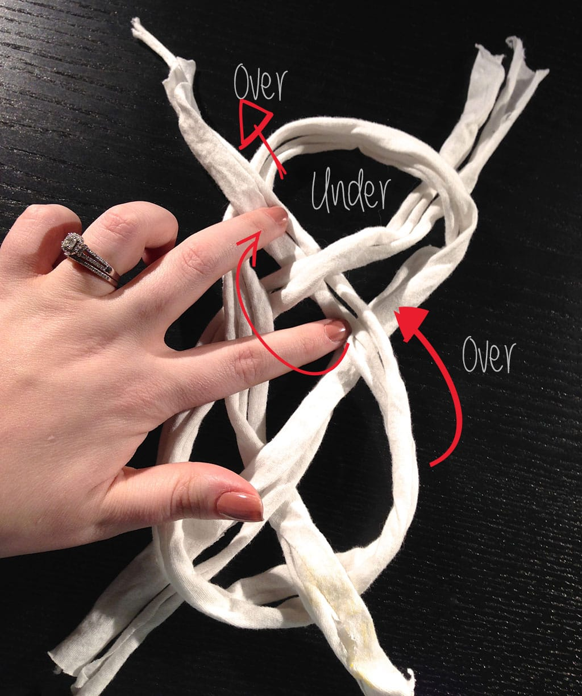
<ul><li>
Next you’ll pull the ends to tighten the knot. Use your fingers to manipulate the yarn and make it pretty!
</li></ul>

          
        

          
        

          
        

          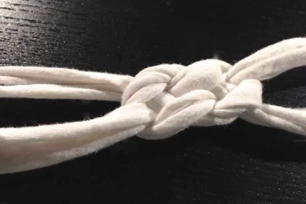
        

<ul><li>
Now it’s time to cut the ends of each side and make them even.
</li></ul>

          
        

          
        

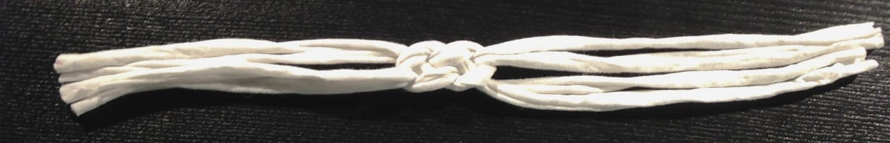
<ul><li>
Place the four strings of one side next to one another.
</li><li>
Do a quick stitch through them with needle and thread to hold them together.
</li></ul>

          
        

          
        

<ul><li>
Place Fold Over Elastic (FOE) on top, wrong side down, and pin. I cut about 6 inches of elastic (knowing I’d lose a little of the length during stitching) but it was just a smidge too much. Next time I’ll do 5 inches. You may even want to do just 4 inches to make it snugger. It’s up to you!
</li></ul>
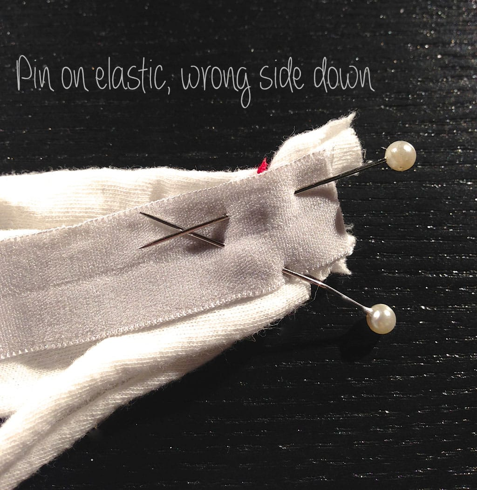
<ul><li>
Use sewing machine or thread and needle and same colored thread to stitch on FOE. I used red so you could see what I was doing!
</li><li>
Snip off excess.
</li></ul>

          
        

          
        

<ul><li>
Place unfinished headband around head and see if the elastic will be tight enough. If not, snip a little off before sewing it to the other side.
</li><li>
Stitch across other side of strings to hold together.
</li><li>
Sew FOE to yarn.
</li></ul><figure id="attachment_1949" aria-describedby="caption-attachment-1949" class="post__figure"><figcaption id="caption-attachment-1949">
My sewing machine was bird-nesting today. Very annoying. Just ignore that!
</figcaption></figure><ul><li>
Because of the bird-nesting (and the red thread I used for you to see!), these DIY photos aren’t the prettiest! However, I assure you if you use matching thread and your machine isn’t acting up, this DIY is both easy and really nice looking!
</li></ul>

          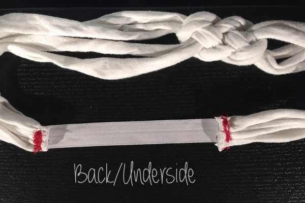
        

          
        

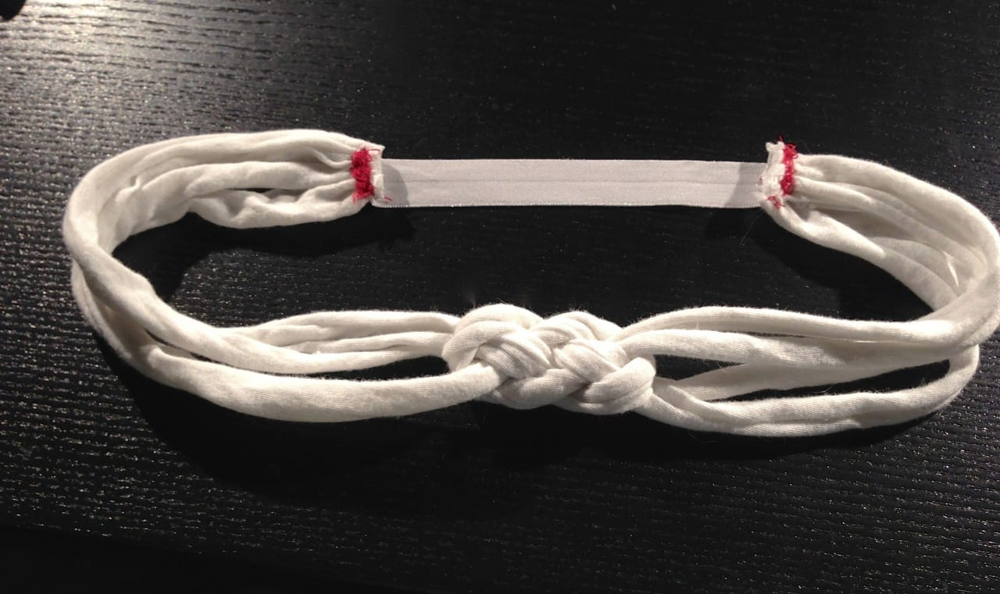

That’s it! I tried to model the headband but I was taking horrible photos and my hair was so messy!!

          
        

          
        

That’s when the Husband stepped in and asked if I wanted him to be my model! “OF COURSE!” is always my response when he asks me this question. Especially if it means he’ll let me photograph him wearing accessories for the blog. Hehe!

          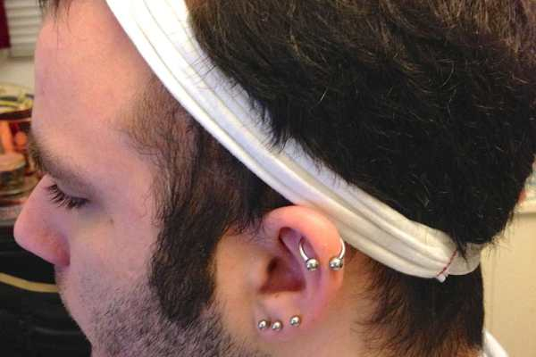
        

          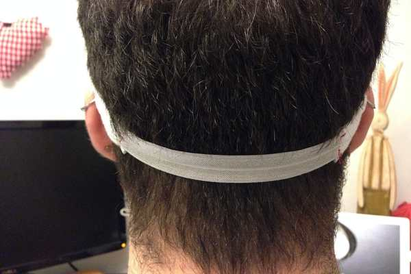
        

          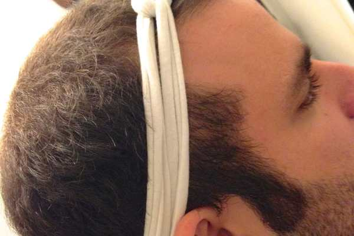
        

          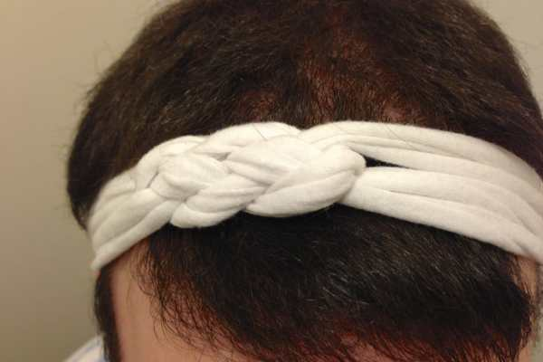
        

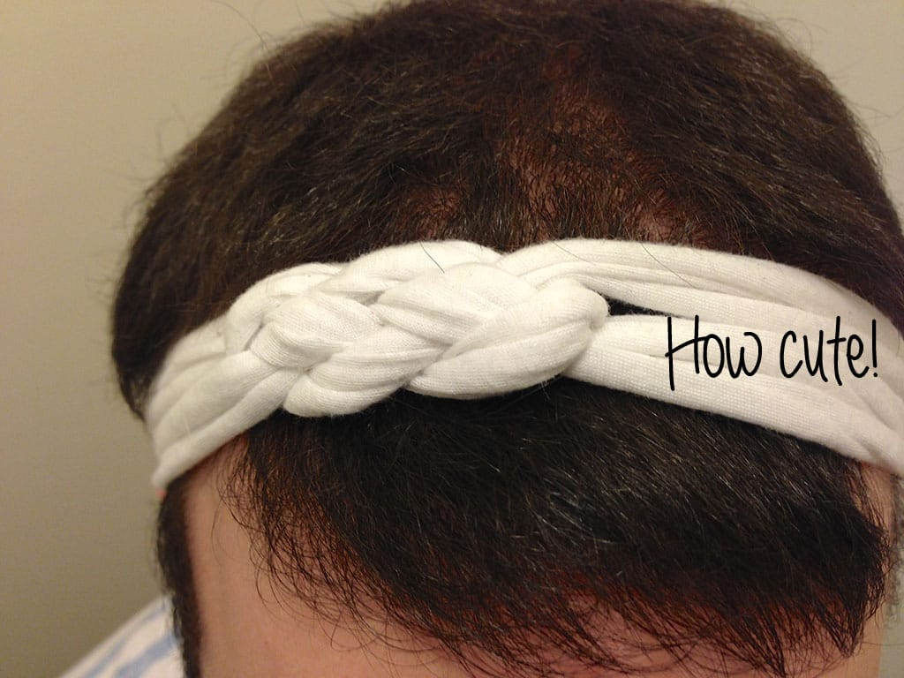

Thanks for being my model, Honey!! And I hope you guys liked this DIY Knotted Headband Tutorial! If you make one, take pics and share them below! If you have a better way to attach the ends of the headband rather than FOE, let me know!

