
 

Project: DIY Pom Pom Easter Bunny

Easter kind of snuck up on me this year! It’s just over a week away and I haven’t really posted anything for it yet. Whoops! I knew I had to get at least one Easter themed DIY on the blog, and I knew it had to be something QUICK and EASY. This little Pom Pom Bun is the perfect solution!
<blockquote>
<em>Please Note: While totally adorable, this bun is best served as a decoration and NOT a children’s toy. The tiny eyes, whiskers and other bun parts can be pulled off by little hands, and you don’t want anyone to choke on anything!</em>
</blockquote>
If you have a pom pom maker, you may absolutely use that instead of your hands to make a much prettier pom pom. For a 5 minute bunny, I thought my hands were a fine tool. 🙂
<h2>Materials:</h2><ul><li>
White or ivory yarn
</li><li>
White or ivory felt
</li><li>
White or ivory thread
</li><li>
Needle
</li><li>
Black beads for eyes
</li><li>
Covered button nose (red or pink)
</li><li>
Scissors
</li></ul><h2>Instructions:</h2><ul><li>
First, make the small pom pom by wrapping yarn around two fingers until you think it’s a sufficient amount for a bunny head.
</li></ul>

          
        

          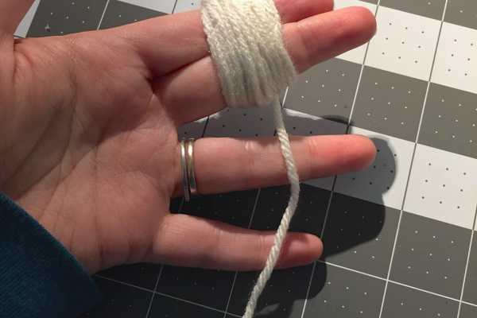
        

<ul><li>
Then slowly slide the yarn off your fingers, keeping it “looped.” Use the loose end to tie the yarn together at the middle.
</li><li>
Once secured, use your scissors to cut through one whole looped side, then the other.
</li></ul>

          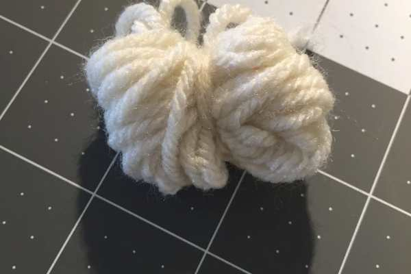
        

          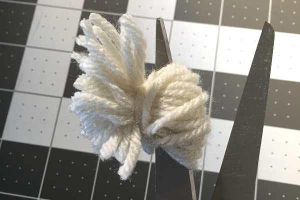
        

<ul><li>
Use fingers to fluff out pom pom and snip pieces that are longer to make it uniform.
</li></ul>
Not yet snipped to perfection!
<ul><li>
Make your larger pom pom by wrapping yarn around four fingers, following the instructions above until you have a bunny body.
</li></ul>

          
        

          
        

<ul><li>
Make sure you like the way both pom poms look!
</li></ul><ul><li>
Fold over a small square of felt and cut out a bunny ear. This will give you two ears.
</li></ul>

          
        

          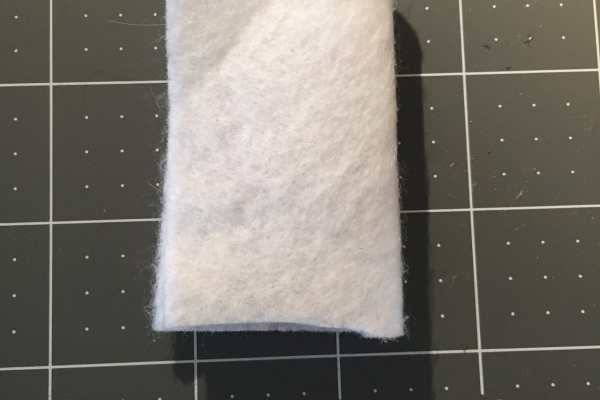
        

          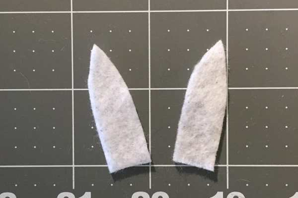
        

<ul><li>
Use your needle and thread to sew the button nose to your small pom pom.
</li></ul>

          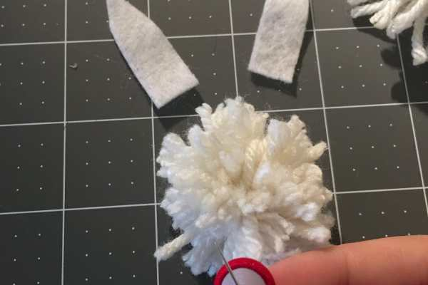
        

          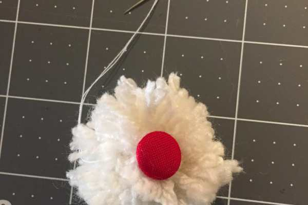
        

<ul><li>
Next, sew on the eyes, and lastly the ears.
</li></ul>
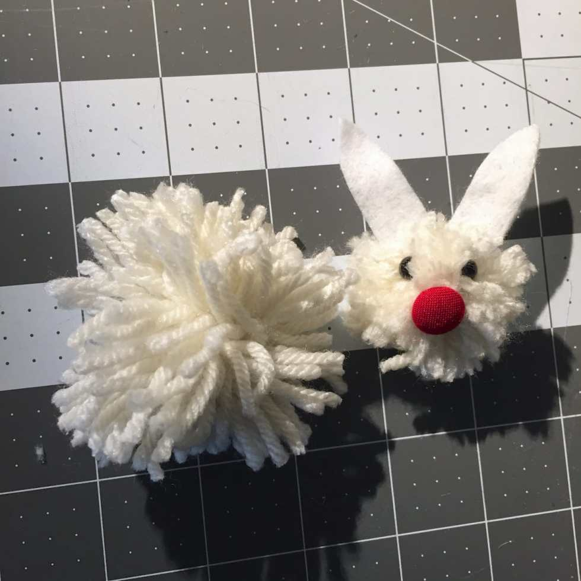
<ul><li>
Double up your thread and cut ten inches of it. Thread it through your needle, but don’t knot it, so that there are now five inches/four strands.
</li></ul>

          
        

          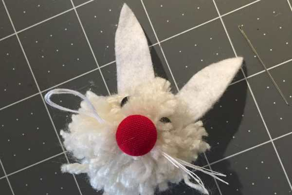
        

<ul><li>
These are your whiskers. Sew them right through the nose once, and back once. This will give you about an inch of whiskers on each side.
</li><li>
Use your scissors to snip the loop and your fingers to separate them.
</li></ul>

<ul><li>
Now it’s time to attach the head and body! Just use your needle, thread and novice sewing skills to sew the two together.
</li></ul>

          
        

          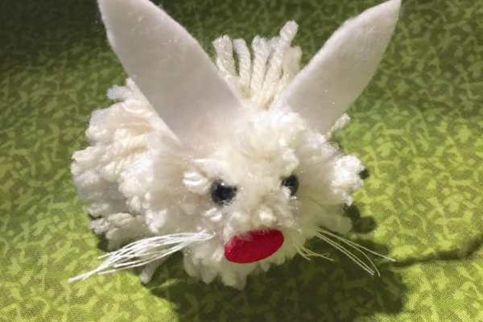
        

Enjoy your cute little pom pom Easter Bunny decoration! Isn’t he adorable!?

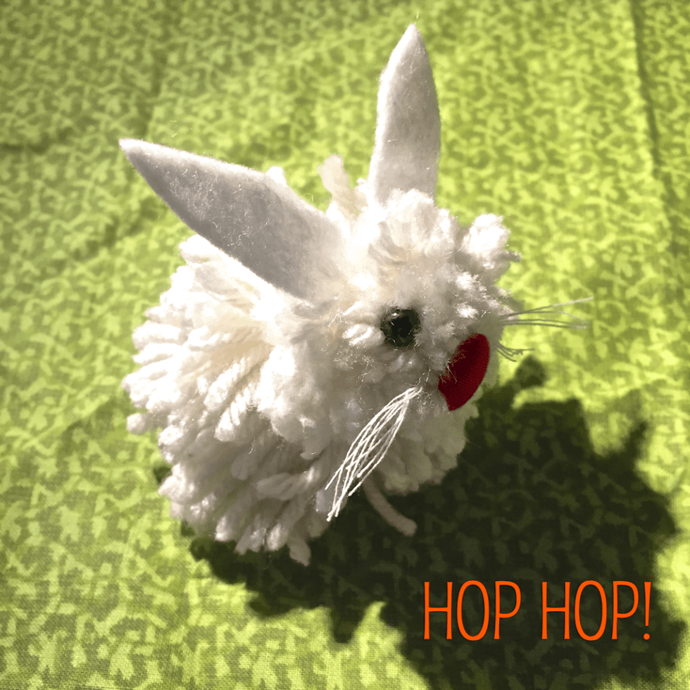

What fun DIYs do you plan on doing this Easter? Share them in the comments!

