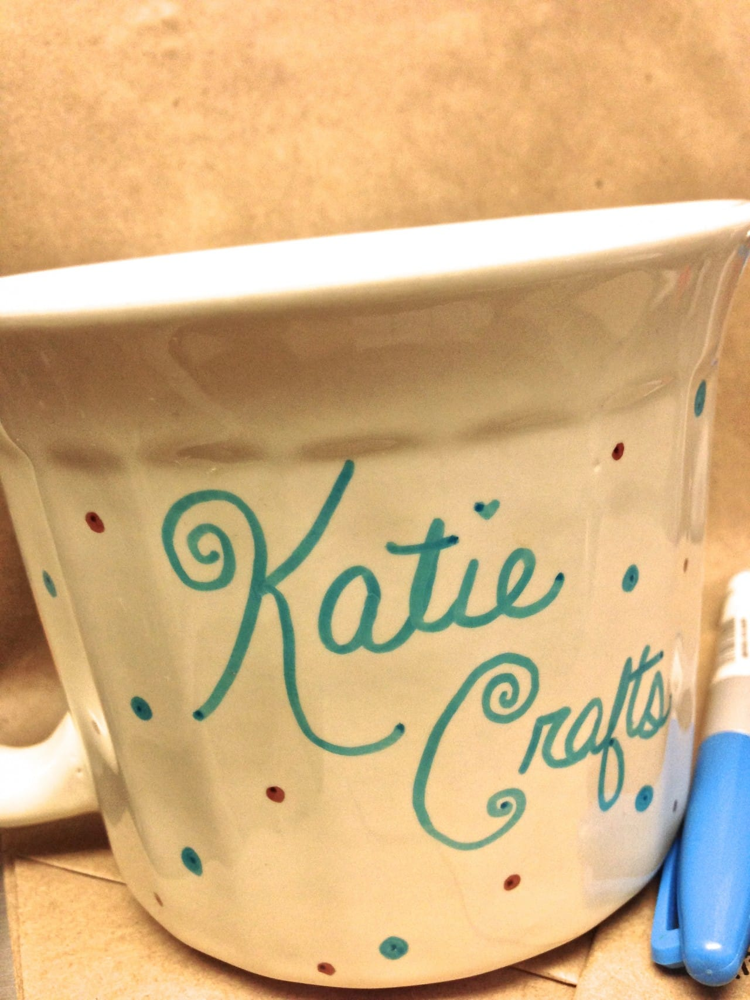
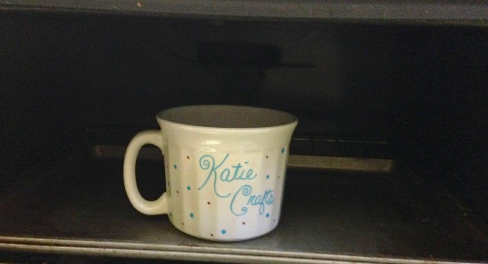

Project: DIY Sharpie Mug

Need a last minute gift for a co-worker before tomorrow? Grab an unused plain coffee cup and a few Sharpie markers and make your friend a personalized mug for their desk! Bonus: Since it’s homemade just for them, they’ll feel extra special and not at all think that you scraped it together last minute.

I made everyone a personalized mug for Christmas one year, filling them with hot chocolate, marshmallows, candy canes and scratch off tickets. It took me awhile, since I was making over a dozen, but they came out really cute! I vowed to remember the easy DIY for future use, and now I’ll share it with you!
<h2>Materials:</h2><ul><li>
Ceramic coffee cup that can withstand heat (should say on the bottom of the mug “oven safe”)
</li><li>
Sharpie markers (or another permanent brand) in various colors
</li><li>
Oven
</li><li>
Cookie sheet
</li></ul><h2>Instructions:</h2><ul><li>
Pre-heat your oven to
<strong>
350º Fahrenheit.
</strong></li><li>
While your oven is heating up, use your
<a title="Sharpie Markers on Amazon" href="http://amzn.to/1fs7rty" target="_blank" rel="noopener noreferrer"><strong>
Sharpie markers
</strong></a>
to decorate the mug! You can write “Happy Birthday, Sean!” on it, or “Happy Easter, Kelly!” Whatever your heart desires. Nix wording all together and do a pretty intricate design if that’s what you’re in to. I love brown and blue together and I super love polka dots, so that’s what I went with. 🙂
</li></ul>

<ul><li>
When finished, put the mug on a cookie sheet and place in oven for
<strong>
30 minutes
</strong>
to “cure” it.
</li></ul>

<ul><li>
After the half hour of baking, carefully remove the hot cookie sheet and let it cool
<strong>
completely
</strong>
.
</li><li>
Once it’s cooled, it’s ready for use.
</li><li>
Make sure to tell the receiver of this awesome gift that it’s hand wash
<strong>
ONLY
</strong>
(dishwasher may take off the design), and not to use anything crazy like a steel wool pad that will surely scrub off the marker. Otherwise, your design will hold up pretty well!
</li></ul>
I know you guys will come up with fun designs for this easy project! Share them if you like!

