
Project: DIY Turban Headband Tutorial
<strong> </strong>
I love the look of turban headbands, but usually they are either WAY too large (Hello! I don’t want 100% of my hair covered or else I’d wear a hat!) OR they are WAY too expensive (Oh
<a title="Anthropologie" href="http://www.anthropologie.com/anthro/product/accessories-hair/31369572.jsp?cm_sp=Grid-_-31369572-_-Regular_7" target="_blank" rel="noopener noreferrer">Anthropologie,</a>
you do it to me every time! $38 for one headband?! I just can’t.) I started searching and found many a tutorial on making your own. Some were great and some were, well, really hard to follow. I took pieces of several different tutorials and came up with my own, for a skinnier version of a turban headband! It isn’t perfect, but I really like how it turned out. Maybe you will too!

The best part about this tutorial is you don’t HAVE to own a sewing machine to complete it! Sure, it makes it go much faster, but you can absolutely do it with a needle, thread, and your own two hands! I used a sewing machine, because I have one- so why not?

At first glance, you’ll probably be scared of this tutorial. It’s pretty long. But it’s REALLY EASY! I just tried to over-explain a bunch of things that I found I had questions on myself when I was trying to figure out how to make it, so that you would maybe understand a bit better! Don’t be scared of the length, it will fly by and by the weekend’s end, you’ll have several new headbands to wear for next week!

I made FOUR different versions of this headband before figuring out the below tutorial. The first two didn’t include any elastic and (in theory) should have just fit on my head as measured. Well, the first ended up being so small I couldn’t squeeze it on my head if I tried (still don’t know how I managed that!), and the second FITS, but sure does give me a headache. It also stuck up in the back because of all the extra fabric- so I figured that I should taper the ends to help with that (and help it does!)
<blockquote>
The photos for this tutorial are an amalgamation of the third and fourth versions, as they are only a smidge different- so I took the best photos from each to put together this tutorial! Hopefully suddenly seeing different fabric doesn’t throw you off too much while you follow it!
</blockquote><h2>Materials:</h2><ul><li>
1 yard of fabric* – I used a cotton blend with no stretch to it.
</li><li>
3-6 inches of elastic
</li><li>
Scissors, pins, needle, matching thread, sewing machine (optional), safety pin, pencil or chalk, soft measuring tape
</li></ul>
*You absolutely won’t use a whole yard of fabric for this project. HOWEVER,
<em>
every
</em>
tutorial I found for this type of headband gave me exactly how much fabric to use based on
<em>
their
</em>
head measurement. Since my head may be bigger than one reader and smaller than another, I am going to make sure you have enough fabric right from the get go and tell you to have one yard ready.

Here were the exact measurements I used, as shown below. Use the steps below to find out yours!

Head = 23″; Ear to Ear = 16″;

Strip Length: 20″; Width: 5″ (when folded in half, and after being sewn, each will be 2″ wide)

Elastic = 4″; Elastic covering tube = 6″ (when folded in half, will be 1.5″ wide)
<h2>Instructions:</h2><ul><li>
This is going to sound like a lot of math, but I swear it’s not. It’s just a few simple measurements, and a few simple calculations! First, you’ll need to get the measurements down.
</li><li>
First decide where you want your headband to lay- are you the kind of girl who wears it pushed back nearer her bun? Or perhaps on her forehead? Or somewhere in the middle?
</li></ul>

<ul><li>
Measure from the top of your head wherever you want your headband to lay, all the way around to the bottom of your hairline. Wrap the tape measure around your head in the same spot you’d wear the headband itself for the most accurate measurement. Jot your number down. I never thought I had a large head (my hat size is only medium), but I guess I must, since this number for me was
<strong>
23″
</strong>
.
</li><li>
For a second measurement, measure from the back of one ear, up across the top of your head where you want your headband to lay, and down to the back of the other ear. Jot that number down. Mine was
<strong>
16″
</strong>
.
</li><li>
Add an extra four inches to that last number and you have how long your strips should be. (‘Why four inches?,’ you ask? Between the amount of overlap on each side that will occur later, this gives you about an inch and a half extra of fabric to extend past your ears to the nape of your neck. This means the thick fabric part will be able to successfully cover your ears before the thin elastic part begins!) My end number was
<strong>
20″
</strong>
.
</li><li><strong>
Cut
</strong>
two strips 5 inches in width (this is because I wanted a skinnier style, but feel free to make it wider if you like that more!), and however many inches in length you just figured out (so my
<strong>
two strips were 20″ by 5″ each
</strong>
).
</li><li>
Next, assume you will lose about an inch in seam allowances, folding and overlapping. This means at the end of the project, your strips will only be (speaking from my number, you’ll have to calculate yours!)
<strong>
19″
</strong>
each. Subtract the length of your (19″) strip from your very first initial head measurement (23″). This gives you a 4 inch difference- that means you’ll need at least
<strong>
4 inches of elastic
</strong>
to make the ends meet! If you cut more elastic, that’s okay. But remember, you want the elastic to be a little tight or it won’t be snug on your head!
</li><li><strong>
Cut
</strong>
your 4″ (or whatever your elastic amount is!) strip of elastic. I used Fold Over Elastic because that’s what I had on hand. You can use any durable elastic you happen to have!
</li><li>
You’ll want a little “scrunch” to the elastic covering tube portion, so when the elastic is stretched out, the fabric has room to stretch as well. Since you’ll also lose about an inch of the elastic covering tube, you just need to add two inches (or even three!) to the length. 4″ (my elastic size) + 2″ =
<strong>
6″
</strong></li></ul>

<ul><li><strong>
Cut one 6″ long x 2″ wide strip
</strong>
. (2″ wide perfectly covered my elastic when folded in half lengthwise. If you have wider elastic, you’ll need to be sure it gets covered!)
</li></ul>
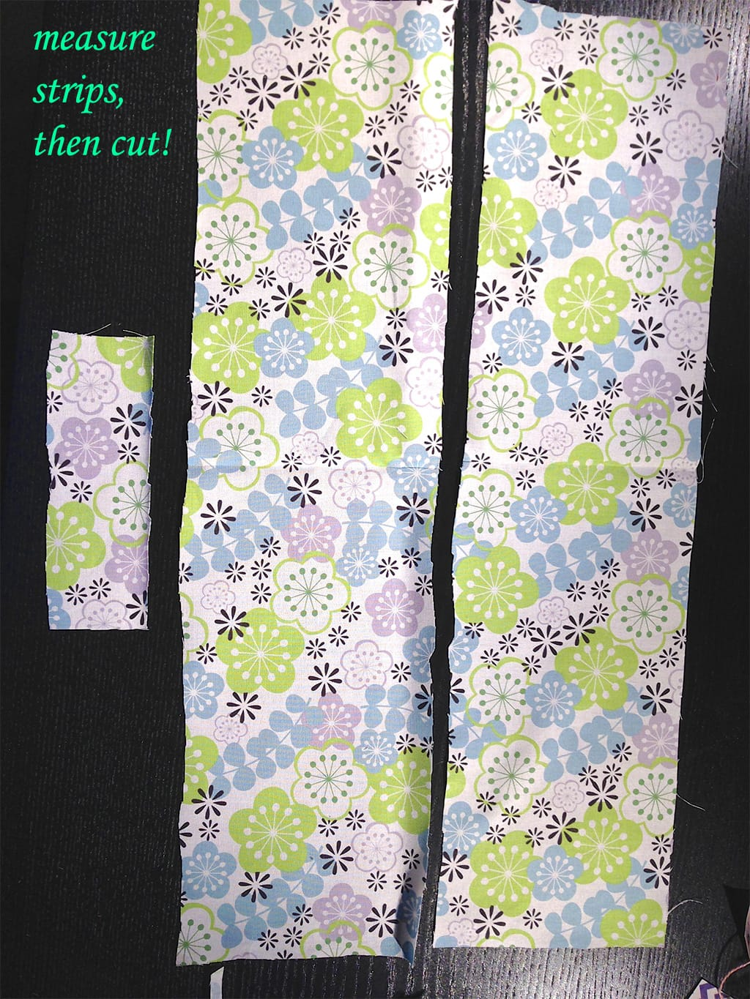

Yay! All your measurements are done! It sure looks like a whole lot of work above, but it really is just a few minutes of calculating and then it’s on to the project. Here we go!

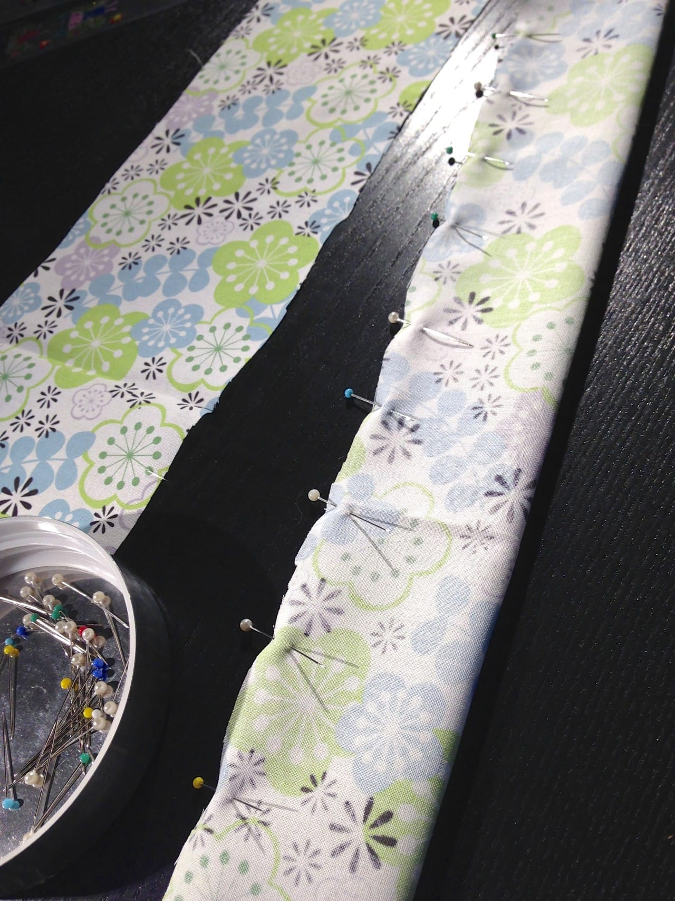
<ul><li>
Fold each of your strips (the 2 large main ones and the one small elastic covering one) in half, lengthwise, with right sides touching. Pin all the way across, forming a tube for each.
</li></ul>

<ul><li>
If your material is mega wrinkly, now is the time to press it! I ironed right on top of the pins, as they can withstand the heat. It makes the next steps so much easier when it’s flat and pressed.
</li></ul>
For
<em>
just
</em>
the large main strips, you’ll need a taper. This will be super helpful later when you are trying to fit all the fabric on the end of each into the teeny little elastic covering tube!
<ul><li>
Fold one of your larger strips in half.
</li></ul>

<ul><li>
To taper: freehand it! I laid my small elastic covering tube next to the large main fabric tube (that is currently folded in half) to compare. Then I did a little sketch right on the fabric to try to match up the sizes and taper it up. It was quick and worked great. Hopefully you can see it in the photo!
</li></ul>
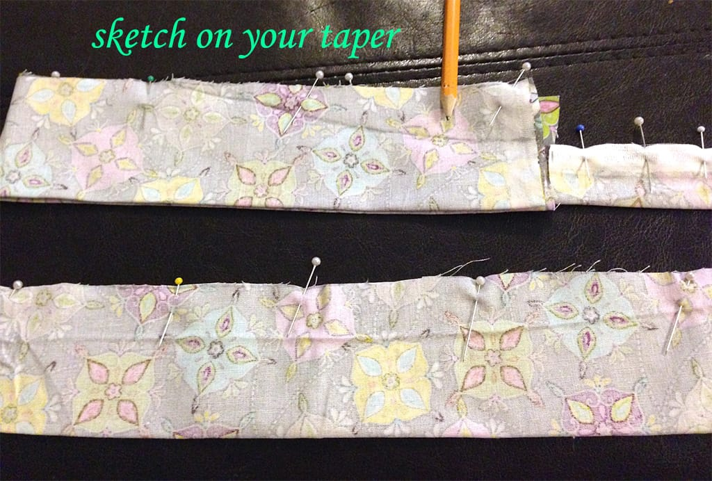
<ul><li>
Keep it folded in half and follow the sketched line with your scissor, cutting off the excess to create a taper on both sides, removing pins as you go.
</li></ul>

          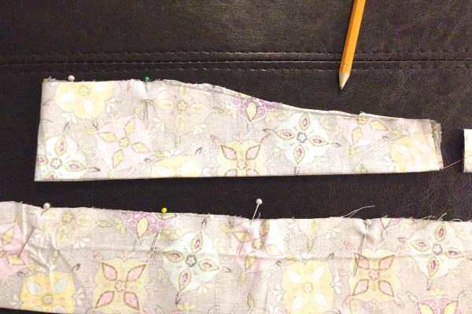
        

          
        

<ul><li>
Re-pin, and use the newly cut tapered piece as a pattern guide for the second piece! Trace it on and cut it out. Re-pin.
</li></ul>

<ul><li>
Now you should have two cut tapered tubes of fabric, and one elastic covering fabric tube.
</li></ul>

<ul><li>
Using matching thread, sew across the pinned tops and close them up, making them tubes!
<strong>
Make Sure To Back Stitch!!
</strong>
This is especially important on something that is going to be pulled on and stretched over and over again!
</li></ul>

          
        

          
        

<ul><li>
Trim off any excess that may be there.
</li><li>
Using a safety pin, pencil, and your fingers, turn each tube inside out! It takes a little working but you’ll get the hang of it!
</li></ul>

<ul><li>
Take this time to iron out any wrinkles that may have formed when you were turning the tubes inside out. Iron the larger tubes with the seams
<em>
in the middle, as pictured above.
</em></li><li>
You now have three lovely little tubes! It’s time to turn them in to a headband!
</li></ul>
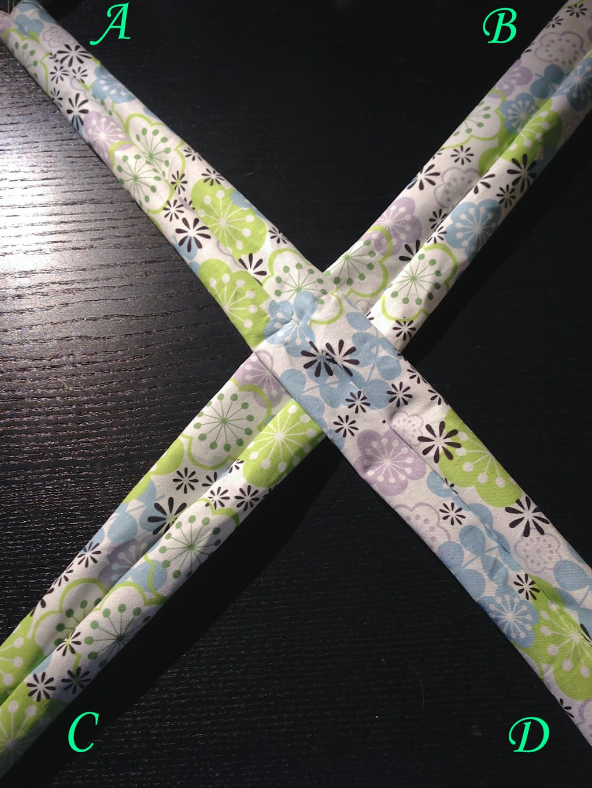
<ul><li>
Make an “X” with the two large tubes, seam sides facing up.
</li><li>
Fold point “D” to point “A” and point “C” to point “B” like in the photo below.
</li></ul>

          
        

          
        

<ul><li>
Make sure your ends are even and that you are happy with the way the little twisted “knot” at the center looks!
</li></ul>
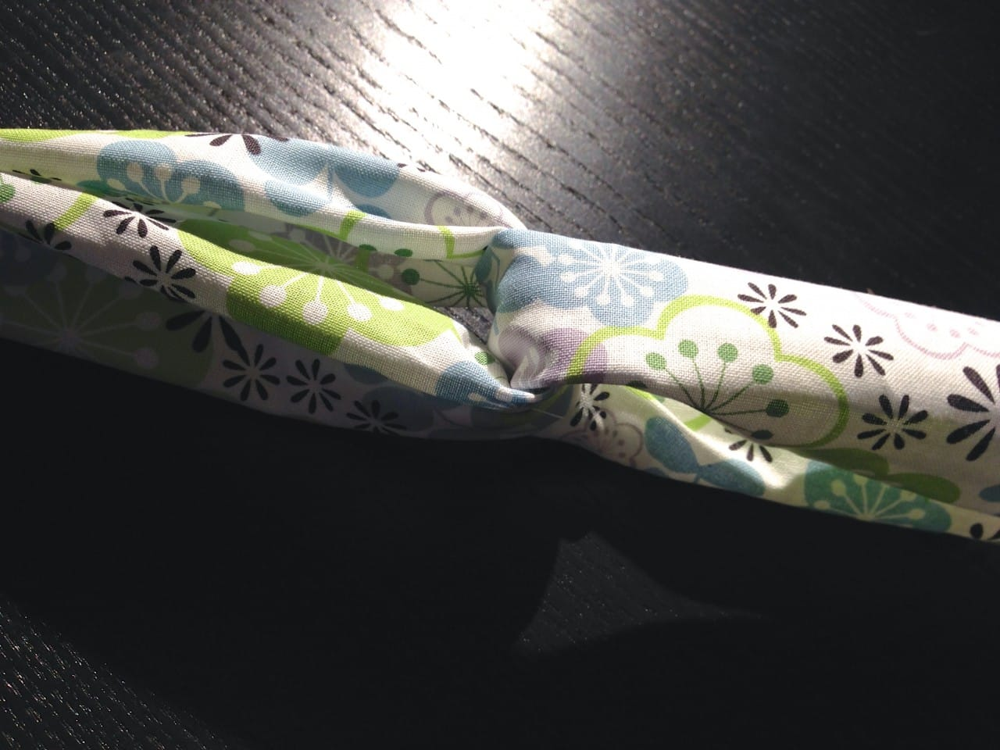
<ul><li>
Grab your elastic strip, and stitch it (via machine or by hand) right to one of the headband ends- this means through both strip ends of that one side. You can sandwich it between them, or sew it right on top. It doesn’t matter, since it will get covered later anyway. Hopefully the photos give you a little explanation! I overlapped and pinned about a half inch of elastic on to the fabric, then sewed.
<strong>
Make Sure To Back Stitch Again!
</strong>
And then forward stitch, and back stitch once more! Remember, this specific part is going to get pulled the most!
</li></ul>

          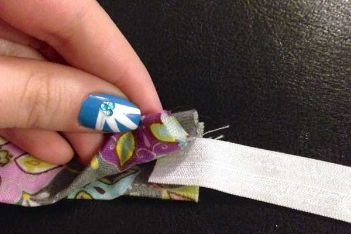
        

          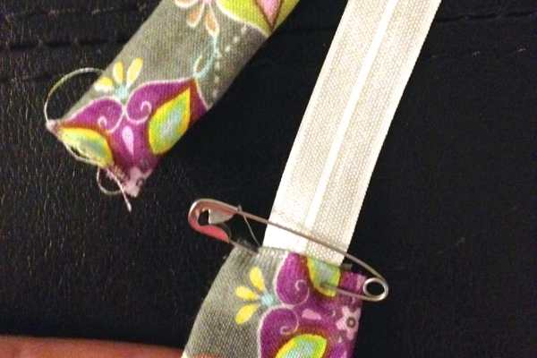
        

          
        

<ul><li>
Attach your safety pin to the free end of the elastic. Slide the elastic covering tube over the elastic and scrunch it down til the safety pin is free again. Use the safety pin to hold the end in place while you carefully shimmy the tube down down down until it covers all the exposed elastic that has been sewn down. Pinch and squish until it’s all covered.
</li></ul>

          
        

          
        

          
        

<ul><li>
Fold the raw edges of the elastic covering tube under itself to make it look nice and clean. Pin and sew!
</li></ul>
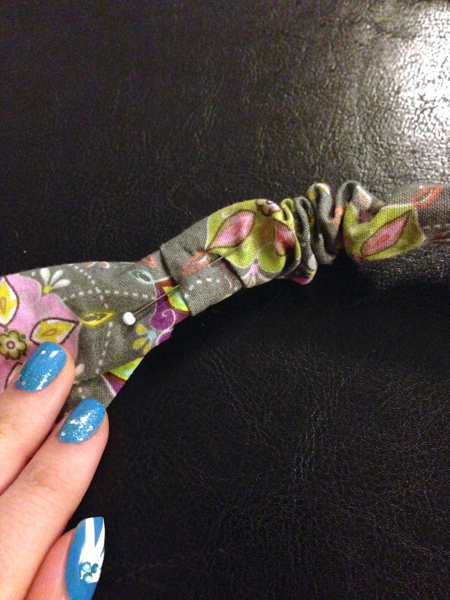
<ul><li>
Take out the safety pin, and repeat the last three steps to the other side. [Sew elastic. Shimmy elastic covering over all exposed elastic. Fold it in. Pin and sew.]
</li></ul>
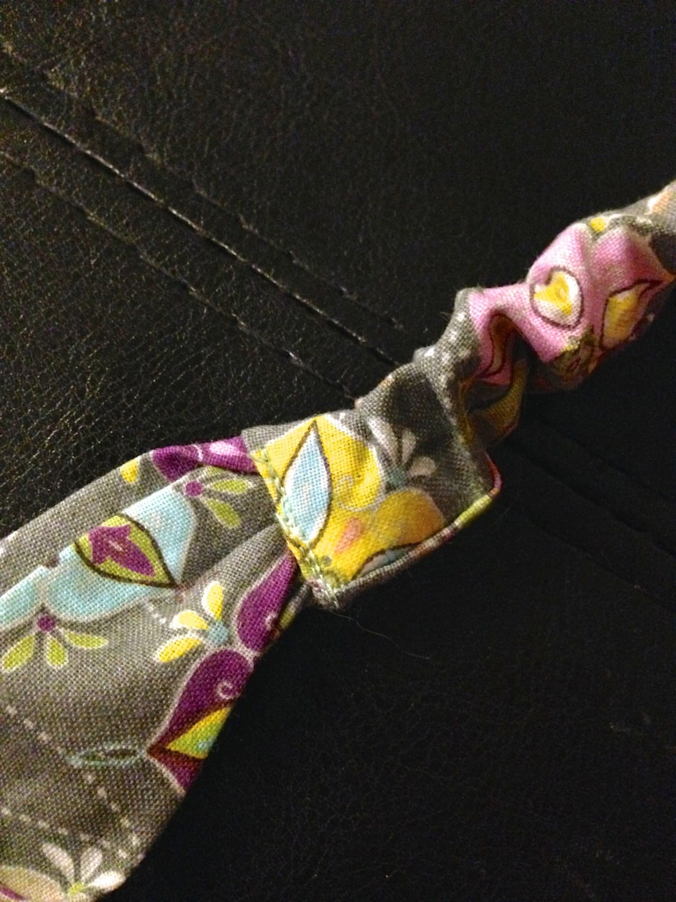
<ul><li>
That’s all! You are totally done! See, that wasn’t so bad?! Enjoy your brand new amazing turban style headband that you didn’t have to spend $38 on!
</li></ul>

          
        

          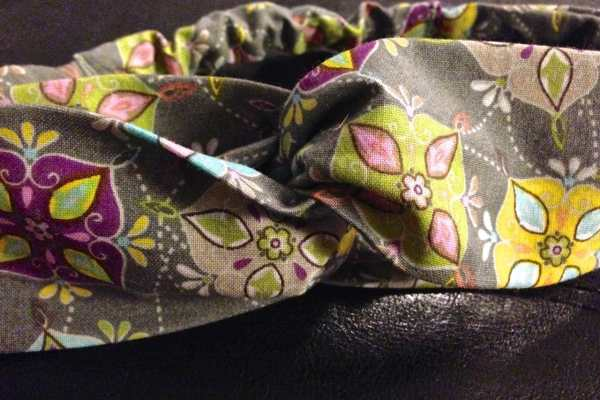
        

          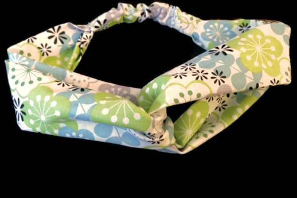
        

          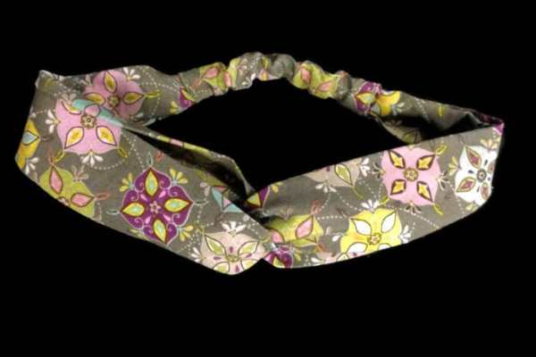
        

          
        

          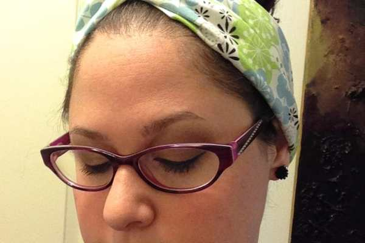
        

<figure id="attachment_2205" aria-describedby="caption-attachment-2205" class="post__figure">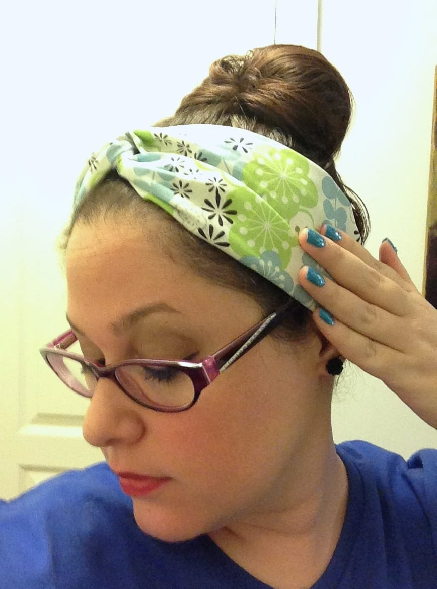<figcaption id="caption-attachment-2205">
Oh my! My nails match my headband! What a pleasant surprise that I had no idea about at all while making it! 😉
</figcaption></figure>
If you try out this tutorial, tell me in the comments! Have a pic? Share that too!

