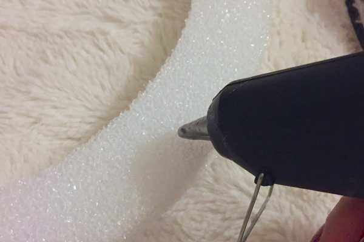
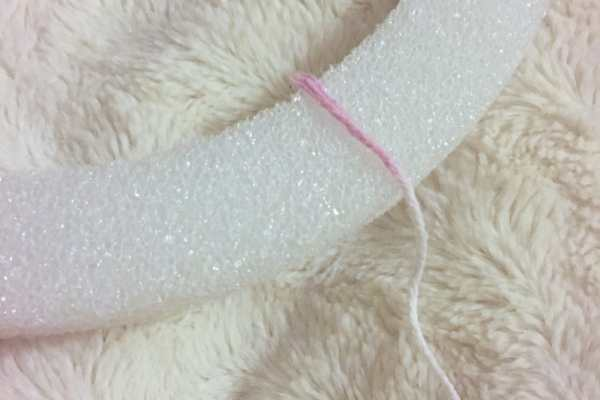
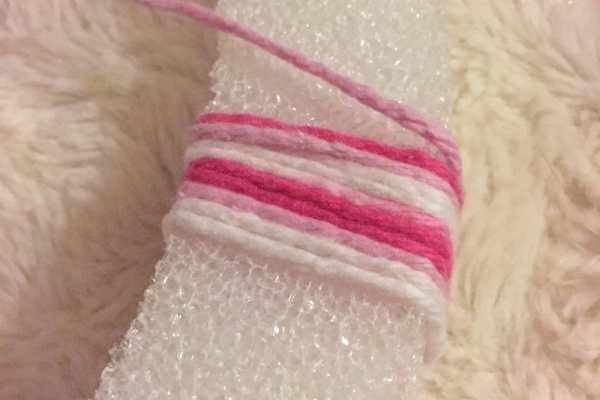
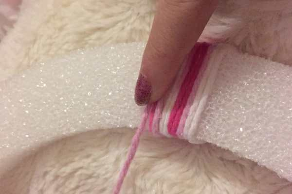
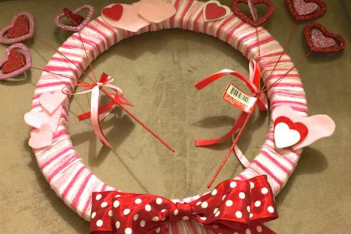

Project: DIY Valentine’s Wreath

Only one week left til Valentine’s Day! Next week, I’ll post a bunch of last minute projects you can make to celebrate that are Valentine’s worthy, but for now let’s focus on this super adorable wreath! It looks so damn cute on my front door!

When I went to the craft store, I found lots of Valentine’s decorations, signs and banners, but none were what I had in mind for the front door. I spent the last several years in apartment buildings, where we didn’t really dress up our front door because no one was seeing it anyway. Since we have a house now, I am taking advantage. Anyone who walks down our street can see the wreath,
<a title="5 Minute Crocheted Hearts" href="/5-minute-crocheted-hearts/"><strong>
crocheted heart garland
</strong></a>
, and assorted red, pink and white doily hearts in ALL the windows. Along with the silver garland I left from Christmas because I knew it would match my Valentine’s stuff. I am prepared.

This wreath is super mega easy to make, but takes a little time and patience. SO, play all of last night’s TGIT* episodes on your DVR, put up your feet, and get started!
<blockquote>
<em>*I don’t know if I love Grey’s, Scandal, or How to Get Away with Murder the best. My mind changes every week. Every show is amazing.</em>
</blockquote><h2>Materials:</h2><ul><li>
Yarn (I used one small skein of pink/white yarn)
</li><li>
Felt (for the hearts)
</li><li>
Hot glue gun + glue
</li><li>
Styrofoam wreath (from the floral section of your craft store)
</li><li>
Ribbon
</li><li>
Additional decorations (optional)
</li></ul><h2>Instructions:</h2><ul><li>
Get comfortable, you’ll be here awhile.
</li><li>
Cut off a long piece of yarn (you’ll do this piece by piece as it’s much easier!)
</li></ul>

          
        

          
        

<ul><li>
With your glue gun plugged in and ready to go, tack on the first bit of yarn.
</li><li>
Wrap yarn around a few times and glue again as you go, continuing until your piece of yarn is finished. Press down as you go.
</li></ul>

          
        

          
        

<ul><li>
Start again with another piece of yarn.
</li></ul>

          
        

          
        

<ul><li>
Continue until entire wreath is filled up. Set aside and turn off glue gun for now.
</li><li>
Make a bow with your ribbon, cut out your felt hearts, and gather up your decorations.
</li></ul>

          
        

          
        

          
        

          
        

<ul><li>
Figure out which side you want as your front-of-wreath, and play around with different ways of displaying it. I tried a couple different ways before settling on my design.
</li></ul><ul><li>
Turn your glue gun back on and glue down the bow, hearts, and anything else that needs gluing.
</li></ul><ul><li>
My hearts-on-sticks were three to a stem, so I cut them off and just poked them through the Styrofoam til they were in the spots I wanted.
</li></ul>

<ul><li>
Add a piece of thread to the top to hang it if you like, and you’re done!
</li></ul>

Seriously, how easy was that? As long as you have the patience to wrap and glue and wrap and glue, you will have a cute, easy and cheap wreath for your front door soon!

How do you decorate for Valentine’s Day?

