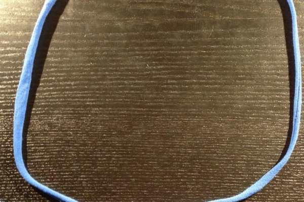
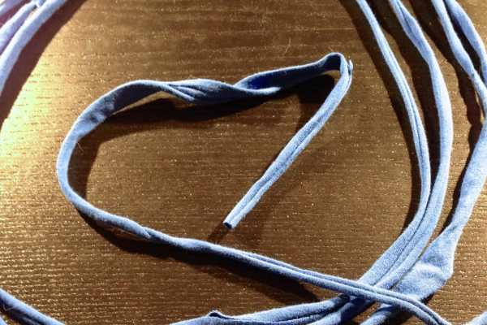
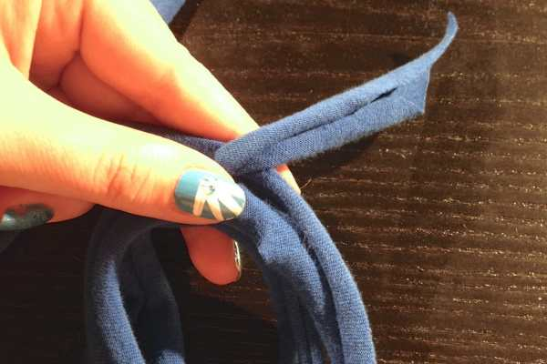
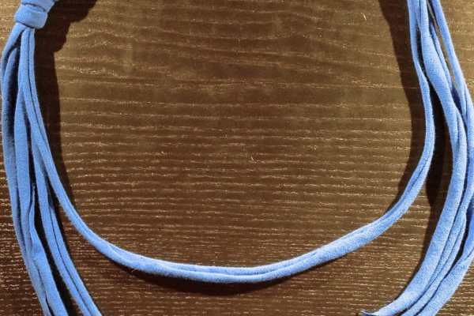
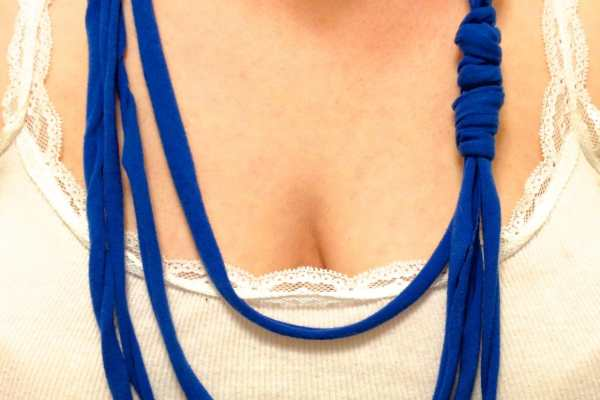

Project: DIY Yarn Necklace Tutorial

Yet another tutorial using t-shirt yarn (woo hoo for upcycling!), this necklace tutorial is incredibly simple to make, and will take you under 10 minutes from getting started to ready-to-wear! Big plus, you can make one to match every outfit you own, so your neck will never be empty or lonely!

I already made a rust orange one, and this blue one. I also used the same concept, only making all loops the same length instead of differing so that I could make matching bracelets. I’m searching our drawers for more t-shirts I can sacrifice in the name of crafting, as well! Hope you like making these as much as I do!
<h2>Materials:</h2><ul><li>
T-shirt yarn
</li><li>
Scissors
</li></ul><h2>Instructions:</h2><ul><li>
Loop the yarn around your neck once to see approximately how long you’d like the shortest loop.
</li><li>
Next, mimic that loop with your yarn on a flat surface.
</li></ul>

          
        

          
        

<ul><li>
Go around a second time, making the next loop slightly larger.
</li><li>
Repeat for a third loop.
</li></ul>

          
        

          
        

<ul><li>
Repeat for a fourth loop, leaving a long tail. Snip yarn.
</li></ul>

          
        

          
        

<ul><li>
Pinch all layers together and hold up in the air to make sure all the loops hang just the way you want them to.
</li><li>
Lay back on the flat surface.
</li><li>
With the short tail, making a small knot around all the layers to keep loops together.
</li></ul>

          
        

          
        

<ul><li>
With the long tail, tightly wrap around the knot so it isn’t visible, until you run out of yarn.
</li></ul>

          
        

          
        

          
        

          
        

<ul><li>
When you come to the end of the tail, weave it under the wrapped portion to hold it in place.
</li></ul>

          
        

          
        

<ul><li>
Voilá

! You have a cute summer necklace that’s ready to wear!
</li></ul>
Every shot I took (and I took over a dozen!) looked like a cheap cleavage shot, so I inevitably nixed them all! Hopefully you still get the feel for what it looks like above! Happy crafting!

