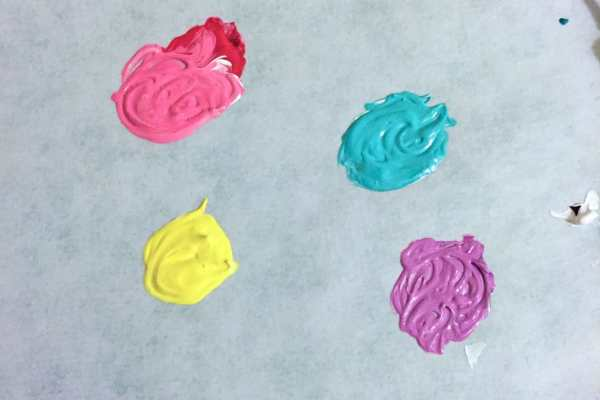
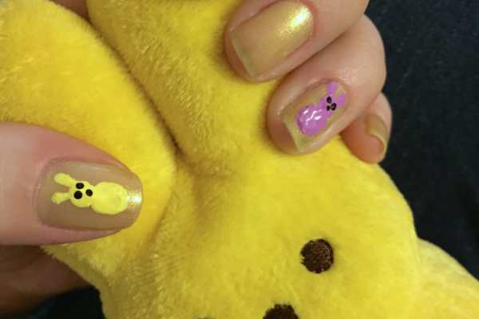
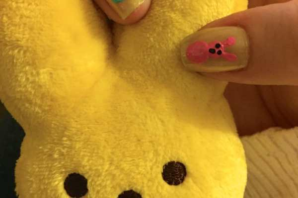
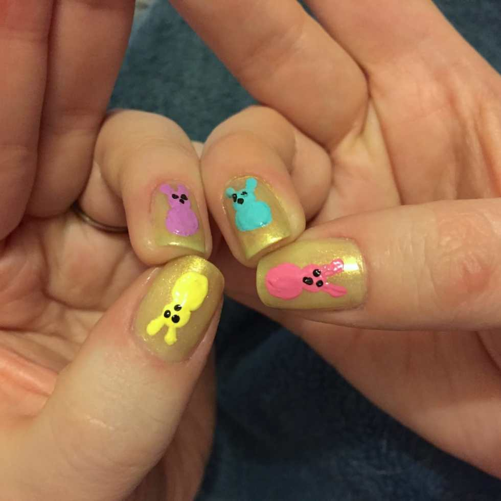
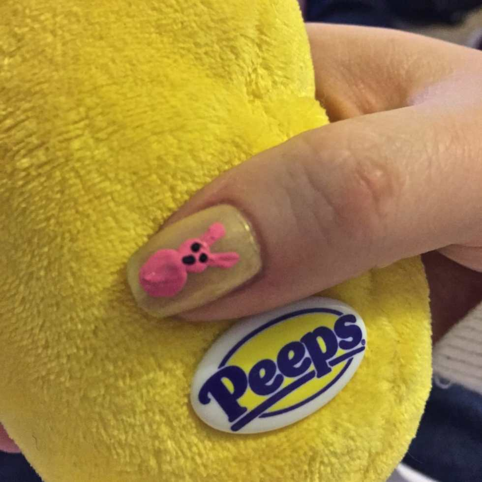

Last year, I had a very cute
<a title="Nail Art: Easter Design 2014" href="/nail-art-easter-design/"><strong>
nail art design for Easter
</strong></a>
that was reminiscent of a little basket with flowers and decorated eggs. This year, I went for a different Easter staple:
<a title="Chocolate Covered Easter Peeps" href="/chocolate-covered-easter-peeps/">Peeps</a>
!

Besides my grandmother, no one in my family really likes Peeps all that much, but I still always put them in our Easter baskets. They are just so cute! I obviously had to use them in my holiday design.

I wasn’t planning on getting a manicure this week, but Husband and I had an hour to kill before a tour yesterday with nothing to do, so I decided to get a fun spring-y color on my nails as the base for a nail art I could do later. Plus, my cuticles were so dry and gross- they really needed the love.

I picked
<a title="OPI " sit="" under="" the="" apple="" tree&#x26;#x26;#x26;#x26;#x26;#x22;="" on="" amazon&#x26;#x26;#x26;#x26;#x26;#x22;="" href="http://amzn.to/1GFtCIY" target="_blank" rel="noopener noreferrer"><strong>
OPI’s “Sit Under The Apple Tree” green
</strong></a>
, which came out lighter than I thought it would, but is still really fun. Plus it’s shimmery, which I love. You can use whatever color or brand of polish you like for this, though!
<h2>Materials:</h2><ul><li>
Nail polish of your choice for base coat
</li><li>
Acrylic paint in: white, black, teal, purple, pink and yellow
</li><li>
Large and small dotting tools
</li><li>
Clear top coat
</li></ul><h2>Instructions:</h2><ul><li>
With clean dry nails, do one to two coats of your preferred base coat shade and let dry.
</li><li>
Put a dab of each color on your palette.
</li><li>
Put a dab of white beside each color.
</li></ul>

          
        

          
        

<ul><li>
Mix the white in to each to make it lighter and give it more “pop” on your nails!
</li><li>
Use your largest dotting tool dipped in the first color to make a bunny body and adjoining body head on your ring finger.
</li></ul>

          
        

          
        

<ul><li>
Next, use the opposite side/smaller dotting tool in the same color to make two bunny ears.
</li><li>
Repeat using the other colors on your other ring finger and both thumbs. Let dry. Don’t worry about the paint looking stippled- your clear coat will smooth it out.
</li></ul><ul><li>
Use your smallest dotting tool dipped in black paint to make little eyes and noses on the bunnies. Let dry.
</li></ul>

          
        

          
        

<ul><li>
Seal in your PEEPS! look with a clear top coat and let dry. Done!
</li></ul>

SO CUTE!!! I love this design so much and can’t wait to show it to the kids on Easter. How will you be decorating your nails for the holiday? Peep peep!

