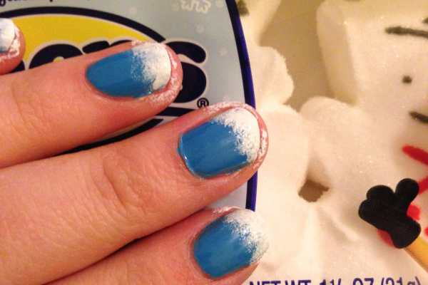
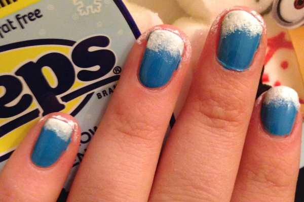
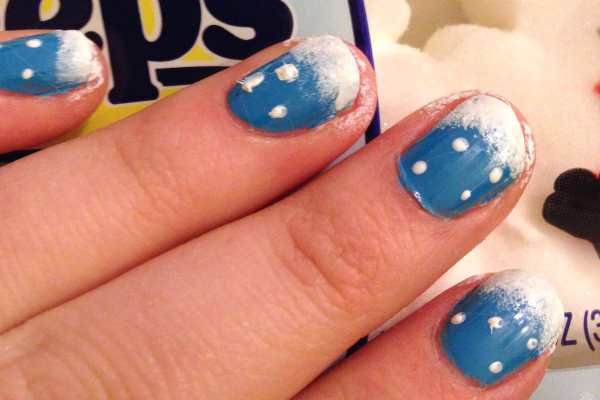
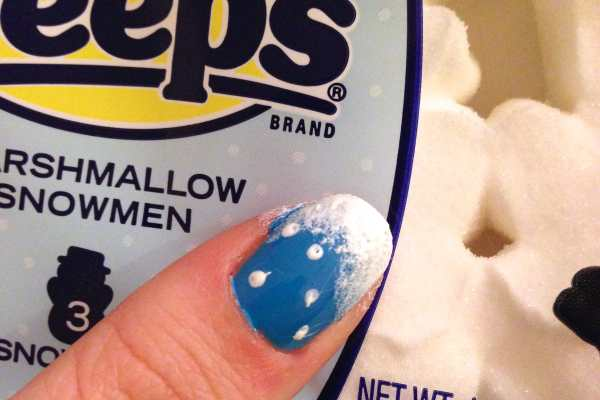
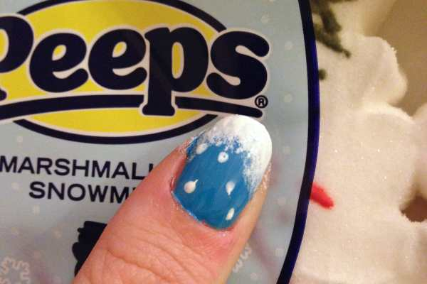
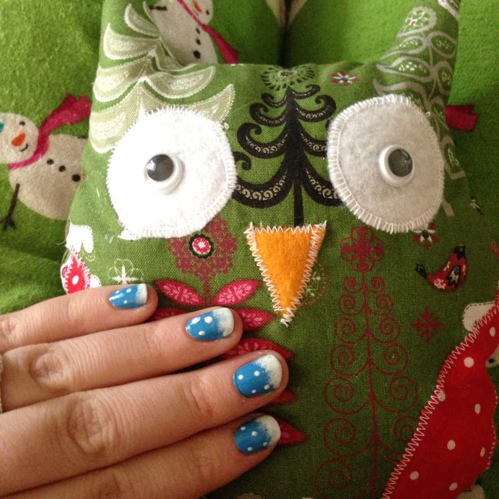

<em>♫ On the eighth day of Christmas, Katie Crafts gave to me- a Manicure Monday design that’s wintery! ♫</em>

Wow, a full week of our
<strong>
12 Days of Christmas
</strong>
has already gone by! So far we’ve enjoyed a
<strong><a title="Fourth Day of Christmas: Key Lime Frosted Cupcake Recipe" href="/fourth-day-of-christmas-key-lime-frosted-cupcake-recipe/">recipe</a></strong>
, some festive
<strong><a title="Fifth Day of Christmas: Easy Origami Christmas Tree DIY" href="/fifth-day-of-christmas-easy-origami-christmas-tree-diy/">origami</a></strong>
, an easy
<strong><a title="Third Day of Christmas: DIY Mini Makeup Bag" href="/third-day-of-christmas-diy-mini-makeup-bag/">sewing project</a></strong>
, and not
<strong><a title="First Day of Christmas: Gift Tag Giveaway" href="/first-day-of-christmas-gift-tag-giveaway/">one</a></strong>
, but
<strong><a title="Seventh Day of Christmas: Big Giveaway!" href="/seventh-day-of-christmas-big-giveaway/">two</a></strong>
giveaways! All while listening to some
<strong><a title="Sixth Day of Christmas: Holiday Playlist" href="/sixth-day-of-christmas-holiday-playlist/">holiday tunes</a></strong>
! Now it’s time to turn to a beauty post and do a fun little nail art design for Manicure Monday!
<h2>Materials:</h2><ul><li>
Blue nail polish
</li><li>
White nail polish or acrylic paint
</li><li>
Dotting tool or toothpick
</li><li>
Clear top coat
</li><li>
Makeup sponge
</li><li>
Nail polish remover &#x26; Q-tip (to clean up around your nails if you make a mess!)
</li></ul><h2>Instructions:</h2>
Notice the streaks?
<ul><li>
With clean, dry nails, do one coat of blue nail polish and let dry.
</li></ul>
Ahh, much better with two coats!
<ul><li>
If streaky, do a second coat of blue nail polish and let dry.
</li></ul>

<ul><li>
Pour a little of the white nail polish or acrylic paint on to a paper plate (or in my case, a piece of cardboard from a package!) Rip a corner of the makeup sponge off and dab it in the white.
</li></ul>

          
        

          
        

          
        

<ul><li>
Gently sponge on some white on the tip of each nail to make it look like accumulated snow. Let dry.
</li><li>
Go back and do the same thing on the lowest portion of the tip of your nail so that the bottom is more opaque. Let dry.
</li></ul>

          
        

          
        

          
        

          
        

<ul><li>
Dip the dotting tool or toothpick in to the white and on to your nails to look like little dots of falling snow. Let dry.
</li></ul>

          
        

          
        

          
        

<ul><li>
Use clear polish to lock in look. Let dry.
</li><li>
Clean up your nails from any nail polish that was sponged on your skin.
</li></ul>

<ul><li>
Share your nails with Mr. Christmas Owl and enjoy your wintery wonderland look!
</li></ul>

<h2>Tip:</h2><ul><li>
On my thumb nails, since they are bigger, I dabbed the sponge up the sides slightly to look like the snow was accumulating there too- as it would in a window sill. 🙂
</li></ul>

That’s it! SUPER easy nail art to enjoy on a snowy day- or any Winter day, really! I love Manicure Monday. What nail design will you be donning this Christmas?

