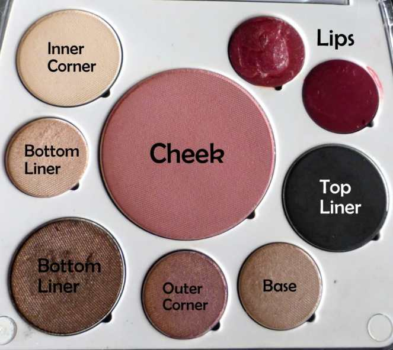

<em>♫ On the eleventh day of Christmas, Katie Crafts gave to me- holiday fashion &#x26; makeup inspiration by La Vie en May! ♫</em>
<blockquote>
Hi everyone! Today’s 12 Days of Christmas post is by guest fashion and beauty blogger, May of
<a title="La Vie en May" href="http://www.lavieenmay.com/" target="_blank" rel="noopener noreferrer">La Vie en May</a>
! Check out her blog when you’re done reading her holiday picks below!
</blockquote>
Holidays are coming up, do you know what you’re going to wear? Before you start scrambling and pulling your hair out, check out these 4 head-to-toe looks I curated for this holiday season! Whether you prefer pants or dresses, extravagant or simplistic, there’s something for everyone. Alright, let’s start…
<h2>Look #1: Classic Black Dress</h2>
Black never goes out of style. It’s a timeless color that’s always chic and fashionable. Plus, its’ slimming qualities don’t hurt either! For this look, I suggest a bold pink lip and soft eyes. It’s all about the pinks this year. Don’t be afraid to make it pop!

Makeup Pairing:

Products used: em waterliner in ‘chocolate dream’ &#x26; ‘bronze kiss’, Elizabeth Mott Smooth Shadow in ‘pearl’, and Urban Decay Glide-On Lip Pencil in ‘Adrenaline.’
<h2>Look #2: Red Dress</h2>
Red is an iconic color for the holidays and it looks fabulous on anyone. Stand out with a bright red or tone it down with a darker hue. A red dress goes well with neutral tones. To complement the dress, wear a muted, dark red lip.

Makeup Pairing:

The palette shown is the em cosmetics Day Life Palette.

<h2>Look #3: Monochrome</h2>
Who says you always need to wear a dress to a holiday party? Pants can look just as sexy and stylish. Personally, I love a white &#x26; black combo. It’s best when combined with a bold red lip and gold glitter liner!

Makeup Pairing:

Products used: Urban Decay Revolution Lipstick in ‘F-Bomb’, em cosmetics Chiaroscuro stick in ‘Light’, em waterliner in ‘black night’ &#x26; ‘chocolate dream’, UD Glitter Liner in ‘Midnight Cowboy’.

<h2>Look #4: Ugly Sweater</h2>
It’s not a holiday party without an ugly sweater! It’s a tradition in my family. Keep your makeup simple and muted. You want your sweater to do the talking!

Makeup Pairing:

Products used: em cosmetics shade play cheek palette in ‘blush a bye pink,’ C3 Warm White Highlighter, em waterliner in ‘bronze kiss’ &#x26; ‘chocolate dream’, Urban Decay Revolution Lipstick in ‘Lovelight.’

<blockquote>
Thanks so much for your awesome holiday picks, May! I don’t know which one I like better! How about you guys? Which is your favorite?
</blockquote>
