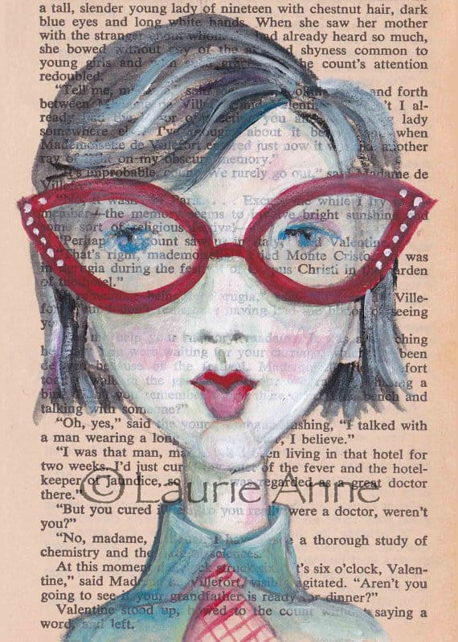

Today’s featured Wednesday artist is Laurie Anne of
<a title="Artful Bits and Bytes on Etsy" href="https://www.etsy.com/shop/ArtfulBitsAndBytes?ref=pr_shop_more" target="_blank" rel="noopener noreferrer">Artful Bits and Bytes on Etsy</a>
! She makes awesome whimsical one-of-a-kind artworks using acrylic, mixed media, collage and more! Check out her unique works below and find out how you can get a great discount in her shop!
<h2>Tell us a little about yourself…</h2>
<em>I am an architect by day, artist/crafter by night. I live in Fairhope Alabama, all the way down at the southernmost portion of the state along the Gulf of Mexico. I have two amazing daughters; one at collage and the other an architect in the big city of Atlanta. Scruffy, my cat and I reside in a big beautiful arts and crafts inspired home at the edge of downtown.</em>
<h2>What do you love about your craft?</h2>
<em>I love that messy total consuming focus of creating something from the heart. I love color, all color, every color. I love words, lyrics, and stories. I love putting them all together and making something interesting that speaks to those who view it. Art just plain makes me happy!</em>
<em><a title="The Making of Friendship on Artful Bits and Bytes Blog" href="/artfulbitsandbytes.blogspot.com/2013/06/the-making-of-friendship.html">Here is a link</a>
showing the creation of a piece called friendship from idea to final product (I think this bog post reflects/represents my love of what I do rather well).
</em>

<h2>What item was your favorite to make so far?</h2>
<em>That is like asking which of my children do I love the most- impossible as each is different and I like for different reasons but since I must, I’ll narrow it down to two.</em>

<em>First is</em>
<em><a title="Tempus Fugit by Artful Bits and Bytes on Etsy" href="https://www.etsy.com/listing/174949263/tempus-fugit-art-print-beautiful-surreal" target="_blank" rel="noopener noreferrer">“Tempus Fugit”</a>
or “Time Flies”, a large mixed media painting
</em>
[pictured above]
<em>
. It is my my largest and most ambitious canvas yet (48″ x 60″) I created it first by collaging old journal pages on to the canvas then texturing it with a combination of modeling paste and paints. I then began painting both directly on to the canvas and also on separate papers that I collaged on at various stages of the process. The base of the body is a photo of plywood from an old abandoned church. The base of the branches and some of the leaves are printed from an old Polish prayer book. Sheet music is also collaged into the art. There are lots of subtle layers of meaning embedded within it and I am very happy how it turned out.
</em>
<em>The second are my literary ladies. I’ve selected one really at random,</em>
<em><a title="Modern African American Woman Art by Artful Bits and Bytes" href="https://www.etsy.com/listing/191398771/modern-african-american-young-woman-with" target="_blank" rel="noopener noreferrer">“Magenta”</a></em>
[pictured below]
<em>
. Painting these women, is so addictive. Everyone I see plants the seed of a new painting. The whole collection represents a bit of all women. We are each beautiful, homely, pious, provocative, joyful, sorrowful, black, white, …. We have so many sides that it is therapeutic to give them an almost intuitive form and I love the extra layer of depth that the recycled book pages add.
</em><h2>Where do you find your creative inspiration?</h2>
<em>My need to create comes from an insatiable curiosity and need to explore. It is the journey more than the destination that keeps my interest. I want my artwork to reflect who I am and connect to the viewer’s heart. Nature, music, poetry, scripture, mythology, people (I am an avid people watcher), graffiti, discarded scraps of ephemera and daydreams all blend and inspire my art.</em>

<em>There are also many wonderful artists who I adore: Amedeo Mogliani, Jessie Wilcox Smith, Picasso, Jennifer Yoswa, Mary Englebreit, and finally the kitchy low brow artists of the 60s with their big eyed kids like Eve, Lee, and Goji.</em>
<h2>How did you decide to open your Etsy shop?</h2>
<em>Creating is my passion. I can’t remember a time when I wasn’t making some kind of art but it has only been in the past couple of years that I finally decided to share my artwork with the world.</em>

<em>A few years ago, I found myself filling countless sketchbooks at a remarkable rate. My daughters had gone off to college so I had a little more free time. I also had many life changes to sort out. A perceptive friend asked what did I really enjoy and want to pursue just for me -funny I hadn’t thought about it until he mentioned it but I immediately knew. I wanted to surround myself with simple joys. I wanted to create. Art began to fill my mind and heart and spill unexpectedly on to whatever I had at hand.</em>

<em>Soon I had quite a collection of artwork, and Etsy seemed to be the perfect fit -a place where both the fine arsty art and the cute craftsy doodles could co-exist. I could also be in control. Etsy is so easy to set up and get started that unlike other venues, it didn’t feel scary or un-doable for a novice like me. Also a plus was that setting up a shop didn’t cost anything – only a small amount for listing and then a small percentage when something sells.</em>

<h2>Any advice for others who want to start their own Etsy shop, or who are looking to fulfill their passion for crafting?</h2>
<em>Set goals and try and do something towards reaching them each day, find your niche/ideal customer and promote yourself (so hard for an introvert like myself), join a few teams that seem like a good fit, create and support the treasuries, use your tags wisely by learning all about SEO optimization, make sure the images/photographs of your items are the best they can possibly be, then be patient and have fun. Having fun is so important in the creative process for without that then why are you doing this -there are certainly easier ways to make a few bucks!</em>

<em>I’m still learning and often feel a bit overwhelmed but its ok, I’m slowly finding my rhythm. When someone loves your art enough to purchase it that really makes all the necessary “business” stuff not so onerous after all.</em>

Be sure to check out Artful Bits and Bytes on all social media accounts!

<a title="Artful Bits and Bytes on Etsy" href="https://www.etsy.com/shop/ArtfulBitsAndBytes" target="_blank" rel="noopener noreferrer">Etsy</a>

♥︎
<strong><a title="Arful Bits and Bytes Blog" href="http://artfulbitsandbytes.blogspot.com/" target="_blank" rel="noopener noreferrer">Blog</a><strong>
♥︎
</strong><a title="Artful Bits and Bytes on Pinterest" href="http://www.pinterest.com/artfulbits/" target="_blank" rel="noopener noreferrer">Pinterest</a><strong>
♥︎
</strong><a title="Arful Bits and Bytes Instagram" href="http://instagram.com/artfulbitsandbytes_laurieanne/" target="_blank" rel="noopener noreferrer">Instagram</a><strong>
♥︎
</strong><a title="Artful Bits and Bytes on Twitter" href="https://twitter.com/ArtfulBytes" target="_blank" rel="noopener noreferrer">Twitter</a><strong>
♥︎
</strong><a title="Facebook Artful Bits and Bytes" href="https://www.facebook.com/pages/Artfulbitsandbytes/677892708964502" target="_blank" rel="noopener noreferrer">Facebook</a></strong>
or contact her at
<strong>
artfilledheart
</strong>
at
<strong>
gmail
</strong>
dot
<strong>
com
</strong>
Laurie Anne has a promo code especially for Katie Crafts readers! Use code
<strong>
Katie10
</strong>
at checkout which is good for
<strong>
10% off
</strong>
everything over $10 for the year 2014.

Thanks for sharing your lovely artworks with us, Laurie!! What was your favorite piece, readers?

