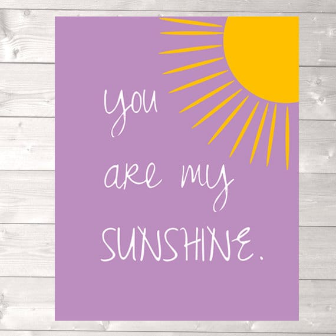
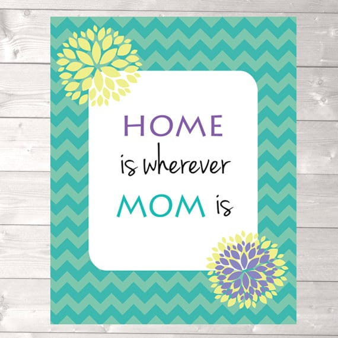

We usually only do our Featured Etsy Shops on Wednesdays, but we teamed up with Belle over at
<a title="Design and Play on Etsy" href="https://www.etsy.com/shop/designandplay?ref=pr_shop_more" target="_blank" rel="noopener noreferrer">Design and Play</a>
to do a very special Friday Feature for you! It’s special, because Belle has the perfect items in her shop for you to give your Mama this Mother’s Day, and she’s giving you the chance to win one!
<h2>Tell us a little about yourself…</h2>
<em>Hi, I’m Belle behind Design &#x26; Play from Canada. I’m obsessed with glitter, coffee and designing.</em>
<h2>What do you love about your craft?</h2>
<em>What I love most is knowing someone chose my invitation design for their party or event. No matter how many times I’ve sold a particular design – it’s always exciting to see how my customers are using it for different special occasions.</em>

<h2>What item was your favorite to make so far?</h2>
<em>My favorite item today is the Glitter print of “Home is where Mom is” with the arrow. I am obsessed with glitter in the physical and digital world! Designing prints is something I have always wanted to do since forever. This particular design was a vision in my head for awhile so to finish it is an awesome feeling!</em>

<h2>Where do you find your creative inspiration?</h2>
<em>Where do I not find creative inspiration! Just today I was looking a child’s book and was inspired by fairy wings and cupcakes! I love textures, playing with colors and small details.</em>
<h2>How did you decide to open your Etsy shop?</h2>
<em>I had my first shop in 2006 sewing up strange plush animals that I adored making. From that shop came so many opportunities for me but I kept thinking about graphic design. After I closed down my first shop and took a break for awhile – I came back with a plan and a goal.</em>

<h2>Any advice for others who want to start their own Etsy shop, or who are looking to fulfill their passion for crafting?</h2>
<em>I have a lot of advice for those who want it! First and foremost – keep creating and put it out there to the world. Nobody will know what you are selling if it’s not listed! Don’t get discouraged if you haven’t made your first sale yet or sales are slow. Keep going!</em>

After you check out her
<a title="Design and Play on Etsy" href="https://www.etsy.com/shop/designandplay?ref=pr_shop_more" target="_blank" rel="noopener noreferrer">Etsy Shop</a>
, be sure to check out Belle’s other social media sites, too!

Twitter:
<a class="external-link-overlay-trigger overlay-trigger" title="Design and Play on Twitter" href="http://twitter.com/designandplay" target="_blank" rel="#external-link-overlay nofollow noopener noreferrer">twitter.com/designandplay</a> 
Pinterest:
<a class="external-link-overlay-trigger overlay-trigger" title="Design and Play on Pinterest" href="http://www.pinterest.com/papergirlie/" target="_blank" rel="#external-link-overlay nofollow noopener noreferrer">www.pinterest.com/papergirlie/</a>
Now for the Giveaway! This raffle is for
<strong>
one 8×10 print
</strong>
for you to give as a gift to your mom this Mother’s Day! It will run until
<em>
April 30th at 11:59 PM ET
</em>
, so the winner will have just enough time to receive the print before Mother’s Day weekend! The contest is
<em>
open to Canadian &#x26; US residents only.
</em>
Be sure to read the terms and conditions for more info! Good luck, everyone!!
 <a id="rc-64ecfa5" class="rafl" href="http://www.rafflecopter.com/rafl/display/64ecfa5/" rel="nofollow noopener noreferrer" target="_blank">a Rafflecopter giveaway</a> 
