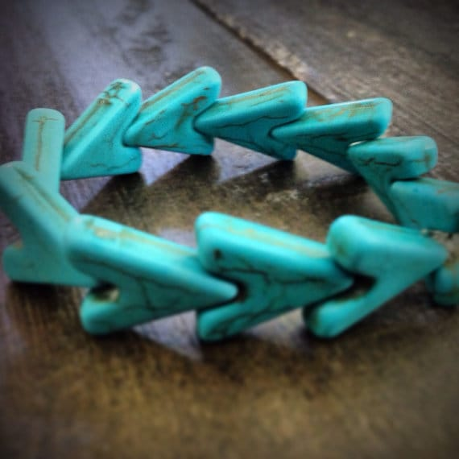
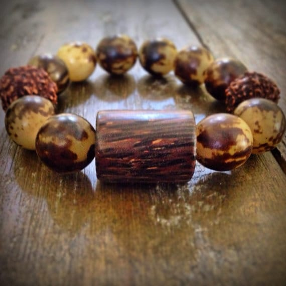

You know what day it is! It’s featured artist day! Yay! Today you’ll get to know
<strong>
Christina
</strong>
from
<a title="Feeling Charmed on Etsy" href="https://www.etsy.com/shop/FeelingCharmed?ref=search_shop_redirect" target="_blank" rel="noopener noreferrer"><strong>
Feeling Charmed
</strong></a>
a bit better, check out some of her unique Earth inspired jewelry and get a fantastic coupon code to get your own piece!
<h2>Tell us a little about yourself…</h2>
<em>My name is Christina Brown and I am from Los Angeles, CA. I am a wife and a mother to a wonderful rabbit named Pilot. I have a love for all things fashion. I love to create pieces that people can wear and enjoy every day. Accessories should be fun and make you feel special and unique when you wear them.</em>
<h2>What do you love about your craft?</h2>
<em>What I love most about my craft is the design process. There is nothing better than coming up with new ideas and bringing them to life. I enjoy putting different beads, accents and charms together to create a unique, one of a kind bracelet.</em>
<h2></h2><h2>What item was your favorite to make so far?</h2>
<em>I would have to say that my favorite item to make so far has been the Firestone Bracelet because I used all organic and natural materials. It was the first bracelet in my organic line and I wanted to make it eye catching and special so that people would respond positively to it. The recycled glass gives it a whole different look and feel. It feels earthy and vintage because you think about where the materials came from and what they might have been used for in a past life.</em>

<h2>Where do you find your creative inspiration?</h2>
<em>I find my creative inspiration all around me. When I first started making bracelets and picking out the materials for them, I always went for the earth tones. So I thought I should stick with what I like and take inspiration from the earth, sea and sky. I enjoy the mix between taking the blue from the sky and joining it with the wood from the earth. I feel like there is a harmony there and all the elements can work together.</em>
<h2>How did you decide to open your Etsy shop?</h2>
<em>I got started making bracelets that I could wear and enjoy. I realized that I had a love for designing and creating them but it wasn’t until I started getting compliments on them that I realized I wanted to sell them so that others could enjoy them the way I do.</em>
<h2></h2><h2>Any advice for others who want to start their own Etsy shop, or who are looking to fulfill their passion for crafting?</h2>
<em>I think anyone that has a passion for crafting should go for it. However, opening an Etsy shop and selling your items takes patience, which I am still learning. You have to get your name and your products out there before you will see any sales. It is hard because sometimes to have to focus more on promoting than on your actual craft. But hopefully, in the long run it will all pay off and creating can become your main focus.</em>

You can also catch Feeling Charmed on these social media sites!:

<a title="Feeling Charmed on Etsy" href="https://www.etsy.com/shop/FeelingCharmed?page=1" target="_blank" rel="noopener noreferrer"><strong>Etsy</strong></a>
<strong>
♥︎
</strong><a title="Feeling Charmed on Instagram" href="http://instagram.com/feeling_charmed#" target="_blank" rel="noopener noreferrer"><strong>
Instagram
</strong></a><strong><strong>
♥︎
</strong></strong><a title="Feeling Charmed on Pinterest" href="http://www.pinterest.com/fcbracelets/" target="_blank" rel="noopener noreferrer"><strong>
Pinterest
</strong></a><strong><strong>
♥︎
</strong></strong><a title="Feeling Charmed on Facebook" href="https://www.facebook.com/pages/FeelingCharmed/709509352444866" target="_blank" rel="noopener noreferrer"><strong>
Facebook
</strong></a>
Love what you see at Feeling Charmed? You are in luck! Christina is offering a
<em>
20% discount
</em>
with a minimum purchase of $25.00 to YOU!. The coupon is good till
<em>
8/31/14
</em>
, just use code
<strong>
20PERCENTOFF
</strong>
at checkout!

Thanks for being featured, Christina! Your stuff is just fabulous!

Which bracelet did you like the best?

