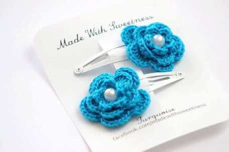
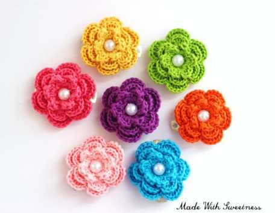

If you weren’t already aware, the entire month of
<strong>
March
</strong>
is
<strong>
National Crochet Month
</strong>
! In celebration of such, I’ll be featuring one
<strong>
Etsy
</strong>
shop each week that specializes in crocheted items! First up is the very talented
<strong>
Zainab
</strong>
of
<strong><a title="MadeWithSweetness on Etsy" href="https://www.etsy.com/shop/MadeWithSweetness" target="_blank" rel="noopener noreferrer">Made With Sweetness</a></strong>
! You’re going to love the handmade headbands and flowers!
 <h2>Tell us a little about yourself…</h2>
<em>My name is Zainab and I live somewhere close to the beaches in Florida. I crochet children’s accessories and have an Etsy shop called</em>
<em><a title="MadeWithSweetness on Etsy" href="https://www.etsy.com/shop/MadeWithSweetness" target="_blank" rel="noopener noreferrer"><strong>
MadeWithSweetness.
</strong></a></em><h2>What do you love about crocheting?</h2>
<em>I love the feeling of creating things myself. The way thread turns into something beautiful in design and meaningful in purpose… It’s so simple, yet so complicated that most people find it daunting to learn how to sew, knit, and crochet. I love that it’s something I can do that most people can’t.</em>
<h2>What item (or pattern) was your favorite to make so far?</h2>
<em>My crochet satin headbands, hands down! I LOVE the color combinations that I came up with. They are gorgeous, if I must say so myself.</em>

<h2>Where do you find your creative inspiration?</h2>
<em>I have an almost 3 year old girl, and she is my inspiration for most of my hair accessories. I just think about what kind of things I can make myself for my kids and if it turns out good, I add them to my shop as well.</em>
<h2>How did you decide to open your Etsy shop?</h2>
<em>I thought it would be cool to get paid for doing something I love while being in the comfort of my home.</em>

<h2>Any advice for others who want to start their own Etsy shop, or who are looking to fulfill their passion for crafting?</h2>
<em>Keep making cool stuff! I don’t know what else to say… Adding variety to your crafting is the key to getting more customers.</em>

Zainab wants to help you readers celebrate this crafty crochet month by hosting a giveaway for a pair of beautiful Hand Crocheted Flower Hair Clips in Christmas Red!! You can enter the raffle in many different ways! Check out details below!*

*Note: This giveaway is open to US residents only. You can enter to win until Monday, March 10th at 11:59PM. Winner will be announced on Katie Crafts blog on Tuesday, March 11th. Winners have 48 hours to contact me with an email address (strictly for contact purposes, not to be sold) so we can get you the prize! If no winner comes forward, I’ll select another.

<a class="rafl" id="rc-64ecfa0" href="http://www.rafflecopter.com/rafl/display/64ecfa0/" rel="nofollow noopener noreferrer" target="_blank">a Rafflecopter giveaway</a>
 
