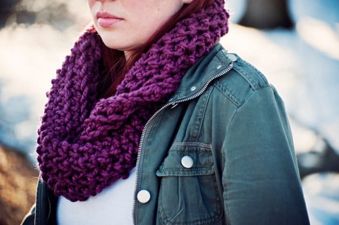
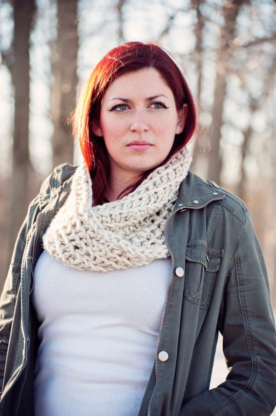

It’s officially the last Wednesday of March, thus the end of National Crochet Month is nearing. Fear not, though! That doesn’t mean Etsy Featured Shops are a thing of the past. In fact, there are a few more already lined up, so stay tuned! For now, we will close out National Crochet Month with an interview by an extremely talented (and awesome!) Etsy newcomer: Allison from
<strong><a title="omgsrsly on Etsy" href="https://www.etsy.com/shop/omgsrsly?ref=pr_shop_more" target="_blank" rel="noopener noreferrer">omgsrsly: handcrafted sass!</a></strong><h2>Tell us a little about yourself…</h2>
<em>My name is Allison, and I’ve been knitting and crocheting for about ten years. I live in Pennsylvania, but was raised in New York. I absolutely love crafting, and have been gifting my goods for as long as I’ve been making them. I work in pharmaceuticals, and love cooking, baking, photography, gardening, and my dog.</em>
<h2> What do you love about crocheting?</h2>
<em>I love the ability to turn something so simple as a skein of yarn into anything imaginable. I was originally a knitter, but once I taught myself to crochet, I fell in love with its speed and simplicity.</em>
<h2>What item (or pattern) was your favorite to make so far?</h2>
<em>I really love making big chunky cowls, as you can see from my etsy shop. They’re so cozy, and have made the long winter this year a lot more bearable.</em>

<h2>Where do you find your creative inspiration?</h2>
<em>I draw inspiration for my crocheting and knitting from the desire for comfort. It’s important to me that all of the things I make instantly feel like home.</em>
<h2>How did you decide to open your Etsy shop?</h2>
<em>I’ve been creating crafts for years now, and it was only after several of my friends who have been on the receiving end of my creative outlet, whether it was a scarf or a sassy cross stitch, suggested that I open a shop that I got serious about it. I spent some time creating an inventory, and here we are today!</em>

<h2>Any advice for others who want to start their own Etsy shop, or who are looking to fulfill their passion for crafting? </h2>
<em>I’ve only recently opened my shop, so I don’t have too much in the way of veteran advice just yet. As for advice about crafting in general, I would say that it’s important to find something you love. I knit for years before I discovered the simple pleasures of crochet. I work hard in a fast-paced job, and the meditative pace of crochet really relaxes me and gives me a great sense of accomplishment.</em>

Allison’s shop,
<a title="omgsrsly on Etsy" href="https://www.etsy.com/shop/omgsrsly?ref=pr_shop_more" target="_blank" rel="noopener noreferrer"><strong>
omgsrsly
</strong></a>
, is super mega brand new to the Etsy marketplace, so be sure to pop on over to her page, check out her stuff, and give her a few faves! If you fall in love with one of her amazing infinity scarves (or super sassy cross stitches!), you can use our
<strong>
exclusive coupon code
</strong><strong>
KATIESCRAFTS
</strong>
to get
<em>
15% off of ANY order
</em>
!! As soon as I’m done writing this post, I’ll be heading over and getting something myself!

